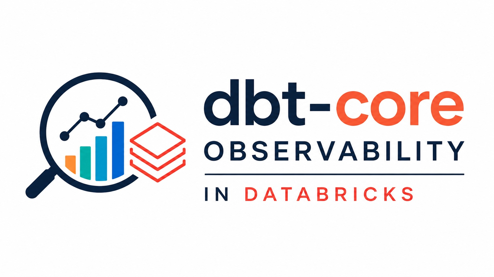

# dbtobsb

<p align="center">
  
</p>

**Documentation:** [miguelelgallo.github.io/dbtobsb](https://miguelelgallo.github.io/dbtobsb/)

Customer-local observability for dbt Core jobs running on Azure Databricks.

When dbt Core runs, it leaves detailed result files and logs. Those files are
useful for investigating one run, but they do not provide an easy history across
many runs.

dbtobsb checks those files, stores selected results in Databricks tables, and
provides read-only views and an App for answering questions such as:

- Which dbt run failed?
- Which model or test failed?
- Are failures or observed model counts changing over time?
- Were the result files and structured logs captured completely?
- Did collection succeed even when dbt failed?

No external telemetry platform is required. The evidence and compute stay inside
the customer's Azure Databricks workspace.

> **Azure Databricks only:** dbtobsb `v0.5.0` installs only in an Azure
> Databricks workspace deployed in the customer's Azure subscription and reached
> through its canonical `https://adb-...azuredatabricks.net` workspace URL. It
> does not support AWS Databricks, GCP Databricks, **Databricks Free Edition**, or
> the retired Community Edition. “Personal Edition” is not a current Databricks
> product name; Databricks directs personal-use users to Free Edition, which is
> not supported by dbtobsb. See the
> [supported environment](https://miguelelgallo.github.io/dbtobsb/reference/supported-environment.html).

## What you get

- An installed Lakeflow Job that runs the approved dbt project.
- A separate collection Job that captures `manifest.json`, `run_results.json`, and
  bounded structured dbt logs.
- Databricks tables containing run, model, seed, snapshot, and test results.
- Three read-only health views for normal queries and the App.
- Native App charts for failed node results and model-result counts over time.
- Restricted Unity Catalog storage for the original captured files.
- A read-only Databricks App that is stopped by default.
- No required schedule and no external monitoring service.

## Start with an agent

This repository includes an
[install-and-run skill](.agents/skills/install-and-run-dbtobsb/SKILL.md) for agents
that support repository skills. From a fresh clone, ask:

```text
Use $install-and-run-dbtobsb to install dbtobsb, run the weather example,
prove that its model result and structured logs were captured, and stop compute.
```

Before changing anything, the agent establishes the workspace, project,
identities, group, warehouse, catalog, schemas, allowed changes, compute deadline,
warehouse stop policy, and final retained state. It rejects Free Edition and
non-Azure workspaces. Once you authorize that summarized task, the agent shows
each exact preview and digest as progress evidence and answers the installer's
confirmation prompts itself. It does not ask again across retries or digest
changes that remain within the task scope. A material expansion of the resources,
mutations, workload, cost ceiling, or finish state is a new task decision.

The expected result is one successful weather model, captured model results,
complete structured logs, published observability rows, and all product compute
stopped.

## Install manually

Follow [Install the private release](https://miguelelgallo.github.io/dbtobsb/how-to-guides/install-private-release.html).
The guide lists the required Azure Databricks resources, shows the attended
installation command, and explains every approval and compute consequence.

Do not run dbt directly after installation. Run the installed
`dbtobsb-observed` Job so the approved paths, result files, and structured logs are
captured consistently.

## See the captured data

dbtobsb publishes three read-only views:

| View | What it answers |
| --- | --- |
| `dbt_run_health` | Did the Databricks task finish, and were its files and logs captured? |
| `dbt_node_health` | Which model, seed, snapshot, or test succeeded or failed? |
| `dbt_collection_health` | Did collection publish successfully, or does it need attention? |

Start with the
[first observed run tutorial](https://miguelelgallo.github.io/dbtobsb/tutorials/see-your-first-run.html)
to see real, sanitized output from the weather example. Use
[Query observability data](https://miguelelgallo.github.io/dbtobsb/how-to-guides/query-observability-data.html)
for copy-ready SQL queries.

## Data and security boundary

Raw dbt files and logs can contain SQL, relation names, paths, messages, workspace
details, and Personal Data. dbtobsb keeps the originals in restricted Unity
Catalog storage and exposes only reviewed fields through the normal views and App.
It does not send logs or results to dbt Cloud or another observability platform.

Customer-local storage does not make the data non-sensitive. Customers remain
responsible for access, retention, export, deletion, backup, legal hold, and
regulatory approval. dbtobsb is not a compliance certification or external
attestation.

## Release candidate

Version `v0.5.0` is being qualified for private installation through a Databricks
Declarative Automation Bundle; Databricks Marketplace distribution is not included.
It is not a supported release until the local and complete live Azure gates pass.

- [Supported environment](https://miguelelgallo.github.io/dbtobsb/reference/supported-environment.html)
- [Security and permissions](https://miguelelgallo.github.io/dbtobsb/reference/security-and-permissions.html)
- [Exact release contract](docs/releases/v0.5.0-support-contract.md)
- v0.5.0 Azure acceptance evidence pending
- [Historical v0.3.0 Azure acceptance evidence](docs/evidence/v0.3.0-stable-acceptance-2026-07-18.md)

## Documentation and development

The documentation follows tutorials, how-to guides, reference, and explanation.
Browse the [documentation website](https://miguelelgallo.github.io/dbtobsb/) or
open the [documentation source](docs/site/index.md).

Build and check the documentation locally with:

```console
scripts/check_docs.sh
```

Maintainer plans, decisions, research, review records, and dated evidence start at
the [maintainer documentation index](docs/index.md).

## License

dbtobsb is available under the [MIT License](LICENSE).
