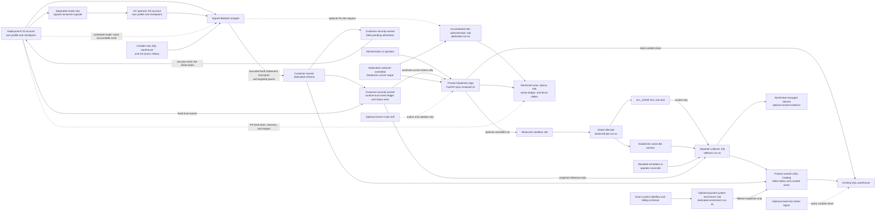

# Product and delivery plan

- Status: P0 acceptance candidate; immutable verdicts are recorded under `docs/reviews/p0-planning-baseline/`
- Baseline: 0.20
- Updated: 2026-07-15
- Starting point: Private Databricks App deployed through a plain-YAML Declarative Automation Bundle

## Outcome

An administrator can install dbtobsb into an Azure Databricks workspace, connect or create an approved dbt Core job, prove that a real run is observable, and hand a safe read-only operator experience to another user. The required path uses only Databricks and dbt Core.

The product is successful only when it can distinguish both outcomes of a run:

- What happened to the Databricks job and task attempt?
- Was valid dbt evidence produced, captured, normalized, and made queryable?

A successful Job without a valid capture is not “observable.” An incomplete attempt is `PARTIAL` for one standalone-valid manifest or an allowlisted start event from the same primary-build ordinal, `NOT_PRODUCED` when the archive is confirmed absent/retrieved and contains neither primary artifact nor same-build start evidence, and `ARCHIVE_UNAVAILABLE` when expected or indeterminate evidence cannot be retrieved. A `deps` event never proves build start. Every case retains the outer Lakeflow failure record.

## Fixed constraints

- No required external telemetry platform or provider-hosted control plane.
- Customer-local storage, compute, identities, audit, retention, export, and deletion.
- Azure Databricks and dbt Core only for the required product path.
- Highly regulated defaults: least privilege, restricted raw evidence, no secrets in paths or parameters, explicit retention, and no AI dependency.
- No continuously running collector.
- No required product-runtime internet egress. Build and installation egress is a separate, disclosed policy decision.
- A bounded scheduled reconciliation job and an operator-triggered reconciliation action are permitted; neither keeps compute running between invocations.
- No cloud mutation before a read-only preflight and a user-visible change plan.
- Direct Bundle schema `grants` are prohibited in v1; privilege mutations are targeted to named product principals and never reconcile unrelated customer assignments.
- A regulated separated-duties install uses exactly two people in distinct managed OS accounts on one supported customer-controlled workstation: an account-and-workspace-admin deployment/seal verifier and a UC operator. A third account-reviewer handoff, same-account separation, and ad hoc separate-workstation transfer are unsupported.
- The selected install mode is immutable after the first mutation. `COMBINED_ROLE` is supported for a personal workspace but records that no independent-human separation occurred.
- Direct plan/apply and Bundle hooks contain no Unity Catalog DDL/DML, schema grants, privileged migration Job, migration run-as principal, or ledger-write path. Deployed runtime resources later execute under separate principals with only their enumerated DML.
- Attended data operations use one customer-supplied installer-only SQL warehouse. Approved migration-operator and seal-verifier groups receive direct `CAN_MONITOR` and accept its full-query-text exposure on that dedicated warehouse; Preview query-history features are not required. The workspace-admin seal verifier separately has effective warehouse `CAN_MANAGE` and is disclosed as a management trusted root.
- A Delta row is a pre-revoke data attestation, not a terminal seal. Runtime unlock requires the row plus a fresh composite observation of statements, direct grants, effective DML, self-grant capability, trusted residuals, and the mode gate.
- App code is staged with zero product-data authority; the complete before/after deployment set is reconciled and stopped; only then is a fresh final-binding Direct plan generated from current state, approved, and applied. The uniquely reconciled deployment is observed and restarted before a durable accepted trust event can unlock it.
- Paid test resources must be bounded and stopped or removed after validation.

## Product boundary

### In scope for the first private product

- Guided prerequisite and permission checks.
- A new-job template and an existing-job scanner.
- A deterministic capture contract and compatibility validator.
- Lakeflow collection after success, failure, cancellation, retry, and repair.
- Normalized run, invocation, node, test, timing, capture-state, and cost views.
- Restricted diagnostic evidence with configurable retention.
- App pages for setup, health, job inventory, run history, investigation, cost, and uninstall readiness.
- Source-controlled Bundle output and a reviewable proposed migration patch with explicit semantic-change warnings.
- Product-owned action audit and optional native Databricks system-table enrichment. Missing or delayed enrichment must degrade visibly, not block capture or widen access.

### Explicitly optional

- Genie Code workspace skill for authoring and migration assistance.
- Read-only Genie Agent over curated observability views.
- MCP adapter that exposes narrow product tools from the same App.
- Databricks App OpenTelemetry while it remains Preview.
- Marketplace distribution after provider-path confirmation.

### Not in scope for the first private product

- A general-purpose dbt orchestrator.
- Arbitrary shell or dbt command execution.
- Replacing Databricks Jobs, Unity Catalog, or dbt artifacts.
- External paging, email, chat, or telemetry integrations.
- Provider-side storage of customer metadata or usage.
- Automatic remediation of production dbt failures.
- Support for every historical dbt Core and adapter version.

## Target architecture



The observed Job has one job-level run-as identity. Its `ALL_DONE` task is a Run Job task, not the collector process: it may invoke only the separately defined collector Job. The collector Job therefore executes as the narrower collector principal. A reconciliation invocation discovers an observed attempt for which no product attempt row exists and uses the same idempotent collector path. The default reconciliation interval is 15 minutes, so the documented worst-case recovery target is 20 minutes including scheduling delay. In a workspace where the required Jobs API visibility is unavailable, reconciliation is `DEGRADED` and the App exposes an operator action; capture from successfully launched collector runs still works.

Declarative Automation Bundles manage the App, Jobs, ACLs, and other supported runtime resources; CLI 1.7.0 has no generic managed Delta-table or view resource. The dedicated product schema is customer-owned and a typed installer input. Direct never manages its `grants`: the CLI 1.7.0 grants adapter treats an omitted remote principal as a removal, which can collide with customer assignments and App-generated parent grants. Direct plan/apply and Bundle hooks therefore execute no SQL and hold no UC DDL/DML; their graph contains no schema, grant, table, view, privileged migration Job, migration service principal, or ledger writer. An attended UC operator approves a protected migration envelope, and signed wrapper code renders its fixed, parameter-bound, idempotent DDL, DML, ownership, and named-grant statements directly to the Statement Execution API under that operator's OAuth U2M identity. The collector implementation executes fixed DML only and never creates or replaces an object during a sweep. It has no schema ownership, `MANAGE`, `CREATE TABLE`, or schema-level write grant; its required table-level `MODIFY` remains residual schema-alter authority, so the collector principal, its code deployers, and Job managers are trusted roots. App `uc_securable` bindings are planned only after the pending attestation and fresh composite live-state observation match every referenced object.

The regulated two-person path runs on one customer-controlled workstation with an account-and-workspace-admin deployment/seal-verifier OS account and a distinct UC-operator OS account. The verifier also performs the native service-principal-roster review; an independent third reviewer is not supported. A system-owned local handoff spool carries only signed, expiring, replay-resistant, nonsecret typed capsules; each account keeps its own checkpoint, browser session, configuration profile, and native-secure-store credential. Both approved groups have direct `CAN_MONITOR` on a customer-supplied installer-only warehouse and explicitly accept visibility of complete query text and user details there. The verifier's workspace-admin role additionally gives that actor effective warehouse `CAN_MANAGE`; wrapper policy limits ordinary actions but cannot remove the underlying stop/edit/delete/ACL authority. The UC account owns fixed schema/data SQL, data verification, the `DATA_APPLIED_PENDING_REVOKE` row, and exact operator-group grant cleanup without returning normal control during an indeterminate mutation. A replacement UC operator uses GA Query History to locate one marked request and may continue only cleanup. A local return capsule is only a navigation hint. The deployment account may plan runtime only after it reads the matching sanitized attestation, Query History is terminal, the UC session is released, and the different verifier recomputes complete live data authority. Separated mode records `human_actor_count=2`, `data_mutation_observer_separation=true`, and `independent_sp_role_reviewer=false`.

The personal path uses one managed OS account, one actor-owned OAuth U2M profile, and one accountable human who proves the union of deployment, UC-operator, seal-verifier, and SP-role-review prerequisites. That person must be an account administrator; otherwise the one-human combined route is unsupported. The path emits no cross-account capsule, account-release proof, or deployer-return receipt. It preserves recovery audit, exact envelope approval, durable cleanup readiness, bounded fixed data apply, remote pending-attestation verification, fresh live-state classification, staged and stopped App deployment, timestamped runtime-trust acceptance, and explicit same-deployment start. Every plan and acceptance record states `mode=COMBINED_ROLE`, `human_actor_count=1`, `independent_human_separation=false`, `data_mutation_observer_separation=false`, and `independent_sp_role_reviewer=false`; attempting `SEPARATED_DUTIES` from one account fails rather than falling back.

The required P4 App remains read-only. The dashed P6 path is installed only by a separate approved upgrade. It adds the secret scope/key, restricted action objects, one Serializable singleton authorization fence initialized closed, role-administration Job, and selected observed-Job run grants through the same stopped-App, attended fixed data envelope, pending attestation, composite acceptance, GA-visible runtime observation, and account-admin roster-attestation sequence; there is no half-enabled action mode. Acceptance does not reopen the fence: the verifier performs a separate transition against the exact accepted snapshot. Optional system enrichment is a different installed capability, disabled by default; it never grants the App, collector, or role Job access to `system`.

## Runtime identity model

Use separate identities and document every privilege.

| Identity | Purpose | Initial permission boundary |
|---|---|---|
| Installer/deployer, seal verifier, trust committer, recovery actor, and SP-role reviewer | Validate/deploy runtime resources, independently observe the post-revoke point-in-time state, perform the GA-visible runtime observation, compare the native SP-role roster, append fixed trust-control events, and drain/recover the optional action fence | Workspace and account administrator in its own U2M account/account-console session; member of the customer-supplied object-scoped verifier group with ownership or `MANAGE` on every relevant object/container so `SHOW GRANTS` is complete; direct `CAN_MONITOR` on the installer-only warehouse, with effective `CAN_MANAGE` inherited from workspace-admin status; parent `USE`; persistent `SELECT` on the sanitized migration-attestation view; persistent `SELECT`+`MODIFY` on `runtime_trust_ledger` and, only after P6, `runtime_authorization_fence`; P6 `SELECT` on `action_ledger`; and the already disclosed workspace-admin/Job authority needed to inspect or cancel an approved run during recovery. It receives no migration-ledger, evidence, other action-table, or enrichment DML and no product DDL workflow. Its account-admin, trust-ledger/fence, UC self-grant, App/Job, and workspace/warehouse-management capabilities are named trusted roots, not administrator-resistant separation |
| Attended UC operator | Apply the approved fixed data envelope and customer-owned-schema handoffs | OAuth U2M identity in the operator's own managed OS account and complete operator-owned profile; member of the customer-managed migration-operator group; owns or has complete-visible authority where needed for the selected schema and product objects; `CAN_MONITOR` on the installer-only warehouse. The CLI may cache credentials only in that account's verified native secure store. The wrapper sends signed fixed parameter-bound statements in memory, the operator supplies no SQL, and no product Job/service principal receives DDL |
| Observed Job run-as principal | Execute the customer's dbt workload and invoke the collector Job | Existing dbt privileges plus `CAN_MANAGE_RUN` on the collector Job; no write to product evidence |
| Collector Job run-as principal | Read explicitly onboarded attempts and write normalized evidence | `CAN_VIEW` on explicitly onboarded Jobs; parent `USE`; `SELECT` on `runtime_trust_status_v`; `SELECT`+`MODIFY` only on `dbt_artifact_registry`, `dbt_invocations`, and `dbt_node_results`; optional managed-Volume read/write only when restricted evidence is enabled; no trust-ledger write, schema DDL, curated/action-table access, or dbt project-data privilege |
| App principal | Query curated views; after the optional P6 upgrade, enroll identities, enforce product roles, ledger decisions, claim the authorization fence, and start an approved bound Job | Stage: no product-data, warehouse, Job, secret, Volume, or user-access binding. Final base: warehouse `CAN_USE` and App `SELECT` bindings only on `runtime_trust_status_v` plus verified curated views. P6 adds `MODIFY` bindings (which include `SELECT`) on `pending_identity_requests`, `action_ledger`, and `runtime_authorization_fence`; `SELECT` bindings on `identity_actors`, `subject_aliases`, `device_bindings`, `action_role_bindings`, and `approved_action_jobs`; read on the dedicated secret scope; and `CAN_MANAGE_RUN` only on approved observed Jobs. It has no trust-ledger write, migration or role-administration Job permission, Job edit, schema-wide write, normalized-table write, `role_admin_ledger`, or raw evidence access. Table-wide fence `MODIFY` and Run Now authority make App code and every App manager an explicit P6 trusted root; this does not resist a compromised App |
| Role-administration Job run-as principal | Validate one immutable enrollment/role request and update the restricted action state | Unscheduled fixed-code Job; warehouse `CAN_USE`; parent `USE`; `SELECT`+`MODIFY` on `pending_identity_requests`, `identity_actors`, `subject_aliases`, `device_bindings`, `action_role_bindings`, `role_admin_ledger`, and `action_ledger`; `SELECT` on `approved_action_jobs`; read on the dedicated key scope. It has no schema ownership/`MANAGE`, arbitrary SQL, observed Job run, normalized evidence, dbt project data, or diagnostic Volume access |
| Optional system-enrichment Job run-as principal | Copy allowlisted operational facts into product snapshots | Capability-specific paused/unscheduled fixed Job; `USE CATALOG` on `system`, `USE SCHEMA`+`SELECT` only on accepted `system.lakeflow` and `system.billing` schemas, parent `USE` on the product destination, `SELECT` on `system_enrichment_job_scope`, and `SELECT`+`MODIFY` only on three enrichment snapshot tables. It has no DDL, scope-table write, App/action permission, dbt project-data privilege, or access to raw artifacts; Lakeflow's regional account-wide and billing's account-global source visibility are explicit reviewed residual risks |

Direct deployment and later runtime execution are separate boundaries. Direct can create/update approved App and Job definitions, ACLs, schedules, run-as references, and verified bindings, but it executes no SQL and has no UC DDL/DML. The resources it deploys intentionally use these exact runtime write sets:

| Runtime component | Intentional write set | Always denied |
|---|---|---|
| Observed dbt Job | None on product data | Every product table, migration ledger, and runtime-trust ledger |
| Collector Job | `dbt_artifact_registry`, `dbt_invocations`, `dbt_node_results`; optional restricted Volume; status-view read only | Migration/runtime-trust ledgers, action state, enrichment scope/snapshots, ownership, `MANAGE`, DDL |
| Base App | None; status/curated-view `SELECT` only | All table DML, migration/runtime-trust ledgers, ownership, `MANAGE`, DDL |
| P6 App | `pending_identity_requests`, `action_ledger`, and the singleton `runtime_authorization_fence`; status view remains read only | Evidence, enrichment, `role_admin_ledger`, migration/runtime-trust ledgers, ownership, `MANAGE`, DDL |
| Role-administration Job | Seven named identity/action tables; `approved_action_jobs` and status view are read-only | Evidence, enrichment, migration/runtime-trust ledgers, `approved_action_jobs` modification, ownership, `MANAGE`, DDL |
| Optional enrichment Job | Three named snapshot tables; scope/status views are read-only | Scope writes, evidence, action state, migration/runtime-trust ledgers, ownership, `MANAGE`, DDL |

Runtime service principals are bounded writers, not the whole trust boundary. The runtime-code/evidence trusted-root register includes the Bundle deployment principal/group, every granted group principal, product administrators, App `CAN_MANAGE` or code-deployment principals, every owner/`CAN_MANAGE` principal for the collector, enrichment, and role-administration Jobs, any accepted principal with Service Principal User on a runtime identity, every accepted Service Principal Manager, all account administrators, and the previously named workspace/metastore/schema/object/attestation roots. Job managers can change code while retaining the existing run-as. Service Principal User alone is not claimed to edit a Job; its combination with Job create/edit authority is the dangerous path. Group membership governance and the account/SP role plane are residual customer authority. v1 does not transfer post-deploy custody, and a customer requiring protection from those roots or machine-current role custody receives `UNSUPPORTED_RUNTIME_CUSTODY_POLICY`.

The approved runtime plan emits a signed `runtime-trust-manifest` with source/build/artifact digests; canonical App/Job code, task, environment, parameter, schedule, timeout, concurrency, run-as, configuration, ACL, binding and grant digests; Job/App managers; the expected Service Principal User/Manager roster; exact runtime DML sets; every granted group as a trusted root; and the accepted observation policy. It never claims a complete member snapshot for a granted group.

### Runtime-trust observation contract

Runtime trust is mixed-evidence and point-in-time. The required GA path uses this closed observation matrix:

| Input | Evidence and feature status | Observer and authority | Completeness and failure rule |
|---|---|---|---|
| UC object identity, owner, direct grants, inherited/effective privileges, and `MANAGE` | GA Unity Catalog object APIs, `SHOW GRANTS`, and paginated Get effective permissions | Attended seal verifier with exact object/container ownership or `MANAGE`; workspace-admin status alone is insufficient for UC | Sort by canonical securable/principal/privilege; consume every page, including an empty page with a next token; denial, malformed output, rename ambiguity, or missing terminal token is `RUNTIME_TRUST_UNVERIFIED` |
| Named migration actor/group paths | GA `SHOW GROUPS WITH USER` and `SHOW GROUPS WITH GROUP` | Attended workspace-admin seal verifier | Query only each actual migration actor and the migration-operator/verifier groups needed for current-DML classification; retain direct/indirect path digests. Every granted group remains a whole trusted root; no all-member or continuous membership claim is made |
| Job definition, task graph, run-as, schedule, environment, parameters, owner, and ACL | GA Jobs Get plus workspace Permissions Get | Attended workspace-admin seal verifier | Consume every documented page/entry and canonicalize IDs to installation-bound digests; missing fields, denied access, or unknown state fails the snapshot |
| App code deployment, configuration, service principal, bindings, owner, and ACL | GA Apps Get/get-deployment plus App/Permissions APIs; Preview-only fields are excluded | Attended verifier administrator | Require one exact successful `SNAPSHOT` deployment ID and artifact/config digest, no pending deployment, every final binding/ACL entry, and the expected lifecycle state. A required Preview-only field, denied response, changed deployment ID, auto-sync mode, or unknown state fails the snapshot |
| Installer warehouse ACL and lifecycle | GA warehouse Permissions/Get plus the documented implicit workspace-admin authority | Attended workspace-admin seal verifier | Record direct group `CAN_MONITOR`, effective verifier `CAN_MANAGE`, owner, channel, auto-stop, state, and procedural escalation owner separately |
| Service Principal User/Manager assignments | Native account-console **Permissions** roster; the machine-readable Account Access Control rule-set API is Public Preview and prohibited in the required path | The attended verifier administrator acting in the separately labeled account-admin review step | Compare every product runtime service principal with the signed expected roster; record reviewer fingerprint, platform/account context, the trust-candidate statement's server `statement_evaluated_at` at query-evaluation start, service-principal digest, expected/observed-roster digests, and `SP_ROLE_ROSTER_ADMIN_ATTESTED`. No screenshot or raw identity is retained. Denial, an unexpected assignment, browser loss before completion, or inability to compare is `BLOCKED_SP_ROLE_VISIBILITY` |
| Account/workspace administrators and granted groups | Documented administrator and group authority classes | Verifier administrator | Treat each class/group principal as a governed trusted root rather than claiming a current complete membership list |

The same verifier administrator supplies two separately labeled evidence components: the GA machine observation and the native account-admin roster attestation. This is not an independent SP-role review. A third-reviewer topology returns `UNSUPPORTED_ACCOUNT_REVIEW_TOPOLOGY` before mutation; a customer policy requiring it returns `UNSUPPORTED_RUNTIME_CUSTODY_POLICY`. In separated mode the independent control is between the different UC data operator and later verifier, not between the two runtime-trust evidence components.

### Durable runtime-trust contract

The base manifest contains one restricted customer-security-owned managed Delta table, `runtime_trust_ledger`, and one sanitized view, `runtime_trust_status_v`. One physical table row is exactly one logical event and one GA Delta transaction; components are nested values, never separate ledger rows. The design does not depend on multi-table transactions or enforced primary keys. Rows are immutable by product contract. The customer-security owner, catalog/schema/object owners and `MANAGE` principals, and the verifier/trust-committer group are explicit trusted roots. The verifier group has persistent parent `USE` plus `SELECT` and `MODIFY` only on this control ledger. No App, collector, role, enrichment, or observed-Job principal receives ledger `MODIFY`.

Each manifest freezes `expected_components ARRAY<STRUCT<component_key:STRING,contract_digest:STRING>>` with exact count, ASCII-sorted unique keys, no null field, and this closed universe: `BASE_OBSERVABILITY` is required; `SYSTEM_ENRICHMENT` and `CONTROLLED_ACTIONS` appear only when those capabilities are installed. Candidate and acceptance rows carry `observed_components ARRAY<STRUCT<component_key:STRING,contract_digest:STRING,observation_digest:STRING>>` with the same key order and exact count. An empty array, duplicate/unknown key, missing component, additional component, null field, changed contract digest, or mixed-generation component is invalid for the whole generation.

The attended migration envelope creates exactly this managed Delta-table schema; the rendered statement supplies the qualified catalog/schema and table properties but may not rename, add, or infer a column:

```sql
CREATE TABLE runtime_trust_ledger (
  ledger_row_id STRING NOT NULL,
  event_id STRING NOT NULL,
  installation_digest STRING NOT NULL,
  workspace_digest STRING NOT NULL,
  account_digest STRING NOT NULL,
  generation BIGINT NOT NULL,
  operation STRING NOT NULL,
  state STRING NOT NULL,
  reason STRING NOT NULL,
  contract_version STRING NOT NULL,
  manifest_digest STRING NOT NULL,
  predecessor_event_id STRING,
  prior_generation BIGINT,
  prior_snapshot_id STRING,
  candidate_event_id STRING,
  snapshot_id STRING,
  target_event_id STRING,
  target_snapshot_id STRING,
  expected_component_count INT NOT NULL,
  expected_components ARRAY<STRUCT<component_key:STRING,contract_digest:STRING>> NOT NULL,
  observed_components ARRAY<STRUCT<component_key:STRING,contract_digest:STRING,observation_digest:STRING>>,
  app_digest STRING,
  deployment_id STRING,
  deployment_mode STRING,
  deployment_set_before_digest STRING,
  deployment_set_after_digest STRING,
  new_deployment_count INT,
  direct_plan_digest STRING,
  direct_lineage_digest STRING,
  direct_state_serial BIGINT,
  resource_selection_digest STRING,
  source_digest STRING,
  build_digest STRING,
  artifact_digest STRING,
  configuration_digest STRING,
  app_resource_digest STRING,
  acl_digest STRING,
  job_run_as_digest STRING,
  uc_grant_digest STRING,
  group_root_digest STRING,
  service_principal_set_digest STRING,
  expected_roster_digest STRING,
  observed_roster_digest STRING,
  stable_graph_digest STRING,
  pre_start_machine_observation_digest STRING,
  pre_start_lifecycle_state STRING,
  pre_start_active_deployment_id STRING,
  pre_start_pending_deployment_count INT,
  post_start_machine_observation_digest STRING,
  post_start_lifecycle_state STRING,
  post_start_active_deployment_id STRING,
  post_start_pending_deployment_count INT,
  machine_observer_fingerprint STRING,
  roster_observation_digest STRING,
  roster_reviewer_fingerprint STRING,
  roster_anchor_event_id STRING,
  roster_anchor_digest STRING,
  candidate_digest STRING,
  acceptance_digest STRING,
  payload_digest STRING NOT NULL,
  server_record_digest STRING NOT NULL,
  statement_evaluated_at TIMESTAMP NOT NULL,
  valid_until TIMESTAMP,
  client_signer_fingerprint STRING,
  client_signature_algorithm STRING,
  client_signature STRING
) USING DELTA
```

Primary/foreign keys are not enforcement. Nested struct fields are base-nullable in Delta but the fixed writer and view require every element field non-null. All digest and fingerprint columns are 64-character lowercase SHA-256 hex. The v1 deployment-ID contract is exactly 32 lowercase hexadecimal characters, matching the pinned Apps API/CLI fixture; any future platform format requires a reviewed contract version rather than permissive parsing. Enum/component fields are closed ASCII strings. Numeric SQL columns stay numeric in Delta but have closed ranges: `generation` is `1..9223372036854775807`; `prior_generation` is null or in the same range and equals `generation-1`; `direct_state_serial` is `0..9223372036854775807`; `expected_component_count` is `1..3` and equals `size(expected_components)`; `new_deployment_count` is null or `0..1` and follows the reason-specific rule below; and each phase pending-deployment count is null or exactly `0` in a candidate/acceptance capable of positive trust. An out-of-domain owner-inserted row is unverified. The optional signature triplet is either all null or exactly a 64-hex SHA-256 public-key fingerprint, algorithm `ED25519`, and 128-hex signature over the UTF-8 bytes `dbtobsb.runtime-trust.client-signature.v1\n<event_id>\n<payload_digest>`; invalid metadata rejects the row. It remains non-authoritative audit metadata: the writer, view, App, and P6 never use its presence or validity as positive trust.

The exact per-operation required/null matrix is normative. `R` means non-null, `N` means SQL null, and `C` means the stated conditional rule; no unlisted value is tolerated.

| Column set | `MANIFEST_REGISTERED` | `TRUST_CANDIDATE` | `SNAPSHOT_ACCEPTED` | `SNAPSHOT_INVALIDATED` |
|---|---|---|---|---|
| Common identity: `ledger_row_id`, `event_id`, `installation_digest`, `workspace_digest`, `account_digest`, `generation`, `operation`, `state`, `reason`, `contract_version`, `manifest_digest`, `expected_component_count`, `expected_components`, `payload_digest`, `server_record_digest`, `statement_evaluated_at` | R | R | R | R |
| `predecessor_event_id` | C: null for generation 1; otherwise prior generation's terminal accepted/invalidation event | R: this generation's registration | R: this generation's candidate | R: current last event in this generation |
| `prior_generation`, `prior_snapshot_id` | C: both null for generation 1; later `prior_generation=generation-1`, and prior snapshot equals that terminal chain's accepted snapshot when one exists | N | N | N |
| `candidate_event_id`, `snapshot_id` | N | N | R: exact predecessor candidate; server-derived snapshot | N |
| `target_event_id`, `target_snapshot_id` | N | N | N | R target event; target snapshot equals its accepted snapshot when one exists, otherwise null |
| `observed_components` | N | R | R: byte-equal to candidate | N |
| Deployment/plan: `app_digest`, `deployment_id`, `deployment_mode`, `deployment_set_before_digest`, `deployment_set_after_digest`, `new_deployment_count`, `direct_plan_digest`, `direct_lineage_digest`, `direct_state_serial`, `resource_selection_digest` | N | R | R: byte-equal to candidate | N |
| Stable graph: `source_digest`, `build_digest`, `artifact_digest`, `configuration_digest`, `app_resource_digest`, `acl_digest`, `job_run_as_digest`, `uc_grant_digest`, `group_root_digest`, `service_principal_set_digest`, `expected_roster_digest`, `observed_roster_digest`, `stable_graph_digest` | N | R | R: byte-equal to candidate | N |
| Pre-start phase: `pre_start_machine_observation_digest`, `pre_start_lifecycle_state`, `pre_start_active_deployment_id`, `pre_start_pending_deployment_count`, `machine_observer_fingerprint` | N | R | R: byte-equal to candidate | N |
| Post-start phase: `post_start_machine_observation_digest`, `post_start_lifecycle_state`, `post_start_active_deployment_id`, `post_start_pending_deployment_count` | N | N | R | N |
| Roster: `roster_observation_digest`, `roster_reviewer_fingerprint`, `roster_anchor_event_id`, `roster_anchor_digest` | N | R | R: byte-equal to candidate | N |
| `candidate_digest`, `acceptance_digest` | N, N | R, N | R byte-equal to candidate, R | N, N |
| `valid_until` | N | N | R, server-derived | N |
| `client_signer_fingerprint`, `client_signature_algorithm`, `client_signature` | C: all null or all valid | C: all null or all valid | C: all null or all valid | C: all null or all valid |

Closed values are exact: `operation` and `state` must be the same one of `MANIFEST_REGISTERED`, `TRUST_CANDIDATE`, `SNAPSHOT_ACCEPTED`, or `SNAPSHOT_INVALIDATED`; registration reason is `INSTALL`, `UPGRADE`, `ROLLBACK`, `CHANGED_REFRESH`, or `UNCHANGED_REFRESH`; candidate reason is `PRE_START_OBSERVED`; acceptance reason is `POST_START_MATCHED`; invalidation reason is `DEPLOYMENT_RECONCILIATION_FAILED`, `FINAL_PLAN_DRIFT`, `PRE_START_MISMATCH`, `ROSTER_REVIEW_FAILED`, `START_MISMATCH`, `POST_START_MISMATCH`, `TRUST_WRITE_INDETERMINATE`, or `OPERATOR_ABORTED`. Candidate/acceptance require `deployment_mode='SNAPSHOT'`, pre-start state `STOPPED`, pre-start active deployment equal to `deployment_id`, and pre-start pending count zero. A generation whose registration reason is `UNCHANGED_REFRESH` requires `new_deployment_count=0`, byte-equal before/after deployment inventories, the already accepted selected deployment, and no staging, Bundle run, or code/configuration/binding change. Every other accepted generation requires `new_deployment_count=1` and an after-minus-before inventory containing exactly the selected new terminal deployment. Acceptance additionally requires post-start state `ACTIVE`, post-start active deployment equal to the same `deployment_id`, and post-start pending count zero. The only lifecycle change is `STOPPED` to `ACTIVE`; `stable_graph_digest` and every column that feeds it remain equal.

### Canonical runtime-trust objects

Every digest is lowercase SHA-256 over the UTF-8 [RFC 8785](https://www.rfc-editor.org/rfc/rfc8785) JSON Canonicalization Scheme encoding of exactly `{"domain":"<literal>","data":{...}}`. Every named property is present; a nullable value is JSON `null`, never absent or the string `"null"`. Every non-null SQL `BIGINT` or `INT` property is a canonical JSON **string**, not a JSON number: unsigned base-10 ASCII matching `0|[1-9][0-9]*`, with no sign, leading zero, whitespace, Unicode digit, decimal point, exponent, or coercion. The SQL column retains its numeric type and must pass the field-specific range above before conversion; JavaScript never parses the value through `Number`. Future numeric properties must declare a range and string mapping in a new reviewed contract version. This avoids RFC 8785/I-JSON binary64 ambiguity while preserving values through signed `BIGINT` maximum. No persisted implementation or trust row exists at P0, so this corrected encoding is frozen as v1 before any data can escape; any later representation change creates new domains/generation and never reinterprets retained rows. Component and deployment arrays use the sorting rules below. RFC 8785 performs no Unicode normalization, so canonical inputs are restricted to the ASCII enums, canonical decimal strings, 32-hex deployment IDs, and lowercase hex digests above. These literal domains and dependency order are versioned contract, not examples:

1. `dbtobsb.runtime-trust.deployment-set.v1` data is exactly `account_digest`, `workspace_digest`, `app_digest`, and `deployments`. The array is sorted by deployment ID; each object has exactly `deployment_id`, `status`, `mode`, `source_digest`, `artifact_digest`, and `configuration_digest`, with nullable values explicit. It is an immutable-record inventory: compute lifecycle and active/pending pointers are deliberately excluded and belong only to the phase-specific machine observation. Deployment `status` is exactly `SUCCEEDED`, `FAILED`, `CANCELLED`, or `IN_PROGRESS`, and `mode` is exactly `SNAPSHOT` or `AUTO_SYNC`; every entry must be terminal (`SUCCEEDED`, `FAILED`, or `CANCELLED`) before acceptance, and the selected deployment must be `SUCCEEDED` plus `SNAPSHOT`. An unknown value or any `IN_PROGRESS` entry cannot authorize.
2. `dbtobsb.runtime-trust.component-observation.v1` data is exactly `component_key`, `contract_digest`, `runtime_resource_digest`, `runtime_principal_digest`, `binding_digest`, `dml_allowlist_digest`, and `authority_digest`. Its result is the corresponding `observation_digest`; observed components are sorted by component key.
3. `dbtobsb.runtime-trust.roster-observation.v1` data has exactly `account_digest`, `workspace_digest`, `service_principal_set_digest`, `expected_roster_digest`, `observed_roster_digest`, `roster_reviewer_fingerprint`, `expected_component_count`, `expected_components`, and `observed_components`.
4. `dbtobsb.runtime-trust.stable-graph.v1` data has exactly `installation_digest`, `workspace_digest`, `account_digest`, `manifest_digest`, `app_digest`, `deployment_id`, `deployment_mode`, `deployment_set_after_digest`, `direct_plan_digest`, `direct_lineage_digest`, `direct_state_serial`, `resource_selection_digest`, `source_digest`, `build_digest`, `artifact_digest`, `configuration_digest`, `app_resource_digest`, `acl_digest`, `job_run_as_digest`, `uc_grant_digest`, `group_root_digest`, `service_principal_set_digest`, `expected_roster_digest`, `observed_roster_digest`, `expected_component_count`, `expected_components`, and `observed_components`. `deployment_set_before_digest`, `new_deployment_count`, lifecycle state, active/pending pointers, phase observation digests, and times are deliberately outside this stable projection.
5. `dbtobsb.runtime-trust.machine-observation.v1` data has exactly `phase`, `installation_digest`, `workspace_digest`, `account_digest`, `manifest_digest`, `deployment_id`, `deployment_mode`, `deployment_set_after_digest`, `stable_graph_digest`, `lifecycle_state`, `active_deployment_id`, `pending_deployment_count`, and `machine_observer_fingerprint`. `phase` is exactly `PRE_START` or `POST_START`; a positive chain permits only the lifecycle values in the required/null matrix.
6. `dbtobsb.runtime-trust.event-id.v1` data is exactly `contract_version`, `installation_digest`, `generation`, `operation`, and `predecessor_event_id`.
7. `dbtobsb.runtime-trust.candidate-digest.v1` data has exactly `event_id`, `predecessor_event_id`, `installation_digest`, `workspace_digest`, `account_digest`, `manifest_digest`, `deployment_id`, `deployment_mode`, `deployment_set_before_digest`, `deployment_set_after_digest`, `new_deployment_count`, `stable_graph_digest`, `pre_start_machine_observation_digest`, `roster_observation_digest`, `roster_anchor_event_id`, `roster_anchor_digest`, `machine_observer_fingerprint`, `roster_reviewer_fingerprint`, `expected_component_count`, `expected_components`, and `observed_components`.
8. `dbtobsb.runtime-trust.acceptance-digest.v1` data has exactly `event_id`, `candidate_event_id`, `candidate_digest`, `installation_digest`, `workspace_digest`, `account_digest`, `manifest_digest`, `deployment_id`, `deployment_mode`, `deployment_set_before_digest`, `deployment_set_after_digest`, `new_deployment_count`, `stable_graph_digest`, `pre_start_machine_observation_digest`, `post_start_machine_observation_digest`, `candidate_statement_evaluated_at`, `roster_statement_evaluated_at`, `roster_anchor_event_id`, `roster_anchor_digest`, `machine_observer_fingerprint`, `roster_reviewer_fingerprint`, `expected_component_count`, `expected_components`, and `observed_components`. The fixed SQL resolves the two predecessor times; a client cannot substitute them.
9. `dbtobsb.runtime-trust.payload-digest.v1` data contains one property named exactly as every DDL column except `ledger_row_id`, server-derived `snapshot_id`, `payload_digest`, `server_record_digest`, `statement_evaluated_at`, `valid_until`, and the three client-signature columns. This includes the derived `event_id`, candidate/acceptance digest when applicable, and explicit nulls. It cannot contain itself or a server-derived value.
10. On first insert only, one CTE evaluates server `current_timestamp()` once as `statement_evaluated_at`; Databricks defines this as query-evaluation start and it may precede Delta commit. For acceptance, fixed SQL resolves the original roster anchor and computes `valid_until = least(statement_evaluated_at + INTERVAL 24 HOURS, roster_anchor.statement_evaluated_at + INTERVAL 24 HOURS)`.
11. `dbtobsb.runtime-trust.snapshot-id.v1` is server-derived for acceptance. Its data has exactly `event_id`, `candidate_event_id`, `candidate_digest`, `acceptance_digest`, `payload_digest`, `installation_digest`, `generation`, `deployment_id`, `deployment_mode`, `deployment_set_before_digest`, `deployment_set_after_digest`, `new_deployment_count`, `stable_graph_digest`, `pre_start_machine_observation_digest`, `post_start_machine_observation_digest`, `candidate_statement_evaluated_at`, `roster_statement_evaluated_at`, `acceptance_statement_evaluated_at`, `roster_anchor_event_id`, `roster_anchor_digest`, `valid_until`, `expected_component_count`, `expected_components`, and `observed_components`. Each timestamp value is an explicit UTC string in exact `yyyy-MM-dd'T'HH:mm:ss.SSSSSS'Z'` form, rendered independently of the SQL session time zone; golden tests run in UTC and a non-UTC session.
12. `dbtobsb.runtime-trust.server-record.v1` data is exactly `event_id`, `payload_digest`, server-derived `snapshot_id`, `statement_evaluated_at`, and `valid_until`, with timestamps formatted as above. Its result is `server_record_digest`. `dbtobsb.runtime-trust.ledger-row-id.v1` data is exactly `event_id` and `server_record_digest`; its result is the physical `ledger_row_id`.

This order is acyclic: observation/subobject digests, event ID, candidate digest, acceptance digest, client payload digest, then server time/validity, snapshot ID, server-record digest, and row ID. Registration/invalidation skip inapplicable steps with explicit nulls. Shared golden vectors freeze every canonical JSON byte string and digest across Python, generated SQL, and a JavaScript/reference-JCS implementation, including null, Unicode rejection, array order, same-event/different-payload, cross-version, duplicate, timestamp-boundary, and numeric cases. Codec vectors accept `0`, `1`, `2147483647`, `9007199254740991`, `9007199254740992`, `9007199254740993`, and `9223372036854775807` only through their exact quoted decimal strings; field fixtures then enforce their narrower range. They reject negative, leading-zero, plus-sign, fractional, exponent, empty, whitespace, Unicode-digit, JSON-number, null-for-required, and overflow forms. A later contract version never reinterprets a retained earlier row's numeric representation; migration writes a new generation with new domains and preserves old digest verification.

The wrapper submits only the fixed marked `MERGE ... WHEN NOT MATCHED THEN INSERT` keyed on `event_id`. For a new row the statement computes its server fields and IDs; for a matching row it performs no update. After Query History is terminal, readback must return exactly one physical row, the wrapper recomputes every client and stored server digest, and the relational checks below must pass. Same event/different payload, duplicate physical/event/operation/snapshot, bad derived digest, replay, denied read/write, ambiguous history, or nonterminal request fails closed. A retry never compares a newly evaluated timestamp with the existing row; it compares the stable payload and verifies the existing server record. The wrapper never retries an indeterminate POST until Query History and readback prove whether the exact event exists.

Event-chain and roster-source rules are exact:

1. Generation 1 registration has no predecessor/prior generation/snapshot. Every later registration follows the immediately prior generation's terminal accepted or invalidation event; a nonterminal prior generation must first be invalidated. Registration makes older trust non-current.
2. Candidate follows its generation's registration. It contains exactly one pre-start observation and no post-start observation. A newly completed native roster review is original and self-anchored: `roster_anchor_event_id=event_id` and `roster_anchor_digest=roster_observation_digest`.
3. An unchanged early refresh may reuse only that original self-anchored event ID/digest, never an intermediate refresh candidate. The immediately prior accepted row must already reference the same original anchor. The original candidate must belong to exactly one complete registration/candidate/acceptance source chain with valid derived IDs, zero invalidations/unknown operations/duplicates/conflicts, matching predecessor links, and the same account/workspace/service-principal/roster/reviewer/component values. Its original statement time must still be less than 24 hours old at the new candidate statement time. The current view revalidates the original source chain on every query; later invalidation, conflict, deletion, or tamper makes every dependent generation unverified. No transitive pointer or current candidate time participates in roster expiry.
4. Acceptance follows exactly one candidate, repeats its complete pre-start, deployment, stable-graph, roster, and component values, and adds exactly one post-start observation. The view permits only the lifecycle transition above. Its server-derived snapshot binds the candidate time, original roster time, and acceptance time without a digest cycle.
5. Invalidation follows the current last event, contains no deployment/graph/evidence values, and dominates acceptance before or after it. Recovery registers a new generation rather than appending a second candidate or acceptance.

`runtime_trust_status_v` is generated from this DDL and canonical contract and returns at most one row per installation, always for that installation's latest generation. Its exact output is: `installation_digest`, `workspace_digest`, and `account_digest` as `STRING`; `generation` as `BIGINT`; `snapshot_id`, `deployment_id`, `deployment_mode`, `deployment_set_before_digest`, `deployment_set_after_digest`, `stable_graph_digest`, `pre_start_machine_observation_digest`, `post_start_machine_observation_digest`, `roster_anchor_event_id`, and `roster_anchor_digest` as `STRING`; `expected_components` and `observed_components` with the DDL array types; `pre_start_statement_evaluated_at`, `post_start_statement_evaluated_at`, `roster_statement_evaluated_at`, `machine_evidence_at`, `roster_evidence_at`, `oldest_evidence_at`, `valid_until`, and query-start `evaluated_at` as `TIMESTAMP`; and `qualifier` plus `state` as `STRING`. It exposes no client signature.

The view selects the maximum generation per installation, then returns positive state only for exactly one registration, candidate, and acceptance; exact prior/predecessor links; zero invalidations/unknown operations/additional rows; valid event/payload/server-record/row/candidate/acceptance/snapshot IDs; exact matrix nullability/enums; equal complete components; exactly one selected deployment; the registration-reason-specific zero-or-one deployment-inventory difference; and an independently valid original roster source. It requires candidate `STOPPED`, acceptance `ACTIVE`, both active IDs equal the selected deployment, both pending counts zero, byte-equal stable graph and all candidate-repeat fields, and distinct phase-specific observation digests. Missing, reversed, swapped, overwritten, wrong-state, changed stable projection, source invalidation/deletion, cardinality conflict, or unreadable input yields no positive row and consumers map it to `RUNTIME_TRUST_UNVERIFIED`. A valid chain with `evaluated_at >= valid_until` is `RUNTIME_TRUST_STALE`; otherwise it is `RUNTIME_TRUST_ACCEPTED_ADMIN_ATTESTED`. The pre-start statement time is exposed as transition audit evidence; validity uses only the post-start machine and original roster times, with `oldest_evidence_at=least(machine_evidence_at, roster_evidence_at)`. The view is a point-in-time trust summary, not a cross-table lock. P6 admission and every trust/lifecycle operation instead contend on the singleton authorization fence below.

The App and each bounded writer receive `SELECT` only on the sanitized summary. Base collection may continue only against an expired otherwise-matching summary with exactly one `BASE_OBSERVABILITY` component and stamps `STALE`; absence, null, duplicate, unreadable view, or component mismatch fails. P6's action-admission statement requires a grouped subquery returning exactly one fresh view row whose installation, generation, and snapshot equal both the prepared action and the fence-bound pair; state is `RUNTIME_TRUST_ACCEPTED_ADMIN_ATTESTED`; `evaluated_at < valid_until`; and `size(filter(observed_components, c -> c.component_key = 'CONTROLLED_ACTIONS' AND c.contract_digest = <embedded digest>)) = 1`. `HAVING count(*)=1` is mandatory. The same statement conditionally changes the singleton fence from `OPEN` to `ACTION_CLAIMED`; that fence-row commit, not the trust-view read or later action-ledger write, is the authorization linearization point. Any candidate, invalidation, source-anchor failure, conflict, expiry, new generation, null, view error, page-open cache state, or losing fence version prevents admission. No runtime component claims to re-observe or promote the graph, and no SQL statement is described as atomic with the later Jobs API call.

The exact refresh entry is the verifier administrator—or the combined administrator—running `dbtobsb bootstrap` in their own deployment OS account; after recovery audit, the checkpoint exposes one next action, **Refresh runtime trust**. There is no UC handoff or code-deployment command for an unchanged refresh. When P6 is installed, the wrapper first drains the authorization fence and proves `CLOSED`; only then may it inventory and stop the App or append the refresh generation. It registers `UNCHANGED_REFRESH`, records a pre-start observation with `new_deployment_count=0` and byte-equal before/after inventories, explicitly starts the same deployment, and records the post-start acceptance while the fence remains closed. An unchanged early refresh copies only the original self-anchored roster event ID/digest already referenced by the immediately prior accepted generation and must pass the complete source-chain rules above. It never points to the prior refresh candidate and never uses that candidate's later statement time. A 24-hour renewal repeats the native roster comparison and creates a new self-anchor while still using the zero-deployment-diff refresh path when the graph is unchanged. Any changed installation/account/workspace, runtime plan/manifest, service-principal set, expected roster, deployment, reviewer fingerprint, component collection, original-source validity, or expired evidence requires new evidence; a code/config/binding change instead enters the stopped staged lifecycle. Refresh appends a generation and never rewrites the migration attestation or prior trust history. Acceptance makes an explicit verifier-owned `CLOSED` to `OPEN` fence transition eligible; it never reopens actions automatically. Retain-uninstall transfers ledger, view, and retained fence record to a named customer owner; delete-uninstall exports when required and removes them only through a separate attended approval after `RETIRED`. App disk, memory, logs, local checkpoints, Jobs output, secrets, workspace files, and Volumes are non-authoritative alternatives.

The next attended observation detects GA-visible code/configuration/ACL/run-as/binding/grant drift as `RUNTIME_CODE_OR_CONFIG_DRIFT` or `RUNTIME_AUTHORITY_DRIFT`. Missing machine evidence or the account-admin roster comparison is `RUNTIME_TRUST_UNVERIFIED`. An accepted point-in-time result is `RUNTIME_TRUST_ACCEPTED_ADMIN_ATTESTED`, never `RUNTIME_INTEGRITY_VERIFIED`. These states do not rewrite the migration attestation and cannot stop or immediately detect a malicious named root.

### Data-object and migration boundary

The v1 product uses one dedicated, customer-owned schema in a customer-selected catalog. Its exact catalog, schema, owner/data-admin group, emptiness or product marker, retention policy, and App-binding authority are typed prerequisites. The Bundle neither creates nor adopts that schema and contains no schema `grants` list. The installer snapshots direct and inherited privileges separately and rejects any plan that removes an unrelated assignment. Retain-uninstall transfers every retained object to a named customer owner and leaves the schema customer-managed; delete-uninstall removes the empty schema only through a separate customer-approved operation.

The signed, versioned base data-contract manifest is a closed list: customer-security-owned control tables `dbtobsb_migration_ledger` and `runtime_trust_ledger`; restricted evidence tables `dbt_artifact_registry`, `dbt_invocations`, and `dbt_node_results`; and guaranteed sanitized views `dbtobsb_installation_attestations`, `runtime_trust_status_v`, `dbt_run_health`, and `dbt_node_health`. P6 adds exactly nine tables: `pending_identity_requests`, `identity_actors`, `subject_aliases`, `device_bindings`, `action_role_bindings`, `role_admin_ledger`, `action_ledger`, `approved_action_jobs`, and the customer-security-owned singleton `runtime_authorization_fence`. System enrichment is omitted from the base manifest and all bindings. Its separately installed manifest extension adds minimal scope table `system_enrichment_job_scope`; snapshot tables `lakeflow_job_run_snapshot`, `lakeflow_dbt_task_run_snapshot`, and `dbt_job_cost_snapshot`; and curated views `lakeflow_job_run_health`, `lakeflow_dbt_task_run_health`, and `dbt_job_health`. The signed attended data plane is the only supported scope-table writer: an approved scope-update envelope replaces the exact installation-owned `(workspace_id, job_id)` set through idempotent DML and needs no schema DDL when the object already exists. P1 may refine columns and view definitions, but any name, object, owner, or grant added after this baseline is a reviewed manifest-version change before P3; generated plans and tests expand every object rather than using a schema wildcard. The attestation-security group owns both base control tables, both sanitized views, and the P6 fence. Neither human actor belongs to that owner group in separated mode. The verifier receives persistent `SELECT` only on the migration-attestation view; persistent `SELECT`+`MODIFY` on `runtime_trust_ledger`; and, only for P6, `SELECT`+`MODIFY` on the fence plus `SELECT` on `action_ledger`. The App and bounded base writers receive `SELECT` only on `runtime_trust_status_v`; the P6 App additionally receives the exact fence/action DML above. Collector, enrichment, observed, and role principals have no migration/trust-ledger or fence write access.

Installation and every schema upgrade use independently approved data and runtime-resource planes:

1. Readiness proves the customer-owned schema and existing authority; attestation-security, migration-operator, and object-scoped seal-verifier/trust-committer groups; exactly two distinct eligible actors for `SEPARATED_DUTIES`; account- and workspace-administrator authority on the verifier; App-binding authority; and one customer-supplied installer-only SQL warehouse. A third reviewer or a non-account-admin verifier is rejected before mutation. Both operator groups receive direct `CAN_MONITOR` and explicitly accept complete query text, user, error, timing, metrics, and profile visibility for that dedicated warehouse. The verifier has effective warehouse `CAN_MANAGE`, persistent runtime-trust-ledger `SELECT`/`MODIFY`, and exact object/container ownership or `MANAGE` so `SHOW GRANTS` is complete; the plan preview names stop, edit, delete, ACL, trust-event, and self-grant authority. The named warehouse owner/manager is the accountable procedural escalation owner, not the only technically capable manager. Workspace-admin status alone is not treated as complete UC visibility.
2. A protected `migration-envelope.json` contains the full secret-free canonical operation list and fixed rendered text for review: installation and migration generation; prior attestation hash; ordered DDL, DML, owner, grant, verification, temporary ledger-access, revoke, and attestation operation IDs; object type/owner/column/property/grant fingerprints; statement AST hashes; canonical workspace/warehouse/schema; migration-operator, verifier, and attestation-owner groups; source/build/object-manifest and intended-runtime digests; expected warehouse use/cost; rollback class; and semantic digest. A mode-specific execution binding binds the digest to the actor-owned profile, host, pseudonymous current actor, and immutable mode. Ordinary progress retains operation IDs and hashes rather than rendered SQL.
3. `RECOVERY_AUDIT` consumes every Query History, effective-permission, grant, ownership, and relevant runtime-resource page, continuing even when an empty page has a next token. It runs GA `SHOW GROUPS WITH USER`/`WITH GROUP` for each named migration actor and operator/verifier group, then intersects those direct/indirect paths with current grants. It separates exact direct grants, inherited/group/`ALL PRIVILEGES` current DML, object/container ownership, `MANAGE` self-grant capability, whole group-principal trusted roots, and other named trusted residuals. It does not enumerate all members of a granted group. Visibility loss, malformed output, rename/recreation ambiguity, incomplete pagination, an indeterminate statement, a conflicting attestation, or unexpected product-created privilege enters cleanup-only failure. Unexpected customer authority names its responsible administrator and never triggers broad revoke.
4. Every SQL request contains exactly one operation, uses `wait_timeout="50s"`, `on_wait_timeout="CANCEL"`, a 10-second connect timeout and 70-second total client timeout, and is never blindly retried after response loss, timeout, `429`, or `5xx`. The original actor may poll its own Statement Execution result; no other actor attempts that fetch. Accepted cancellation is only a request, not proof of rollback. Query History terminal state plus reconstructed UC post-state wins over the earlier HTTP outcome.
5. Before each mutating request, the wrapper submits and verifies one read-only preparation marker on the dedicated warehouse. Its full query text contains a signed closed locator—installation/generation, monotonic sequence, random operation UUID, envelope and rendered-statement digests, exact customer-managed migration-operator group, warehouse, securable type/name, and one privilege or action—but no individual name/email, token, secret, or user-supplied SQL; Query History supplies the executing user and platform timestamps. The mutation carries the same opaque UUID/digest marker and is submitted only after the GA Query History API can recover exactly one preparation record. Query History is the durable recovery channel for this short window; dbtobsb never copies unrelated query history or claims to delete Databricks-managed history. Preview `system.query.history` and query tags are prohibited dependencies.
6. A lost response, actor death, or secure-store loss becomes `INDETERMINATE`, never automatic retry. A different eligible recovery actor—another migration operator or, in the two-person separated route, the named seal verifier using its disclosed object-scoped `MANAGE`—lists Query History by dedicated warehouse and narrow time range, matches exactly one operation marker, and never fetches another user's Statement Execution result. That actor is constrained by the wrapper to observation, cancellation, exact recorded revoke, and reconstruction; its underlying admin/self-grant capability remains an explicit trusted root. If one query is nonterminal, the wrapper deep-links to Query History for explicit cancellation and polls every 5 seconds, backing off to 15 seconds. At ten minutes, or for zero/multiple matches, mutation stops in `WAREHOUSE_CUSTODY_ESCALATION` until the named warehouse manager proves one terminal operation. Auto-stop is not cancellation proof.
7. After approval, signed code re-renders the envelope and creates/versions only the closed manifest, transfers owners exactly, applies named grants, and journals under a compare-protected generation. On initial install it creates the ledger and transfers it to the attestation-owner group; every generation grants direct ledger `SELECT` and `MODIFY` only to the named migration-operator group after the recoverable marker exists. Parent `USE` is a typed prerequisite or separately recorded exact grant/revoke. Exact post-state skips, exact pre-state applies, a third state is `DRIFT_BLOCKED`, and multi-object DDL/grants are never described as transactional.
8. After `DATA_VERIFY`, the actor writes one fixed idempotent `DATA_APPLIED_PENDING_REVOKE` attestation and requires exactly one matching row or retry. Its closed fields are schema version; workspace/installation/generation/mode; prior attestation hash; envelope/source/build/object-manifest/intended-runtime/data-verification/intended-authority digests; completed prior Statement Execution IDs; pseudonymous actor; platform time; state; and attestation hash. The row excludes its own Statement Execution ID and never claims to observe the later revoke. It contains no raw identity, SQL, path, token, exception, or arbitrary payload. A conflicting row is `AMBIGUOUS_ATTESTATION`.
9. The wrapper then revokes the exact direct ledger `MODIFY`/`SELECT` pair from the migration-operator group plus any product-created temporary parent use. Response loss enters idempotent revoke recovery. The lifecycle is `NO_ATTESTATION`, `DATA_MUTATION_ACTIVE`, `DATA_VERIFIED`, `DATA_APPLIED_PENDING_REVOKE`, `REVOKE_REQUIRED`, `DIRECT_GRANT_REMOVED_PENDING_OBSERVATION`, `COMPOSITE_SEALED`, and `RUNTIME_BOUND`; fail-closed states include `STATEMENT_INDETERMINATE`, `REVOKE_INDETERMINATE`, `BLOCKED_EFFECTIVE_DML`, `BLOCKED_INCOMPLETE_VISIBILITY`, and `AMBIGUOUS_ATTESTATION`.
10. The verifier reads the sanitized attestation and recomputes a canonical acceptance tuple: attestation hash; workspace/installation/generation/mode; envelope/source/build/object-manifest/intended-runtime digests; observed object-owner and non-App-grant digests; `product_direct_select_present=false`; `product_direct_modify_present=false`; current effective `SELECT`/`MODIFY` booleans and paths digest; ownership/`MANAGE` self-grant capability and paths digest; named-actor/group direct-and-indirect path digest; whole group-principal and other trusted-residual digests; `visibility_complete=true`; `no_indeterminate_statement=true`; observation time/verifier fingerprint; mode gate; outcome; and final seal digest. Table ownership or any other current DML path for the named migration actors/group is `BLOCKED_EFFECTIVE_DML`. Schema/catalog ownership or `MANAGE` without current DML may be `SEALED_TRUSTED_SELF_GRANT` and is shown as a trusted ability to regrant, never as absence of future capability. Membership changes inside a trusted group after that instant remain customer-governed residual authority, not silently monitored product drift. In combined mode the same actor performs this step and the tuple records `independent_observer=false`.
11. The sequentially generated saved App plans bind the tuple and recheck it at each Apply, deployment reconciliation, stop, explicit start, and final acceptance. The stage plan has no App product-data authority or user `CAN_USE`. Only after the stage Apply and one reconciled deployment establish current Direct/remote state does the wrapper generate the final plan; it adds only reviewed existing-object bindings while that exact deployment is stopped. The tuple attests only point-in-time direct-grant removal, current effective DML, self-grant paths, named roots, and complete visibility; it does not claim that trusted roots cannot later regrant/tamper or that the system is administrator-resistant. App `uc_securable` entries bind verified existing objects and grant only the App principal; generated and foreign assignments are audited separately.

Every recovery screen, Operation `required_actor_role`, native deep link, and test derives from this one decision table:

| Actor | Query History locate/cancel | Statement result | Reconstruct UC state | Exact signed revoke | Final separated observation | Prohibited |
|---|---|---|---|---|---|---|
| Original UC operator | Yes | Own submitted statement only | Yes | Yes | No | Blind retry or broad revoke |
| Registered replacement migration operator | Yes | No | Yes, after eligibility proof | Exact recorded pair only | No | Remaining envelope DDL/DML or broad revoke |
| Verifier administrator | Yes | No | Yes through disclosed object `MANAGE` | Exact recorded pair only | Yes, after cleanup | Ordinary data-plan execution or broad revoke |
| Warehouse manager | Native UI only | No | No, unless separately eligible | No | No | Choosing among ambiguous queries or UC mutation |

In combined mode the same accountable actor follows the original-operator row and records no independent observer. Zero or multiple matches never authorizes the warehouse manager to choose one; escalation proves terminal state or remains blocked.

The signed attended UC data plane is the only product path with DDL and the only writer of object definitions, ownership, non-App grants, the migration ledger, `system_enrichment_job_scope`, and `approved_action_jobs`. The verifier's separately planned fixed operations are the only exceptions: event DML on `runtime_trust_ledger` and, after P6, the exact fence drain/recovery/reopen transitions. It has no object/evidence/migration/identity/enrichment DML and only read access to `action_ledger`. Direct execution and Bundle hooks contain none of those mutations. Deployed collector, App, role, and enrichment resources later perform only their enumerated runtime DML. Neither Delta control ledger nor the authorization fence is tamper-proof against its owner, UC/metastore authority, verifier `MANAGE`, App code/managers, or other named roots.

Optional system enrichment is `DISABLED` in the base product and is not a readiness requirement. Its separate enable envelope creates the one scope table plus three snapshot tables and views through the same attended data plane, then the runtime Bundle deploys one paused fixed-code Job with a dedicated principal. That principal reads only accepted `system.lakeflow` and `system.billing` schemas, joins every source row immediately to the product-owned current-installation `(workspace_id, job_id)` scope table, allowlists columns, and writes only the three snapshots. Configuration records the signed attended data plane as the only supported scope writer and requires an approved idempotent DML-only scope-update envelope for later onboarding changes; Lakeflow's account-wide/current-region and billing's account-global visibility; stable source tables/columns; snapshot keys, watermarks/lookback, late/SCD2 data, idempotent merge/delete behavior; freshness/latency; bounded cost; retention; denial-to-`DEGRADED` behavior; access review; rollback; and uninstall. Creator/run-as emails, names/descriptions/tags, Job parameters, Pipeline data, cross-workspace rows, and unonboarded Jobs are excluded unless a later reviewed extension says otherwise. The App binds only the sanitized views and never receives `system` access. A customer-supplied pre-filtered alternative is accepted only as a typed, independently verified input.

The optional regulated-v1 action path uses stable shared App authorization for the platform call and a separate deny-by-default FastAPI policy for the human decision. App user authorization and `system.access.audit` are optional while they remain Preview. The platform action still runs as the App principal; App access alone is never human action authorization.

### Human action authorization

- App `CAN_USE` never grants a product action. The product enables P6 only after separate secret, targeted privilege/data, and saved Direct runtime plans are explicitly approved and sealed. The base read-only App has no action key, role-administration Job, or observed-Job run grant.
- A deployed request must contain exactly one nonblank `X-Forwarded-User` value within the reviewed byte bound and without control characters. The value is IdP-provided and may be an email. FastAPI uses its exact UTF-8 bytes as received—no trimming, case folding, or Unicode normalization—and never logs, stores, displays, or sends the raw value to a Job. Missing, repeated, malformed, local-simulated, or wrong-installation context fails closed while read-only pages remain available.
- The installer creates a 256-bit HMAC key with a CSPRNG inside an approved P6 enable operation and writes it only to a dedicated per-installation Databricks-backed secret scope. The App references it through `valueFrom`; the scope contains only current/previous action-identity keys because App secret permission is scope-wide. The key never enters argv, URLs, plan JSON, source, checkpoints, logs, screenshots, or Job parameters.
- `subject_fingerprint_vN = HMAC-SHA-256(KvN, domain-separated length-prefixed(installation UUID, workspace ID, canonical host, App name, exact forwarded-user bytes))`. The workspace ID, host, and App name come from validated GA App/deployment context; account ID is not assumed. Fingerprint collisions, ambiguous current/previous matches, or scope mismatch disable actions and require administrator recovery.
- Restricted identity tables map one or more versioned subject fingerprints to a random `actor_id` plus `identity_epoch`. `ACTION_INITIATOR` and `ACTION_APPROVER` roles, scope, expiry, revision, revocation, and production separation of duties are keyed only by `actor_id`, so two browsers cannot make one person appear to be two approvers. Dynamic group expansion is unsupported; named groups remain App/admin access boundaries only.
- Every browser profile also requires a distinct 256-bit random credential in a host-only `__Host-` cookie with `Secure`, `HttpOnly`, `SameSite=Strict`, `Path=/`, no `Domain`, and expiry no later than its approved binding. The server retains only a protected verifier. Authorization requires both the active actor role and an active device binding for the same actor/epoch. Actor revocation invalidates all browsers; device revocation invalidates one browser. CSRF protection is mandatory for every state-changing endpoint.
- First enrollment creates an immutable short-lived request containing only a random nonsecret locator, request digest, actor/device pseudonyms, requested role/Job/environment/expiry, constrained administrator label or governance reference, and state. The label/reference is restricted Personal Data. The administrator verifies the accountable person through the customer's approved out-of-band process. Additional-browser requests can add only a device to the existing actor; they cannot silently change role scope.
- The signed wrapper displays the immutable summary and invokes the role-administration Job with only the nonsecret request locator. Job ACL is the approval boundary. No secret, raw identity, cookie, HMAC input, arbitrary role/scope/SQL, or internal Job ID is a Job parameter. The named action-role-administrator group receives `CAN_MANAGE_RUN` on this Job and no direct warehouse/table grant; the App receives no permission on it.
- The named-group Job ACL is the administrator authorization boundary. The Job validates its own immutable Job/run context, request digest, one-time/expiry state, approved Job registry, and allowed role/scope before writing. It journals operation/request digest and terminal state so retry after a partial multi-table write is idempotent. The product ledger stores the role-admin Job run ID for native creator attribution rather than copying `creator_user_name`; optional Preview audit enrichment is not required.
- FastAPI reads authorization state without a cache at prepare, approve, and run. It rechecks actor, device, identity epoch, role/scope, expiry, revision, revocation, immutable approval digest, and distinct production actors. Missing or stale state fails closed before Job start. A request reaching FastAPI and denied produces a safe ledger row; a proxy denial that never reaches the App is not promised in the product ledger.
- Controlled-run prepare creates an immutable expiring digest and shows action/environment, bound Job by display name, approved selector, initiator and required approver fingerprints, platform caller, actual Job run-as display name, compute/running-cost consequence, expected writes, cancellation/reconciliation behavior, and idempotency/retry consequence. Approve shows the identical digest and any changed field; run revalidates the digest and every binding. A change or stale request requires a new prepare step. Denial, expiry, revocation, same-person rejection, approval, run, cancellation, and retry each have a stable plain-language state/code and safe ledger evidence.
- Header value change, a new browser, cookie loss, or key migration requires re-enrollment or an approved rekey/device request. Current and previous HMAC keys may coexist only during a bounded migration: a previous-key match creates a rekey request that the role Job links to the same actor, or the actor re-enrolls. Retire the previous key after all active identities migrate/expire; compromise rotation has an explicit deadline and disables unmatched actors.
- A deleted/recreated IdP account that receives the identical forwarded value cannot be distinguished by this GA header alone. Regulated P6 therefore requires the customer's unique-person-account policy, bounded actor/device expiry, accountable access review, explicit offboarding/identity-epoch revocation, and fresh approval for every unrecognized browser. If guaranteed same-string recreation detection is mandatory, controlled actions are `UNSUPPORTED`; read-only observability still works.
- Pseudonymous fingerprints, actor/device records, enrollment requests, governance references, and action records are Personal Data. The browser secret is a credential. All are separately permissioned, retained/exported/deleted under policy, excluded from ordinary observability views, and never included in public examples.

### Controlled-action authorization fence

P6 adds one unpartitioned customer-security-owned managed Delta table. It has no identity column, append writer, informational key dependency, catalog-commit feature, or multi-table transaction. The attended data envelope creates it with explicit `UTF8_BINARY` default collation, establishes GA `Serializable` table isolation in a separate statement, adds every named `CHECK` through a separate `ALTER TABLE ... ADD CONSTRAINT`, verifies the complete table contract, and only then initializes exactly one `CLOSED`/`INSTALL` row. Current Azure Databricks does not support inline Delta `CHECK` constraints in `CREATE TABLE`; no implementation may collapse this sequence back into one statement. Every later transition conditionally modifies the same physical row.

```sql
CREATE TABLE runtime_authorization_fence (
  singleton_key STRING NOT NULL,
  contract_version STRING NOT NULL,
  installation_digest STRING NOT NULL,
  fence_version BIGINT NOT NULL,
  state STRING NOT NULL,
  bound_generation BIGINT,
  bound_snapshot_id STRING,
  action_id STRING,
  action_digest STRING,
  action_claim_version BIGINT,
  action_job_id BIGINT,
  jobs_idempotency_token STRING,
  action_phase STRING,
  native_run_id BIGINT,
  action_claimed_at TIMESTAMP,
  action_resolved_at TIMESTAMP,
  action_lease_owner_digest STRING,
  action_lease_expires_at TIMESTAMP,
  drain_id STRING,
  drain_reason STRING,
  drain_claim_version BIGINT,
  drain_owner_digest STRING,
  drain_requested_at TIMESTAMP,
  drain_lease_expires_at TIMESTAMP,
  last_transition_actor_digest STRING NOT NULL,
  last_transition_at TIMESTAMP NOT NULL
) USING DELTA
DEFAULT COLLATION UTF8_BINARY;

ALTER TABLE runtime_authorization_fence
  SET TBLPROPERTIES ('delta.isolationLevel' = 'Serializable');

ALTER TABLE runtime_authorization_fence ADD CONSTRAINT fence_key
  CHECK (singleton_key = 'RUNTIME_AUTHORIZATION');
ALTER TABLE runtime_authorization_fence ADD CONSTRAINT fence_contract
  CHECK (contract_version = 'runtime-authorization-fence.v1');
ALTER TABLE runtime_authorization_fence ADD CONSTRAINT fence_version_valid
  CHECK (fence_version >= 1);
ALTER TABLE runtime_authorization_fence ADD CONSTRAINT fence_bound_generation_valid
  CHECK (bound_generation IS NULL OR bound_generation >= 1);
ALTER TABLE runtime_authorization_fence ADD CONSTRAINT fence_action_claim_version_valid
  CHECK (action_claim_version IS NULL OR action_claim_version >= 1);
ALTER TABLE runtime_authorization_fence ADD CONSTRAINT fence_action_job_id_valid
  CHECK (action_job_id IS NULL OR action_job_id >= 0);
ALTER TABLE runtime_authorization_fence ADD CONSTRAINT fence_native_run_id_valid
  CHECK (native_run_id IS NULL OR native_run_id >= 0);
ALTER TABLE runtime_authorization_fence ADD CONSTRAINT fence_drain_claim_version_valid
  CHECK (drain_claim_version IS NULL OR drain_claim_version >= 1);
ALTER TABLE runtime_authorization_fence ADD CONSTRAINT fence_state_valid
  CHECK (state IN ('OPEN', 'ACTION_CLAIMED', 'DRAINING', 'CLOSED', 'RETIRED'));
ALTER TABLE runtime_authorization_fence ADD CONSTRAINT fence_action_phase_valid
  CHECK (
    action_phase IS NULL OR action_phase IN (
      'CLAIMED', 'DISPATCH_INTENT', 'RUN_CONFIRMED',
      'CANCEL_REQUESTED', 'RUN_TERMINAL',
      'DISPATCH_REJECTED', 'ABORTED_NO_REQUEST'
    )
  );
ALTER TABLE runtime_authorization_fence ADD CONSTRAINT fence_drain_reason_valid
  CHECK (
    drain_reason IS NULL OR drain_reason IN (
      'INSTALL', 'INVALIDATE', 'REFRESH', 'UPGRADE',
      'ROLLBACK', 'STOP', 'UNINSTALL_RETAIN',
      'UNINSTALL_DELETE'
    )
  );
```

The ordered envelope gives the statements immutable semantic operation IDs: `P6-FENCE-01` is the exact managed-table create; `P6-FENCE-02` is the isolation-property set; `P6-FENCE-03` through `P6-FENCE-13` are the eleven constraints in the displayed order; and `P6-FENCE-14` is the parameter-bound initial singleton insert. Each is one Statement Execution request with its own completed read-only Query History marker, signed statement digest, pre-state, post-state, and exact readback. `P6-FENCE-14` inserts the fixed singleton/contract, installation digest, fence version `1`, state `CLOSED`, one generated drain identity, reason `INSTALL`, drain claim version `1`, operator digest, one query-start timestamp for requested/transition time, a null drain lease, null bound/action fields, and then proves cardinality one and the full row contract.

Resume is state-based, never name-based. A missing table executes `P6-FENCE-01`; an exact empty table continues. The wrapper verifies the default collation as `UTF8_BINARY`, the unpartitioned managed-Delta shape, every column/type/nullability, owner, and the isolation property before constraint or row work. An exact missing subset of constraints is added only after every existing row passes the complete v1 predicate; the normal case is zero rows, and the only accepted non-empty case is the one exact already-initialized singleton. A same-name/different-expression constraint, unknown extra row, duplicate singleton, wrong column or collation, or non-product object is drift and blocks. A wrong isolation property on an otherwise exact trusted table is repaired only by the marked `P6-FENCE-02` and verified. A product-created exact empty table with wrong collation requires a separately approved drop/recreate recovery because changing table default collation does not change existing string-column collations; every other collation conflict is customer-security remediation. If all constraints and the exact singleton already exist, `P6-FENCE-14` is a verified no-op. Process death after every operation resumes from these pre/post states; no unknown or weaker definition is accepted merely because its name exists.

The fixed writer and every read path enforce the complete row contract in addition to the SQL checks:

- `OPEN` requires the bound generation/snapshot and null action/drain fields.
- `ACTION_CLAIMED` requires the bound pair and every action field, except `native_run_id` and `action_resolved_at` follow the phase rules below; every drain field is null.
- `DRAINING` requires the bound pair, action fields, and every drain field. It admits no new action.
- `CLOSED` requires null action fields; non-null drain identity/reason/claim-version/owner/requested-at; and a null drain lease. The bound pair is null only for initial `INSTALL`; after the installation has opened it is retained until a later explicit reopen binds the new pair.
- `RETIRED` requires null action fields, the final drain identity/reason/owner/time, a null drain lease, and has no outgoing transition.
- `native_run_id` is required only for `RUN_CONFIRMED`, `CANCEL_REQUESTED`, and `RUN_TERMINAL`. `action_resolved_at` is required only for `RUN_TERMINAL`, `DISPATCH_REJECTED`, and `ABORTED_NO_REQUEST`.

All IDs, digests, and tokens use their exact closed lowercase-hex contract. `fence_version`, bound generation, claim versions, Job/run IDs, and every other integral property are range-checked before use; any canonical JSON representation uses the unsigned decimal-string rule, never a JSON number. The deterministic Jobs token is exactly the 64-lowercase-hex SHA-256 result of RFC 8785 data `{"domain":"dbtobsb.jobs-run-idempotency.v1","data":{"installation_digest":"<digest>","action_id":"<digest>","action_digest":"<digest>","job_id":"<unsigned-decimal>"}}`. It is generated by product code, never entered by a user, and is the only token permitted for that action.

Get Run compatibility projection `dbtobsb.jobs-run-terminal.v1` keeps terminality separate from outcome. When `status` is present, `status.state` must be exactly one of `BLOCKED`, `PENDING`, `QUEUED`, `RUNNING`, `TERMINATING`, `TERMINATED`, or `WAITING`; only `TERMINATED` is terminal. A current terminal row requires `termination_details.type` in `SUCCESS`, `CLIENT_ERROR`, `CLOUD_FAILURE`, or `INTERNAL_ERROR` and `termination_details.code` in the frozen pinned-SDK set: `BREAKING_CHANGE`, `BUDGET_POLICY_LIMIT_EXCEEDED`, `CANCELED`, `CLOUD_FAILURE`, `CLUSTER_ERROR`, `CLUSTER_REQUEST_LIMIT_EXCEEDED`, `DISABLED`, `DRIVER_ERROR`, `FEATURE_DISABLED`, `INTERNAL_ERROR`, `INVALID_CLUSTER_REQUEST`, `INVALID_RUN_CONFIGURATION`, `LIBRARY_INSTALLATION_ERROR`, `MAX_CONCURRENT_RUNS_EXCEEDED`, `MAX_JOB_QUEUE_SIZE_EXCEEDED`, `MAX_SPARK_CONTEXTS_EXCEEDED`, `REPOSITORY_CHECKOUT_FAILED`, `RESOURCE_NOT_FOUND`, `RUN_EXECUTION_ERROR`, `SKIPPED`, `STORAGE_ACCESS_ERROR`, `SUCCESS`, `SUCCESS_WITH_FAILURES`, `UNAUTHORIZED_ERROR`, `USER_CANCELED`, or `WORKSPACE_RUN_LIMIT_EXCEEDED`. The current projection maps those exact safe enums into `SUCCEEDED`, `SUCCEEDED_WITH_FAILURES`, `CANCELED_OR_TIMED_OUT`, `SKIPPED_OR_NOT_EXECUTED`, `FAILED`, or `INTERNAL_ERROR`; the two success codes, the two cancel codes, the four skipped/not-executed codes, and any `INTERNAL_ERROR` type/code map to their matching named category, while every remaining allowlisted code maps to `FAILED`. The unstructured message is never persisted or displayed.

Deprecated `state` is fallback only when `status` is wholly absent. Its lifecycle set is exactly `PENDING`, `RUNNING`, `TERMINATING`, `TERMINATED`, `SKIPPED`, `INTERNAL_ERROR`, `BLOCKED`, `WAITING_FOR_RETRY`, or `QUEUED`; the terminal set is `TERMINATED`, `SKIPPED`, and `INTERNAL_ERROR`. `INTERNAL_ERROR` always maps to terminal `INTERNAL_ERROR`; `SKIPPED` maps to `SKIPPED_OR_NOT_EXECUTED`; and `TERMINATED` requires one allowlisted `result_state`: `SUCCESS`, `FAILED`, `TIMEDOUT`, `CANCELED`, `MAXIMUM_CONCURRENT_RUNS_REACHED`, `UPSTREAM_CANCELED`, `UPSTREAM_FAILED`, `EXCLUDED`, `SUCCESS_WITH_FAILURES`, or `DISABLED`. The result maps respectively to the same six broad categories while the exact safe result enum is stored separately, preserving success, failure, timeout, cancel, skip, and internal-error semantics. If both representations are present, each is projected independently: terminal versus nonterminal must agree and terminal broad categories must agree; current cancel is compatible with legacy cancel/timeout, and the exact legacy enum retains that distinction. Legacy `INTERNAL_ERROR` requires current terminal type/code `INTERNAL_ERROR`; legacy `SKIPPED` requires a current skipped/not-executed code. Missing required details, malformed data, conflicting projections, a future enum, denied/deleted Get Run, or unavailable/pagination-incomplete evidence is indeterminate and holds the fence.

Every transition uses one fixed conditional `MERGE` or `UPDATE` whose source proves `count(*)=1`, exact singleton/installation/current version/state, expected action or drain identity and owner, and the transition-specific trust/lifecycle predicate. It increments `fence_version` exactly once, evaluates one server `current_timestamp()` at statement query start, and requires exact readback. Missing or duplicate rows, numeric overflow, zero affected rows, bad nullability, lost response, or a concurrent-modification error triggers readback and deterministic reconciliation; none implies success. Lease durations are fixed candidates of 120 seconds for the action owner and 300 seconds for the drain owner, renewed by 30 and 60 seconds respectively, but P3/P8 must qualify them before release. Expiry only allows one eligible recovery actor to claim takeover after reconciling the fence, action ledger, Jobs request/run, Query History, and App state. It never releases, closes, reopens, proves quiescence, or authorizes mutation by time alone.

The state protocol is normative:

1. **Admit.** One Serializable statement reads exactly one fresh accepted `runtime_trust_status_v` row matching the prepared action, the fence-bound generation/snapshot, and the exact `CONTROLLED_ACTIONS` component, then compare-and-swaps `OPEN` to `ACTION_CLAIMED` with phase `CLAIMED`. That fence commit is the sole action-authorization linearization point. Two simultaneous claims or a claim and drain contend on the same row; one serial order wins and the loser rereads.
2. **Journal before dispatch.** The App writes and verifies the idempotent `CLAIMED` action-ledger fact. No Jobs request is allowed before both the fence claim and ledger row read back exactly. It then persists phase `DISPATCH_INTENT`; that phase means the request might reach Databricks even if no response is retained.
3. **Dispatch once.** The App calls Jobs Run Now with exactly the approved fixed `job_id` and stored `idempotency_token`. The body contains no `job_parameters`, task/compute override, selector, `--vars`, path, environment value, fence value, or other workload input. A successful response records the native run in the fence and ledger. A lost response, timeout, or retryable API failure may retry only the identical body and token; a different token is prohibited. A definitive pre-request rejection records `DISPATCH_REJECTED`. If deletion, API behavior, or outage prevents proof, the action remains indeterminate and holds the fence.
4. **Hold until terminal.** `ACTION_CLAIMED` remains occupied until projection v1 proves current `TERMINATED` or legacy `TERMINATED`/`SKIPPED`/`INTERNAL_ERROR`, or a definitive `DISPATCH_REJECTED`/`ABORTED_NO_REQUEST` proves no run. `INTERNAL_ERROR` is a known terminal platform failure, never success or indeterminate merely because a convenience waiter returned an error. An accepted cancel request is asynchronous and never terminal evidence. The terminal action-ledger milestone records projection version, safe current/legacy enums, normalized outcome, and final paginated run/task/compute inventory; the inventory must show no active/queued execution before release or `CLOSED`. A normal release to `OPEN` is permitted only if the same bound summary is still exactly fresh and accepted; otherwise the terminal claim remains closed to new admission until the verifier drains it for refresh.
5. **Drain.** The verifier/recovery writer compare-and-swaps `OPEN` directly to `CLOSED`, or `ACTION_CLAIMED` to `DRAINING`, with one drain ID/reason/owner. The drain commit prevents every later dbtobsb action admission. If it loses to an earlier claim, that one admitted action remains visible. A pre-`DISPATCH_INTENT` claim becomes `ABORTED_NO_REQUEST`; an intent with unknown outcome is reconciled using the same token, then cancelled under the fixed `CANCEL_AND_WAIT_TERMINAL` policy. A non-cancellable run is allowed to reach terminal. `DRAINING` never means no run can still launch or execute.
6. **Prove quiescence.** Only after the native run is terminal or no-request outcome is proven, the terminal action-ledger event is verified, and every SQL/API operation is determinate may one release compare-and-swap `DRAINING` to `CLOSED` and clear action fields. This commit is the controlled-action quiescence linearization point. No trust-ledger append, App stop/binding change, refresh, upgrade, rollback, stop, or uninstall mutation may begin before `CLOSED` with the matching drain ID/owner/version.
7. **Maintain trust while closed.** `INVALIDATE` stays closed. `REFRESH`, `UPGRADE`, and `ROLLBACK` drain, stop/stage/register/candidate/start/accept, and retain `CLOSED` throughout. `STOP` remains closed. Acceptance only makes reopening eligible; it never opens actions automatically.
8. **Reopen explicitly.** Only the matching verifier-owned drain can compare-and-swap `CLOSED` to `OPEN`. The same statement requires exactly one latest, fresh, accepted summary with the new generation/snapshot and exact component, binds that pair, clears drain fields, and verifies readback. Candidate, stale, expired, null, duplicate, wrong-generation, wrong-snapshot, or wrong-component state performs zero update.
9. **Retire.** Uninstall drains and proves closed, inventories affected Jobs' active/queued runs, removes App Job/fence authority, and compare-and-swaps `CLOSED` to irreversible `RETIRED` before retain-transfer or approved deletion.

This is deliberately one-action-at-a-time per installation in v1. The strict promise is: **the drain commit prevents subsequent dbtobsb action admissions; any action admitted earlier is reconciled and cancelled or allowed to reach terminal state before trust or lifecycle mutation commits.** It is not an atomic Delta-plus-Jobs transaction, an instant-cancel guarantee, a lock on customer schedules or direct callers, or protection from a malicious App, App manager, trust committer, UC owner, or administrator. Before a lifecycle change that promises broader Job quiescence, the wrapper separately inventories affected Jobs' queued/active runs, cancels only product-owned runs, and waits for or explicitly classifies unrelated runs. A customer requiring resistance to compromised App code must disable P6 until a separately governed fixed dispatcher removes the App's direct Run Now and fence-write authority.

The UI derives plain-language states from the physical state, action phase, current trust, and lifecycle checkpoint: **Controlled actions available**, **One controlled action is active**, **New actions blocked — resolving one prior action**, **Actions blocked — action outcome unknown**, **Actions locked — maintenance can proceed**, **Actions locked — operation in progress**, **Actions locked — runtime trust must be revalidated**, **Runtime trust accepted — actions remain locked**, and **Controlled actions permanently unavailable**. Every page and signed-wrapper status shows whether new admission is allowed; whether one prior action may still run; safe Job/action display names; required/current eligible actor; last confirmed server time; compute and possible cost; drain policy/deadline/escalation owner; read-only App availability; expected controlled-action downtime; an append-only milestone timeline; and exactly one primary next action. Internal IDs, tokens, SQL, paths, profiles, and YAML are never user input. If the App must stop, the wrapper continues to show durable drain/recovery progress. Emergency wording is exact: **New actions are blocked now; one previously admitted action must be resolved before trust can be changed.**

App access and App resource authorization are separate:

- The installer requires named operator and product-admin groups.
- The operator group receives App `CAN_USE`; the product-admin/deployer group receives App `CAN_MANAGE`.
- No account-wide or workspace-wide group receives access by default.
- Runtime grants to the App principal are shown in a separate change-plan section and are removed by uninstall.
- Optional P6 App grants, role-administration Job ACL/run-as grants, dedicated secret-scope access, actor/device/role table privileges, and observed-Job run grants appear as separate change-plan sections and are reviewed on enablement, upgrade, access review, key rotation, rollback, and uninstall.

## Human role and prerequisite model

Roles may be combined in a personal workspace, but that path is labeled `COMBINED_ROLE`, records both independence flags false, and is never presented as separation of duties. The normative enterprise path uses distinct managed OS accounts on one supported customer-controlled workstation: the verifier administrator and UC actor never share an OS login, browser session, configuration profile, checkpoint, or token. The verifier must also be an account administrator and completes the native roster review inside the returning deployment invocation. Same-account and separate-workstation handoffs return `HANDOFF_TOPOLOGY_UNSUPPORTED`; a separate third identity reviewer returns `UNSUPPORTED_ACCOUNT_REVIEW_TOPOLOGY` in v1. The mode becomes immutable after the first mutation; changing it requires cleanup and a new plan. Every check runs before mutation and reports the display-name resource, required privilege, responsible role, current OS-account role, and next action.

| Human role | Acts during | Minimum prerequisite | Why and who grants it | Residual access |
|---|---|---|---|---|
| Workspace administrator | Readiness only, unless also a deployer | Ability to enable Apps/serverless features and required system schemas | Account or workspace policy owner grants it | None added by dbtobsb |
| Workstation administrator | In separated mode, install/verify the signed local handoff component, provision distinct managed OS accounts, and approve its system-owned ACL/session-release boundary | Local authority to install the signed component and manage only its fixed state root and named accounts | Customer endpoint-management owner delegates it; not required for a verified combined-role workstation without cross-account handoff | Signed component and system-owned empty spool remain until verified local uninstall; no Databricks grant is required |
| Verifier administrator | Bootstrap, handoff/return, Query History takeover, exact cleanup when the UC actor is lost, complete live data-authority observation, App stage/final plans, GA-visible runtime observation, native SP-role review, fixed trust-event commit, upgrade, stop, and uninstall | Workspace and account administrator; own U2M profile/secure store and individual account-console session; App/Bundle resource authority; direct `CAN_MONITOR` and effective workspace-admin `CAN_MANAGE` on the installer-only warehouse; parent `USE`; sanitized migration/trust-view `SELECT`; trust-ledger `SELECT`+`MODIFY`; membership in the customer-supplied verifier group with exact object/container ownership or `MANAGE` for complete `SHOW GRANTS` | Account, workspace, UC, and workstation governance owners delegate it | Account admins manage all service principals; trust-ledger DML, workspace admin, warehouse management, and verifier `MANAGE` are explicit trusted code-management/self-grant/revoke capabilities. Optional client signatures are audit metadata, not an additional authority. The roster result is administrator-attested and point-in-time, not independent, API-verified, or continuous |
| Unity Catalog data-plan operator | Supply the schema; accept separated handoff or continue combined; approve/execute fixed data operations; write the pending attestation; perform ordinary revoke/verification; transfer ownership; and delete when approved | Authority for the schema/objects; member of the customer-managed migration-operator group; catalog/schema use; `CAN_MONITOR` on the installer-only warehouse; own U2M profile/secure store | Existing customer data-admin and warehouse owners delegate it | The group receives the exact temporary ledger pair, then loses it; existing schema/object ownership or `MANAGE` is disclosed self-grant capability; no terminal-row or permanent-absence claim is made |
| Attestation security/governance owner | Own both control ledgers and sanitized migration/runtime-trust views; approve exceptional repair | Named customer group with ownership and governance responsibility | Customer security or metastore administrator | Trusted residual authority over attestations and trust history; neither human actor belongs to it in separated mode |
| Combined personal administrator | Complete the personal path as one accountable actor | Union of account-administrator, deployment, data-plan, verifier, trust-committer, and warehouse prerequisites in one supported account/profile; acknowledge no independent data observation or SP-role review | Personal workspace/account owner | All human/admin authority remains; records state one actor and all independence flags false; technical runtime identities remain separate |
| Existing-job owner | Approve onboarding and binding | `CAN_MANAGE` on each selected Job | Existing Job owner or workspace administrator | Existing ownership is unchanged |
| Installer-warehouse owner/manager | Approve dedicated use, direct `CAN_MONITOR`, lowest auto-stop, privacy exposure, exceptional stop, and teardown | `CAN_MANAGE` on the installer-only Current-channel warehouse; no unrelated workload on it | Existing warehouse owner or workspace administrator | Accountable procedural escalation owner; the workspace-admin verifier is also technically able to manage the warehouse |
| Optional system-data owner | Approve the enrichment principal, source schemas/fields, scope-table writer and `(workspace_id, job_id)` allowlist, cadence, retention, and removal | Authority to grant exact `system.lakeflow`/`system.billing` access and review regional-account Lakeflow plus account-global billing exposure | Account/workspace governance owner | No App access; the capability remains disabled if this approval or source scope is unavailable |
| dbt project owner | Review selector and generated source patch | Repository write/review authority; no extra workspace admin grant | Repository owner | No product runtime grant |
| Action-role administrator | Verify enrollment and approve/revoke actor roles or browser bindings | Membership in the named customer group with `CAN_MANAGE_RUN` on the unscheduled role-administration Job; approved out-of-band identity check and governed reference | Workspace/Job owner delegates the group permission; may be combined with deployment operator in a personal workspace | No direct warehouse/table grant and no permission to edit the Job or make the App self-authorize |
| Read-only operator | Investigate runs and cost confidence | Membership in the named operator group | Product administrator | App `CAN_USE` and no setup, raw-evidence, or mutation privilege |

The combined path requires one person to prove every prerequisite and acknowledge missing independent data observation and SP-role review. The separated path uses two accounts: the UC operator performs normal schema/data apply, while the verifier administrator can recover a lost query and exact grant through its explicitly trusted `MANAGE`, then independently observes the final data tuple and performs both runtime-trust evidence steps. Neither path unlocks runtime from a pending Delta row or trust candidate alone. Both show Direct resources, fixed data operations, dedicated-warehouse query exposure, persistent and temporary grants, current DML, self-grant capability, trusted roots, composite seal, staged App lifecycle, runtime trust, optional system access, and final bindings as separate concepts.

## dbt capture contract

### Candidate compatibility baseline

The first fixture suite will test this exact candidate pair:

- `dbt-databricks==1.12.2`, wheel SHA-256 `158d76c940f3f0b0a8229203d9efb0752c73b881ede21c8f0696cfe9484aec43`
- `dbt-core==1.11.12`, wheel SHA-256 `3b7760a3760a6db8a14a6ef38fb86532b2c2b150d49beaa1feb0f50170baa86e`
- `dbt-common==1.37.5`, expected structured-log version `3`, wheel SHA-256 `432e3f2f9ca61eace65d4d1cb99a715c3ffc343b7190a692c39f126eedf0c077`
- `dbt-adapters==1.23.0`, wheel SHA-256 `6c6c9cb6fca5d01324b5c39961c8b16b985b1ac7b701909f4416ce9dad66e288`
- `dbt-protos==1.0.541`, wheel SHA-256 `4e03f88e6b5c13a8cac68c6aa78267d8eb4396e6341a807112d619ab938318d5`
- `dbt-spark==1.10.3`, wheel SHA-256 `1906f4cb507c931c4988ea6074603769da7466788b53483546e3abf6eabbf04d`
- Azure Databricks serverless environment version 5, Standard CPU base environment
- Python `3.12.3`, supplied by serverless environment version 5
- Databricks CLI `1.7.0` for bootstrap and Bundle validation/deployment, pinned with `bundle.databricks_cli_version: '1.7.0'`
- GA Direct Bundle deployment engine, pinned in YAML with `bundle.engine: direct`
- Customer-supplied installer-only serverless SQL warehouse on the Current channel; Preview channel and shared unrelated workloads are unsupported

This is a candidate until every golden-capture and staging preflight test passes. These named distributions freeze the artifact-producing subgraph used for P1.1 research; the complete Python 3.12/Linux and Node dependency graphs must still be hash-locked. Adapter and Core version numbers do not imply compatibility with matching minor versions. In particular, `dbt-adapters==1.24.5` is a separate candidate because it can produce JavaScript macro-language values not accepted by the tagged Core 1.11.12 manifest schema. Core 1.12 and Core 2.0 remain trend-watch items until compatible adapter pairs pass the suite.

The inspector checksum-pins manifest schema bytes from the exact Core 1.11.12 tag (`b290bb419026be3fa361ead7f0d8e3bb0eb6bca8c3a3fb7971f5d252fd0825b3`) and run-results v6 bytes (`1783bda55656bde624ed67640375640a2919a8608e2505e3a02c04cd139e2cdf`). Artifact metadata must still contain the standard v12/v6 schema URLs. The generic manifest-v12 URL is mutable and was stale relative to Core 1.11.12 on 2026-07-15, so it is not an immutable supply-chain identifier. A raw local manifest from the named candidate subgraph validated against the tagged schema with zero errors; that parse is development evidence, not a live runtime qualification.

### P1.1 implemented boundary

P1.1 is a separate Python 3.12 distribution under `capture/`. Its deterministic keyword-only API validates exactly one in-memory manifest-v12/run-results-v6 pair and returns only `PAIR_VALID` or `PAIR_INVALID`. The function opens no caller-supplied path and reads only its installed checksum-pinned schema resources. Its CLI reads two closed regular local files with nonblocking, no-follow descriptors, caps each at 128 MiB, emits a deterministic allowlisted report, and returns stable exits. Inspection performs no network, Databricks, dbt, environment, clock, subprocess, archive retrieval, structured-log parsing, persistence, hashing of customer evidence, AttemptKey correlation, or capture-state classification. Initial dependency installation is separate build/install egress and requires an approved index, mirror, or populated cache; a disconnected wheelhouse is deferred.

The three checked-in fixtures are deterministic, sanitized, and canary-bearing: valid dbt success, valid dbt error, and invalid invocation mismatch. They prove local contract behavior and the distinction between pair validity and native dbt outcome. They are not real Databricks captures and do not qualify the candidate compatibility row. Remaining archive, logs, AttemptKey, trust, hashing, full capture-state, and real-runtime fixture work stays in later P1 parts.

Both pinned packages declare Python `>=3.10`; their published/tested candidate intersection is CPython 3.10–3.13. Python 3.12.3 is inside that bounded intersection. Python 3.14 or a different serverless environment is unsupported until requalified.

### Invocation rules

- The v1 supported sequence is an optional `dbt deps`, followed by exactly one named-selector-scoped `dbt build`.
- Both command templates include exactly one `--warn-error-options '{"error":["NoNodesForSelectionCriteria","NothingToDo"]}'`; the second event covers selectors that match resources before `build` filters them to zero executable nodes.
- The scanner rejects any explicitly set `warn_error`, including `false`, in `dbt_project.yml:flags`, deprecated `profiles.yml:config`, the command, `DBT_ENGINE_WARN_ERROR`, or legacy `DBT_WARN_ERROR`. It also inspects `DBT_ENGINE_WARN_ERROR_OPTIONS`, legacy `DBT_WARN_ERROR_OPTIONS`, and project/profile values. Existing warn-error-options must be absent or exactly the approved set; same-option CLI precedence is not misreported as dbt's mutual-exclusion error. Any other state is `NEEDS_CHANGES` and Apply remains disabled.
- Any simultaneous non-empty `dbt_project.yml:flags` and deprecated `profiles.yml:config` is `NEEDS_CHANGES` with `DBT_PROJECT_PROFILE_FLAGS_CONFLICT`; Core 1.11.12 raises before ordinary value resolution even when CLI overrides exist. They are never described as an ordered precedence pair.
- For each governed flag, simultaneous current `DBT_ENGINE_*` and legacy `DBT_*` values in the configured Job environment are `NEEDS_CHANGES` with `DBT_FLAG_ALIAS_CONFLICT`, even if equal. Inspect the configured environment before Core internally propagates aliases; post-propagation inspection would create false conflicts.
- Selectors come from version-controlled `selectors.yml`; no free-form command fragments, `--vars`, flags, or selectors enter through the App, job parameters, or AI tools.
- Disable anonymous dbt usage statistics and dbt artifact-ingest upload explicitly on both commands. No dbt artifact/log is sent to dbt Cloud or another external endpoint.
- Use JSON file logs at `info` level and require JSON artifacts. Set `--log-file-max-bytes 20971520`; Core's pinned event logger may retain the active file plus five backups, so the collector enforces at most six files and 120 MiB per command ordinal. Any logger/dependency change reopens this bound.
- Keep active logs task-local. Do not stream an append-style `dbt.log` to a Volume.
- Use a unique immutable target directory for every Lakeflow task attempt, retry, repair, and execution.
- Within that attempt root, each dbt command ordinal has its own task-local `logs/` directory and reserved `target/` boundary. `build` receives its ordinal target path; `deps` does not accept `--target-path` and must never be generated with one.
- Let Lakeflow retry a complete build into a new attempt; do not make `dbt retry` the normal scheduled path.

### Resolved dbt invocation contract

The generated new-Job template supplies every value below through command options accepted by tagged Core 1.11.12. Existing-Job scanning first applies the two configuration-conflict rules above, then computes effective values from CLI, configured current/legacy environment aliases, the one allowed project-or-profile mapping, `DO_NOT_TRACK`, and defaults. Searching command text is insufficient. `DO_NOT_TRACK` values `1`, `t`, `true`, `y`, or `yes`, case-insensitive, force anonymous usage false. A value outside the table is `NEEDS_CHANGES`, and two scans of unchanged input return the same state/code/proposed patch.

Shared flags apply independently to both command ordinals:

| Resolved value | Required value | Generated enforcement on `deps` and `build` |
|---|---|---|
| CLI vars | Empty CLI mapping | No `--vars`; reject non-empty CLI vars but do not outlaw ordinary `dbt_project.yml:vars` |
| Warning promotion | Exactly `NoNodesForSelectionCriteria` and `NothingToDo` | One approved `--warn-error-options` value; reject `warn_error` and conflicting aliases/sources |
| JSON artifacts | `write_json=true` | `--write-json`; `deps` still has no required execution artifact |
| File-log format | `log_format_file=json` | `--log-format-file json` |
| File-log level | `log_level_file=info` | `--log-level-file info` |
| Anonymous usage | `send_anonymous_usage_stats=false` after `DO_NOT_TRACK` and normal flag resolution | `--no-send-anonymous-usage-stats` |
| Artifact-ingest upload | `upload_to_artifacts_ingest_api=false` | `--no-upload-to-artifacts-ingest-api`; inspect `DBT_ENGINE_UPLOAD_TO_ARTIFACTS_INGEST_API` and its legacy alias |
| Log path | AttemptKey plus this command ordinal's task-local `logs/` | `--log-path <generated-absolute-path>` under the attempt root |
| File rotation | `log_file_max_bytes=20971520` plus collector cap of six files/120 MiB | `--log-file-max-bytes 20971520`; `0`, oversized values, foreign files, or excess backups fail/quarantine per policy |

Command-specific templates are closed for governed output, privacy, egress, selector, vars, and path options:

| Ordinal | Exact command-specific contract | Prohibited form |
|---|---|---|
| Optional prerequisite | `dbt deps` plus all shared flags; no selector; no execution artifact required; ordinal-local log path | No `--selector` and no `--target-path`; its reserved target boundary is collector policy only |
| Required primary | `dbt build --selector <approved-name>` plus all shared flags and `--target-path <attempt-root>/<ordinal>/target` | No free-form selection, target/log path, vars, upload, or unclassified output/egress override |

The scanner validates the fixed project checkout, approved profiles location, and classified connection/target options without exposing paths or internal IDs to App, Job-parameter, or AI input. Any additional flag that can change artifact/log output, upload/telemetry, selector, vars, or target/log paths is rejected unless this table classifies it. Collector caps remain authoritative when a future logger behaves differently; truncation/quarantine is explicit and never presented as complete diagnostic evidence.

### Supported command and artifact matrix

| Command | v1 classification | Expected evidence |
|---|---|---|
| `dbt deps` | Optional prerequisite only | Closed structured log; no execution artifact required |
| `dbt build --selector <approved-name>` | Supported primary command | One compatible `manifest.json` plus `run_results.json` pair |
| `dbt run`, `test`, `seed`, `snapshot`, `clone`, `show`, `retry`, or `compile` | Unsupported primary in v1 | These may produce run-results, but are never normalized as the supported build |
| `dbt run-operation` | Unsupported primary in v1 | May produce run-results; no arbitrary macro execution through this product |
| `dbt source freshness` | Deferred separate evidence type | Exact future pair is manifest v12 plus sources v3; never run-results |
| `dbt docs generate` | Unsupported primary in v1 | Adds `catalog.json`; behavior also varies with `--no-compile` |
| `dbt parse` or `list` | Validation-only, not an observable run | Manifest-only inventory is not execution success |
| `dbt clean`, `debug`, or `init` | Unsupported/non-observable | No manifest expected |

`READY` means only optional `deps` followed by one canonical `build`. The scanner deterministically classifies every other row and never invents support from the presence of a run-results file. A proposed `run`/`test`/`seed`/`snapshot`-to-`build` change is not called exact or behavior-preserving: `build` changes DAG ordering, indirect selection, downstream skips, and artifact semantics, so the App shows a change preview and requires dbt-project-owner review.

Both a selector that matches no resource and one that filters to nothing executable must exit non-zero, create zero node results, receive a documented outer attempt and capture state, and never become `Observable`. A selector containing only ephemeral models can produce an empty run-results array without those warnings; the scanner rejects it, and the collector postcondition treats any empty `run_results.results` as `INVALID_CAPTURE_CONTRACT` with stable code `DBT_EMPTY_EXECUTION`.

### Correlation model

The product must persist this crosswalk:

```text
workspace_id
  + job_id
  + job_run_id
  + repair_count
  + dbt_task_run_id
  + execution_count
    -> dbt command ordinal
    -> dbt invocation_id
    -> artifact hashes and schema versions
```

When supported by the pinned adapter, ingest `job_id`, `job_run_id`, and `task_run_id` from `adapter_response` as corroborating evidence, not as the only correlation mechanism.

P2 must also enforce `(workspace_id, dbt_task_run_id)` as a uniqueness invariant because a Databricks task run ID is unique across workspace runs. Job, parent-run, task-key, repair, execution, attempt, and original-attempt fields remain required lineage and consistency checks, but changing a counter cannot create a second root for the same task run. A native retry or repair with a new task-run ID creates a new root; collector retry or reconciliation for the same task-run ID reuses the existing root.

### Evidence priority

1. Outer Databricks job/task state is authoritative for whether the attempt existed and how it ended.
2. `manifest.json` plus `run_results.json` are the primary dbt execution evidence.
3. Structured dbt events are diagnostic and cover early or detailed failures.
4. Human-readable messages are display-only and never a stable parsing API.

### Artifact-pair invariants

The supported primary pair is exactly manifest schema `https://schemas.getdbt.com/dbt/manifest/v12.json` plus run-results schema `https://schemas.getdbt.com/dbt/run-results/v6.json`. The collector accepts only allowlisted closed paths and known schemas. There must be at most one canonical archive entry for each primary file; both must contain the same non-null parseable UUID `metadata.invocation_id`, exact `metadata.dbt_version == 1.11.12`, the same trusted AttemptKey/command-ordinal context, and a non-empty result array with no duplicate result IDs. `run_results.args.which` must be `build`, and `manifest.metadata.adapter_type` must be `databricks`.

Result `unique_id` values resolve exactly once across the supported Core 1.11 BuildTask collections: `manifest.nodes`, `unit_tests`, `saved_queries`, `exposures`, or `functions`. A source, macro, metric, semantic-model, missing, or multiply resolved ID fails closed. `generated_at`, `invocation_started_at`, and `env` are not pair-equality keys because partial parsing can retain earlier metadata. Run-results v6 has no adapter type, and neither artifact is trusted for adapter version; `dbt-databricks==1.12.2` comes from the locked runtime inventory/trusted version probe.

Each primary file first receives standalone path, size, JSON-schema, metadata, and command-ordinal validation. Duplicate primary entries, path traversal, unsupported schemas, or a malformed standalone candidate are invalid. A run-results candidate without its manifest is also invalid because result IDs cannot be resolved to trusted inventory. Exactly one standalone-valid manifest without run-results is an allowed incomplete candidate and can become `PARTIAL`; it never creates a node-result row. When both files exist, invocation mismatch, empty/duplicate results, or unresolved IDs fail closed. Expected ancillary outputs such as `semantic_manifest.json`, `partial_parse.msgpack`, graph files, and compiled/run trees are path- and size-checked but never normalized or persisted. Multiple structured `ArtifactWritten` events for one final file do not count as duplicate archive entries. Artifact hashes and actual Core, adapter, Python, environment, serverless release, SQL channel, and CLI versions are persisted.

For each command ordinal, persist the actual `MainReportVersion.data.log_version`, exact locked `dbt-common` version, and one structured-log state. An allowlisted log-version/parser pair is qualification evidence alongside Core, adapter, Python, and artifact schemas. Evaluate once in this order:

1. `UNAVAILABLE` — archive/log retrieval cannot be assessed because the retrieval state is unavailable.
2. `NOT_INITIALIZED` — trusted outer evidence proves this command never reached logger initialization and no structured bytes exist; the reason distinguishes not invoked, configuration/argument failure, and other pre-logger failure.
3. `TRUNCATED` — file/byte caps, rotation loss, or incomplete closed-file retrieval is proven. Six saturated files without the first `MainReportVersion` event are truncated, not missing.
4. `MALFORMED` — invalid JSON/envelope, conflicting invocation IDs, duplicate or mismatched `MainReportVersion` events, or another schema contradiction exists.
5. `MISSING` — trusted evidence proves the logger started but a complete non-truncated set contains no valid `MainReportVersion` event.
6. `UNKNOWN_VERSION` — exactly one valid `MainReportVersion` exists but its `data.log_version` is not allowlisted for the locked dependency.
7. `VALID` — exactly one matching allowlisted version exists and every normalized event satisfies its qualified parser contract.

Unknown, missing, malformed, or truncated JSONL is quarantined from event normalization and never parsed through `msg`; it does not invalidate an otherwise valid primary artifact pair. Start evidence is scoped to one command ordinal: a valid `deps` event never proves that the primary `build` began.

Manifest resources are project inventory, not execution results. A manifest node without a matching run result is `NO_RESULT_RECORDED`, never inferred as success, skipped, or failed. Native dbt result statuses are preserved; the UI presents Lakeflow, dbt invocation, node/test, collector, and capture outcomes separately.

If source freshness is added later, its only accepted pair is manifest v12 plus `https://schemas.getdbt.com/dbt/sources/v3.json`; every freshness result resolves to `manifest.sources`. It has no run-results, `args`, or adapter-type contract, and custom `--output` remains prohibited.

### Capture-state precedence

First persist exactly one archive retrieval state:

- `RETRIEVED` — the canonical archive was fetched and closed.
- `CONFIRMED_ABSENT` — reserved until a staging fixture qualifies a stable platform response that proves no archive was created. P2 must not emit it from a missing link, access denial, expired link, transport failure, `400`, `403`, or human-readable error text; those remain `UNAVAILABLE`.
- `UNAVAILABLE` — the archive is known/expected to exist, or existence is indeterminate, but access is denied, expired, or transport-failed after bounded retries. Indeterminate existence maps conservatively here.

Then evaluate exactly once in this order; after a predicate matches, stop:

1. `ARCHIVE_UNAVAILABLE` — retrieval state is `UNAVAILABLE`, regardless of ancillary start signals; the next action is retrieval/access recovery.
2. `INVALID_CAPTURE_CONTRACT` — retrieval is `RETRIEVED` and any primary candidate is unsafe/malformed/unknown/duplicate/contradictory, a run-results file lacks its manifest, or a present pair fails schema, version, invocation, attempt, hash, cardinality, non-empty, or `unique_id` invariants. A single standalone-valid manifest is the only missing-counterpart exception.
3. `COMPLETE` — retrieval state is `RETRIEVED` and exactly one valid manifest/run-results pair exists for the supported build.
4. `PARTIAL` — retrieval is `RETRIEVED` with exactly one standalone-valid manifest and no run-results, or retrieval is `RETRIEVED`/`CONFIRMED_ABSENT` with neither primary file but an allowlisted start event for this same primary-build ordinal. No trusted node-result row is created.
5. `NOT_PRODUCED` — retrieval is `RETRIEVED` or `CONFIRMED_ABSENT`, neither primary candidate nor same-build-ordinal start evidence exists, and the outer Lakeflow attempt exists.

The normal collector or bounded reconciler must create exactly one outer attempt record even when dbt never produced an artifact. Early Git checkout, library, authentication, and process-start failures use outer Lakeflow evidence only.

### Collector trust-observation provenance

Collector trust is observation-time provenance, not commit-current trust. `dbt_artifact_registry` is the immutable AttemptKey root among the three evidence tables and contains one root row even for `NOT_PRODUCED`, `ARCHIVE_UNAVAILABLE`, and pre-dbt failures. Its first successful idempotent write evaluates `runtime_trust_status_v` once and freezes exactly `runtime_trust_accepted_snapshot_id_observed`, `runtime_trust_generation_observed`, `runtime_trust_state_observed`, and `runtime_trust_view_evaluated_at_observed`. The last value is the server query-evaluation timestamp returned by the status view for that statement. It is not the evidence-table commit time, a cross-table transaction time, or proof that no registration, invalidation, expiry, or refresh occurred before or after the evidence write committed.

Subsequent invocation, artifact, and node rows copy or join the root tuple; a retry, repair, reconciliation, or partial-commit recovery never refreshes or overwrites it. An indeterminate first root write requires exact readback: an existing root and tuple win, while proven absence permits one new observation. Once admitted, bounded idempotent normalization may finish with that frozen tuple even if current trust later changes. The App queries current runtime trust separately and labels the two facts **Trust observed by collector** and **Current runtime trust**. Documentation shows the honest timeline: collector reads accepted snapshot N, trust changes, then the evidence row commits with its earlier N stamp.

The tuple is excluded from AttemptKey, merge identity, dbt invocation correlation, archive/artifact hashes, artifact-pair validity, structured-log state, capture-state precedence, result resolution, and every native Lakeflow/dbt/node/test outcome. Accepted and stale observations over identical dbt evidence therefore produce identical capture classifications and normalized dbt results. Missing, duplicate, unreadable, or component-mismatched trust blocks a new root as specified above, but trust never changes what the native evidence says happened.

## Regulated data model

- Curated tables contain an allowlist of operational fields only.
- Raw code, compiled code, arbitrary metadata/descriptions, `run_results.args.vars`, result messages, adapter messages, raw event payloads, and structured-log `msg` are excluded from ordinary analytical tables.
- Raw diagnostic evidence is disabled or failure-only by default, separately permissioned, size-limited, and short-lived.
- Signed archive links are never stored.
- `DBT_ENV_CUSTOM_ENV_*` accepts only opaque non-sensitive identifiers because dbt intentionally copies those values into artifacts and logs.
- Versioned subject fingerprints, random actor/device IDs, protected browser-credential verifiers, enrollment/request locators, restricted accountability labels/governance references, role bindings, and action-ledger records are Personal Data; the browser credential and HMAC key are secrets. Identity tables are separately permissioned from ordinary observability views and included in retention, access review, export, revocation, and deletion workflows. Raw forwarded identity and browser-secret values are request-local and never persisted.
- Retention must be configurable and verifiable. Automatic TTL may be offered only when its asynchronous deletion behavior meets the customer's policy; a scheduled delete/vacuum/verify path remains available.

### Runtime egress and supply chain

- Product runtime has zero required public-internet egress. It calls only the selected Azure Databricks workspace APIs and customer-local resources.
- Every generated dbt ordinal disables anonymous usage and the artifact-ingest API explicitly; scanner policy rejects a Job whose effective privacy/egress flags can upload dbt evidence.
- Build/deployment downloads are separately disclosed. Private alpha supports a customer-approved mirror/offline package path and an explicitly allowlisted connected path.
- The installer verifies signed release metadata, checksums, exact Python/Node lockfiles, and an SBOM before mutation.
- App and serverless network-policy support is checked read-only. Unsupported restricted-egress combinations are `UNSUPPORTED`, not discovered after Apply.
- The required Bundle path uses the GA Direct engine and pins `bundle.engine: direct`; environment variables cannot select Terraform. Direct-state/diff/drift semantics are P3 qualification inputs.
- Optional controlled actions use one customer-controlled per-installation Databricks-backed secret scope containing only the current/previous identity keys. The separate enablement plan creates, rotates, retains, or deletes it under customer policy; removing an App secret resource alone is not treated as deleting the scope.
- Secret scrubbing is defense in depth. Field allowlisting and exclusion remain the primary data boundary.

## Installation experience

### Bootstrap the product

The canonical private-alpha entry artifact is a signed `dbtobsb` wrapper bundle obtained from the private GitHub Release or an approved offline transfer. It contains the checksum-pinned Databricks CLI `1.7.0` binary rather than invoking an unknown CLI on `PATH`. It runs on one supported customer-controlled workstation, uses actor-owned OAuth U2M profiles, and starts identically in every participating OS account with:

```text
dbtobsb bootstrap
```

The start state is a supported workstation with the wrapper signature/checksums verified. The first screen chooses `Combined personal role` or `Separated duties` and explains the missing independent-human control before confirmation. Separated mode additionally requires a verified system-owned local handoff component plus distinct managed deployment and UC-operator OS accounts on this same workstation; combined mode uses one account and emits no handoff artifact. Each actor selects a complete profile only inside their own account. Selection shows a safe profile label, canonical host, authentication type, and current identity for explicit confirmation. The wrapper runs the pinned CLI and SDK with an allowlisted environment, explicit profile and host, and `DATABRICKS_AUTH_STORAGE=secure`; it rejects `DEFAULT`, ambiguous/multiple matches, inherited credential-bearing Databricks/Azure variables, PAT/Azure-CLI fallback, incomplete profiles, plaintext storage, `auth token`, deprecated `auth env`, and sensitive auth output. If no complete U2M profile exists, the wrapper guides OAuth login within the current actor's account and returns to selection. It never creates, overwrites, copies, logs out, or deletes an actor-owned profile. The end state is a ready private App URL plus resumable per-actor installation records. Same-account separation, separate-workstation handoff, source checkout, and workspace-native deployment are explicit alternatives outside the v1 regulated journey.

The development-only P0 App liveness wrapper is not that production bootstrap. P0 uses `databricks auth token` only to obtain one short-lived U2M token in memory for an authenticated `/api/health` request; curl configuration is disabled, the header travels through standard input rather than argv, and the variable is cleared. This exception never becomes a product install/capture/runtime dependency and is removed or replaced before the regulated production bootstrap gate.

Each actor's secret-free checkpoint uses that account's platform-standard state directory and mode `0600` where supported. It contains mode, stages, safe display names, hashes, typed operation descriptors, Statement Execution references, Query History marker references, and remote-attestation references but no token, hostname credential, raw API body, rendered SQL, log, artifact, or another actor's state. The checkpoint is not the cleanup authority: before every mutation the closed exact cleanup locator is first made uniquely recoverable in Query History on the dedicated warehouse. Checkpoints are deleted on verified uninstall or after 30 days by default; policy may shorten that value. Every resume first revalidates the selected immutable mode, current OS-account role, profile, host, actor, optional capsule, workspace identity, and actual remote state.

In separated mode the signed installer uses a fixed system-owned local handoff spool created during workstation readiness. It uses OS-authenticated access, least-privilege ACLs, atomic create/rename, anti-symlink/TOCTOU controls, one-time nonces, expiry, replay detection, and auto-discovery by `dbtobsb bootstrap`; no person enters or copies a path, token, profile, ID, checkpoint, or capsule. A capsule contains only protocol/product versions, installation/workspace display binding and fingerprints, typed object identifiers, operation nonce/expiry, source/build/envelope digests, required actor role, allowed next state/consequence, signing public-key reference/signature, and safe recovery route. It excludes raw usernames/emails, executable SQL, full plans/checkpoints, credentials/cache contents, configuration paths, private keys, signed URLs, and raw API/CLI output. Tamper, replay, deletion, duplication, ambiguity, or expiry fails before mutation. Same-account and separate-workstation attempts to claim separation return `HANDOFF_TOPOLOGY_UNSUPPORTED`; an intentional `COMBINED_ROLE` operation neither reads nor writes the spool.

Common resumable stages are `SELECT_MODE`, `SELECT_WORKSPACE`, `IDENTITY_VERIFIED`, `RECOVERY_AUDIT`, `PREFLIGHT`, `CHOOSE_RESOURCES`, `BUNDLE_VALIDATE`, `MIGRATION_ENVELOPE_PLAN`, `MIGRATION_ENVELOPE_APPROVE`, `QUERY_MARKER_PREPARE`, `DATA_APPLY`, `DATA_VERIFY`, `ATTESTATION_WRITE`, `LEDGER_ACCESS_REVOKE`, `LIVE_AUTHORITY_OBSERVE`, `COMPOSITE_ACCEPT`, `APP_STAGE_PLAN`, `APP_STAGE_PLAN_APPROVE`, `APP_STAGE_APPLY`, `APP_DEPLOYMENT_BASELINE_CAPTURE`, `APP_STAGE_DEPLOY_INVOKE`, `APP_DEPLOYMENT_RECONCILE`, `APP_STAGE_STOP_VERIFY`, `APP_FINAL_BINDINGS_PLAN`, `APP_FINAL_BINDINGS_APPROVE`, `APP_FINAL_BINDINGS_APPLY`, `RUNTIME_PRESTART_GA_OBSERVE`, `SP_ROLE_REVIEW_REQUIRED`, `SP_ROLE_REVIEW_ACTIVE`, `SP_ROLE_ROSTER_ADMIN_ATTESTED`, `RUNTIME_TRUST_CANDIDATE`, `APP_SAFE_BOOT_START`, `RUNTIME_POSTSTART_GA_OBSERVE`, `RUNTIME_TRUST_ACCEPT`, and `APP_READY`. P6 additionally uses `ACTION_FENCE_DRAIN_REQUEST`, `ACTION_FENCE_RECONCILE`, `ACTION_FENCE_CLOSED`, `ACTION_MAINTENANCE_ACTIVE`, `ACTION_TRUST_REVALIDATION_REQUIRED`, `ACTION_FENCE_REOPEN_ELIGIBLE`, `ACTION_FENCE_REOPEN`, and `ACTION_FENCE_RETIRED`. Separated-only actor stages are `UC_HANDOFF_REQUIRED`, `UC_CAPSULE_ACCEPTED`, `UC_ACTIVE`, `UC_ACCOUNT_RELEASE_REQUIRED`, `DEPLOYER_RETURN_REQUIRED`, and `HANDOFF_COMPLETE`. Combined-only stages are `COMBINED_ROLE_ACKNOWLEDGED`, `COMBINED_ACTIVE`, `COMBINED_CLEANUP_REQUIRED`, `COMBINED_COMPOSITE_ACCEPTED`, and `COMBINED_COMPLETE`. Visible data states are `NO_ATTESTATION`, `DATA_MUTATION_ACTIVE`, `DATA_APPLIED_PENDING_REVOKE`, `REVOKE_REQUIRED`, `DIRECT_GRANT_REMOVED_PENDING_OBSERVATION`, `COMPOSITE_SEALED`, and `RUNTIME_BOUND`. Runtime trust is independently `MANIFEST_REGISTERED`, `TRUST_CANDIDATE`, `RUNTIME_TRUST_ACCEPTED_ADMIN_ATTESTED`, `RUNTIME_TRUST_STALE`, `RUNTIME_CODE_OR_CONFIG_DRIFT`, `RUNTIME_AUTHORITY_DRIFT`, `RUNTIME_TRUST_UNVERIFIED`, or `SNAPSHOT_INVALIDATED`. The physical P6 fence is independently `OPEN`, `ACTION_CLAIMED`, `DRAINING`, `CLOSED`, or `RETIRED`; recovery and maintenance labels are derived without inventing a successful transition. Deployment failure states include `APP_STAGE_DEPLOYMENT_BASELINE_BLOCKED`, `APP_STAGE_DEPLOY_INDETERMINATE`, `APP_DEPLOYMENT_PENDING_TIMEOUT`, `APP_DEPLOYMENT_SET_AMBIGUOUS`, `APP_DEPLOYMENT_ACTIVE_MISMATCH`, `APP_FINAL_PLAN_REVIEW_REQUIRED`, `APP_FINAL_PLAN_INTENT_MISMATCH`, `APP_FINAL_PLAN_STALE`, `APP_STOPPED_TRUST_FAILED`, and `APP_STOP_FAILED_RUNNING_UNVERIFIED`. Every state reports running compute, pending/new deployment count, binding/fence state, required actor, and exactly one safe action. The wrapper never repeats a `bundle run` invocation or any indeterminate mutating POST; recovery reconciles remote state first. Every invocation performs `RECOVERY_AUDIT` before normal resume; cleanup permits only Query History observation/cancellation, post-state reconstruction, exact recorded revoke, attestation verification, trust-event/deployment/fence reconstruction, action/run reconciliation, App stop, and safe status. With P6 installed, refresh, invalidation, upgrade, rollback, stop, and uninstall first win the drain CAS and reach exact `CLOSED`; only then may trust, App, binding, or data mutation begin.

Every Direct runtime plan writes exact JSON to the deployment account's mode-`0600` state and a protected sidecar that binds: plan SHA-256; exact CLI binary/checksum; Direct engine; target/profile/host/workspace/principal; variables/resource selection; Bundle UUID/configuration; source/build digest; pending-attestation hash; composite seal; runtime-trust manifest; expected service-principal role roster; observation policy; Direct lineage/serial; and semantic remote-state digest. It contains no secrets and never crosses to the UC account. Immediately before apply, any changed input, actor, source/build, attestation, live composite state, trusted-root set, lineage/serial, or remote plan returns for approval. The graph/diff must prove Direct executes no SQL or UC DDL/DML and contains no migration Job/identity, ledger mutation, or mutating hook.

Before the stage Apply the wrapper may display a non-executable final-binding intent so the user understands expected bindings, ACLs, principals, and cost, but it must not save or label that preview as the executable final plan. The executable final-binding plan is generated only after stage Apply, deployment-set reconciliation, and stop verification have changed and then stabilized Direct/remote state. It receives a separate approval. A process death before final planning resumes at `APP_FINAL_BINDINGS_PLAN`; remote drift during approval, stale-plan rejection, or partial Apply returns to recovery audit and fresh planning. The wrapper never disables or bypasses Direct lineage/serial validation.

`migration-envelope.json` is separately protected in the initiating account and contains the full fixed DDL, DML, owner, grant, verification, Query History marker, temporary ledger-access, revoke, and pending-attestation text for accountable review. In separated mode the capsule carries only typed descriptors/digest; signed code in the UC account re-renders the text, compares the digest, creates `UC_EXECUTION_BINDING`, and asks the different actor to approve. Combined mode creates `COMBINED_EXECUTION_BINDING` and records one-actor/no-independent-observer risk. The envelope is never executable input.

The wrapper exposes `--plan`, `--json`, and `--no-color`. Human progress is append-only text rather than a spinner or cursor rewrite. On failure it reports which allowlisted resources changed, which stages remain, whether anything is running, and the exact safe resume or cleanup action.

Common path:

1. Choose the mode and one complete profile; confirm the effective OAuth U2M source, canonical host, and current identity. `COMBINED_ROLE` requires an explicit residual-risk acknowledgement. `SEPARATED_DUTIES` requires the local handoff topology. The wrapper records pseudonymous actor and mode verifiers and never auto-selects `DEFAULT` or an ambiguous host match.
2. Run `RECOVERY_AUDIT`. An indeterminate query, incomplete attestation/revoke, unexpected product-created privilege, object drift, ambiguous trust event, or ambiguous generation stops normal work. The original UC operator may fetch only its own Statement Execution result and perform normal exact cleanup. A registered replacement migration operator may locate/cancel, reconstruct, and perform the exact recorded revoke but no remaining envelope mutation. The verifier administrator may do the same exact cleanup through disclosed object `MANAGE` and then perform the final separated observation. The warehouse manager may cancel only the uniquely deep-linked query and cannot reconstruct or mutate UC unless independently eligible. Direct and runtime principals cannot invoke the attended data workflow.
3. Run the versioned readiness and human-role/grant checks read-only. Prove attestation owner, migration-operator and object-scoped verifier/trust-committer groups; existing customer-owned schema; dedicated installer-only warehouse plus direct `CAN_MONITOR`, effective verifier `CAN_MANAGE`, and full-query disclosure; complete data-authority visibility for the named actors/group; account- and workspace-admin verifier eligibility; runtime-binding authority; whole-group/trusted-root inventory; and selected mode topology. Reject a third-reviewer topology or non-account-admin verifier before mutation. Choose `Create an observable job` or `Connect an existing job` and remaining resources by display name.
4. Run `databricks bundle validate -t <target> -p <profile>` without deploying. Generate the deterministic migration envelope and show every table/view, version, fixed DDL/DML, owner, product grant, temporary migration-group ledger pair plus exact revokes, Query History exposure, expected warehouse use/cost, rollback class, prior attestation, and before/after fingerprint. Show customer/foreign grants as preserved context. Prove Direct deployment contains no SQL, schema/grant/table/view/migration-Job/ledger-write path.
5. Freeze the envelope/source/build/object-manifest/intended-runtime digests without mutation. A changed actor, profile, host, mode, digest, object, owner, grant, warehouse, operator/verifier group, current attestation, or trusted-root set requires a new envelope and approval. No mutation is submitted until its read-only recovery marker is uniquely visible through Query History.

Separated-duties branch:

6. Publish one expiring signed `UC_HANDOFF_REQUIRED` capsule and instruct the deployment operator to lock or leave the OS session; no file, path, profile name, identifier, SQL, or token is copied.
7. In the distinct UC-operator OS account, run `dbtobsb bootstrap`. It auto-discovers exactly one eligible capsule, verifies OS account/ACL/signature/nonce/expiry/digests/live state, and asks the actor to select only their own complete U2M profile. It requires secure native storage, matching host, agreement between `auth describe` and `current-user me`, eligible UC authority, complete visibility, and a Databricks actor different from the deployer. The actor sees every consequence, cost, rollback class, and next owner before `UC_EXECUTION_BINDING` and approval, then creates and verifies the durable cleanup checkpoint before the first statement.
8. Without returning normal control, the UC wrapper executes only the bounded fixed parameter-bound sequence, one marked operation per request; verifies objects/owners/versions/grants; writes `DATA_APPLIED_PENDING_REVOKE`; and revokes the migration group's exact ledger pair. Process death, token expiry, secure-store loss, timeout/cancel race, or response loss enters Query History recovery. The genuinely different deployment/seal-verifier U2M actor may locate/cancel and use its disclosed object-scoped `MANAGE` only for the exact reconstructed revoke; zero/multiple matches or a ten-minute nonterminal query escalates to the warehouse manager.
9. After the exact direct pair is absent, the UC actor locks or signs out. The system handoff records `OWNER_PROFILE_RETAINED` and `OS_ACCOUNT_RELEASED` and emits a signed return capsule. Back in the deployment account, `dbtobsb bootstrap` reads the matching sanitized attestation, proves Query History terminal, and—as a different named seal verifier—enumerates every owner, grant, effective-DML path, self-grant path, trusted residual, and page. It runs `SHOW GROUPS WITH USER`/`WITH GROUP` for the named actors and operator/verifier groups, records direct/indirect path digests, and treats each granted group as a whole trusted root rather than enumerating every member. The capsule only locates the operation. Incomplete visibility, current effective DML, account-release failure, or row/live-state mismatch blocks runtime.

Combined-role branch:

6. Record `COMBINED_ROLE_ACKNOWLEDGED`, `human_actor_count=1`, `independent_human_separation=false`, `data_mutation_observer_separation=false`, and `independent_sp_role_reviewer=false`; create `COMBINED_EXECUTION_BINDING` and durable `COMBINED_CLEANUP_READY` in the same account. Emit no capsule, handoff, release, or return state.
7. The same actor executes the bounded marked Statement Execution sequence without a role/account switch, verifies every operation/object/owner/grant, writes the pending attestation, revokes the exact migration-group ledger pair, and classifies current DML separately from trusted self-grant paths. The fixed App/collector identities remain separate even though human roles are combined.
8. On interruption, the same actor reauthenticates and enters `COMBINED_CLEANUP_REQUIRED`; only Query History recovery, exact revokes, live-state reconstruction, attestation verification, and status are allowed. Wrong actor/profile/host/workspace/digest, ambiguous query, or mode change fails before mutation.
9. After `COMBINED_COMPOSITE_ACCEPTED`, re-read the attestation and recompute the full tuple under the same actor with `independent_observer=false`. No handoff receipt, capsule, account release, or deployer-return state exists.

Common runtime path:

10. Only after `DATA_VERIFY`, the matching pending attestation, exact direct-pair removal, `visibility_complete=true`, `no_indeterminate_statement=true`, truthful effective-DML/self-grant classification, and the mode gate succeed, generate the signed runtime-trust manifest, canonical expected-component collection, a non-executable final-binding intent, and the executable stage Direct plan. The stage plan contains the App/paused Jobs but gives the App no product-data, warehouse, Job, secret, Volume, or user-`CAN_USE` binding and sets `lifecycle.started:false`. Every nonsecret locator is resolved through Bundle substitutions into visible configuration; unresolved `valueFrom` and literal secrets are forbidden. Review and approve the exact stage plan, then append `MANIFEST_REGISTERED` and apply it. Re-read Direct/remote state and prove the staged App and any prior deployment have zero product authority before code deployment.
11. At `APP_DEPLOYMENT_BASELINE_CAPTURE`, consume every `list-deployments` page and canonicalize every deployment ID/status/mode/source/artifact/configuration digest plus Apps Get active/pending pointers and compute state. Invoke `databricks bundle run <app-resource-key> -t <target> -p <profile>` exactly once; the wrapper never retries it and never claims one invocation means one POST. The pinned runner may temporarily start the prior active deployment and may reissue the deploy POST internally after an error, so the UI discloses the bounded zero-authority billed interval. On success, error, timeout, or lost response, immediately request `databricks apps stop <app-name> -p <profile> --timeout 20m`, continue bounded paginated observation, and reconcile the complete after-set. Proceed only when every prior record is accounted for, no deployment is pending, compute is `STOPPED`, and the set difference is exactly one new terminal successful `SNAPSHOT` whose source/build/artifact/configuration matches the manifest. Zero or multiple new deployments, a failed/unknown/auto-sync/mismatched record, an unexplained changed prior record, or a pending timeout appends/derives invalidation and stays stopped; the user is never asked to choose or enter an ID. A failed stop is `APP_STOP_FAILED_RUNNING_UNVERIFIED` and exposes running cost and the one stop/reconcile action.
12. Only after that reconciliation generate `APP_FINAL_BINDINGS_PLAN` from the now-current Direct lineage/serial and live stopped App state. Compare it with the pre-stage intent and require a diff limited to the reviewed existing-object bindings and ACLs; the selected deployment ID, deployment-set digests, source, build, artifact, App command/environment/configuration, resource selection, and `lifecycle.started:false` must remain unchanged. `APP_FINAL_BINDINGS_APPROVE` is a second explicit approval. Re-read remote state immediately before `APP_FINAL_BINDINGS_APPLY`; drift, stale serial, process death, or partial failure returns to recovery audit and a newly generated plan rather than reusing an old file. Apply while stopped, stop/Get/list again, prove the deployment set and selected ID did not change, and audit every generated and foreign App grant.
13. The verifier administrator performs `RUNTIME_PRESTART_GA_OBSERVE`, then reviews each runtime service principal in the native account-console Permissions page inside the same invocation. It sees one safe display name/expected role set/group-root qualifier at a time and chooses only `Matches exactly` or `Block`. Browser loss returns to `SP_ROLE_REVIEW_REQUIRED`; denial or mismatch is `BLOCKED_SP_ROLE_VISIBILITY`. No screenshot or raw identity is retained. Append exactly one `TRUST_CANDIDATE` row containing the reconciled before/after deployment-set digests, selected deployment, complete component collection, a distinct `PRE_START` machine observation with lifecycle `STOPPED` and zero pending deployments, and either a new self-anchored roster observation or the exact eligible original self-anchor. Its server `statement_evaluated_at` is transition-audit evidence and the original roster freshness time; the candidate cannot unlock evidence or actions.
14. Reconsume the deployment pages and require that the selected deployment is still the unique last active deployment and none is pending, then run only `databricks apps start <app-name> -p <profile> --timeout 20m`. This starts the last reconciled deployment without deploying code. While no accepted event exists, the App serves setup-only health and exposes no trusted evidence, collection, or controlled action. After `ACTIVE`, repeat the complete GA observation and require the same deployment ID, inventory digests, artifact/configuration, bindings, ACLs, grants, manifest, component collection, stable-graph digest, and eligible original roster anchor. Append one atomic `SNAPSHOT_ACCEPTED` row that byte-repeats the candidate facts and adds a distinct `POST_START` machine observation with lifecycle `ACTIVE`, the same deployment, and zero pending deployments. Only then may the App unlock and the wrapper show its URL with the pre-start transition-audit time, post-start machine-freshness time, original-roster-freshness time, two validity ages, oldest validity-component age, expiry, and `ADMIN_ATTESTED_POINT_IN_TIME`. Any mismatch or transaction-commit ambiguity appends/derives invalidation, remains unverified, and stops App compute by default. No-argument or bare `apps deploy` is prohibited throughout the wrapper; `bundle run` and `lifecycle.started:true` are prohibited after the stage invocation.

Protected migration-envelope and Direct plans are deleted after accepted mode-specific completion, rollback, or uninstall; an incomplete operation retains only each actor's checkpoint and safe separated-mode capsules for the documented period. The handoff record contains mode, installation/envelope digest, pseudonymous OS-account/actor references, profile/host/workspace verification, secure-store result, Query History/Statement Execution outcomes, pending-attestation reference, composite seal digest, `OWNER_PROFILE_RETAINED`, account release, and return result. Runtime-trust authority lives only in the customer-security-owned ledger/view; the local checkpoint holds references and digests, never the authoritative record. Combined records repeat one actor and all independence flags false; separated records show two humans, independent data mutation/observation, and no independent SP-role reviewer. Records exclude raw identity, tokens/cache data, paths, rendered SQL, screenshots, and raw output. P3 fixtures prove plan/source lineage, data/grant drift, changed builds, Direct deployment data-plane prohibition, bounded marked Statement Execution, dedicated-warehouse privacy and effective admin authority, exact group revoke, pending-row semantics, complete live composite acceptance, staged zero-authority deployment, same-deployment start, durable trust-event conflict handling, actor isolation where applicable, and that failed seal/runtime-trust/mode gates cannot unlock runtime.

The administrator never pastes an internal resource ID, constructs a workspace path, or edits YAML in the primary path.

### Configure the product in the App

1. Confirm setup health and named human handoff actions.
2. Run a packaged fixture validation.
3. Offer one explicit cost-confirmed real one-model dbt run.
4. Mark the installation `Observable` only after querying the expected evidence row.
5. Grant the named operator group and prove its read-only investigation path.
6. Show four separate lifecycle actions: stop App compute; remove code/configuration; retain or export governed evidence; irreversibly delete and verify evidence.

### Enable optional controlled actions

Controlled actions are a separate P6 upgrade, not part of the read-only bootstrap:

1. `ACTION_PREFLIGHT` proves the unique-person-account policy, named role-administrator group, dedicated scope permissions, an account-admin-attested Service Principal User/Manager roster for the role-Job run-as principal no older than 24 hours, approved observed Jobs, warehouse/UC owners, cookie policy, and Personal Data retention/access-review basis.
2. `ACTION_STOP_PLAN` shows and applies only the stopped-App consequence before action data mutation. The future runtime diff for the fixed unscheduled role-administration Job/run-as/ACL is reviewable but cannot be applied until every referenced action object, matching pending attestation, composite seal, and runtime-trust manifest exist.
3. `SECRET_PLAN` shows creation/reuse of one dedicated Databricks-backed scope, current key name/version, scope-wide App/role-Job read consequence, uninstall policy, and no running compute. `SECRET_APPROVE` is separate from Direct and data approval. `SECRET_PROVISION` creates the key in memory and writes it through the Secrets API idempotently; timeout recovery verifies only a version/fingerprint and never regenerates blindly.
4. `ACTION_MIGRATION_ENVELOPE_PLAN` and `ACTION_MIGRATION_ENVELOPE_APPROVE` use the same dedicated-warehouse, marked, bounded Statement Execution contract: exact parent grants, fixed creation/versioning of the nine restricted tables including the unpartitioned Serializable singleton fence, one verified `CLOSED/INSTALL` row, exact role/object grants, data verification, temporary migration-group ledger DML plus exact revoke, a new pending attestation, and composite observation. The immutable mode is reused. Failure keeps actions closed, resolves Query History/revoke/composite/fence state first, reapplies the compatible base runtime plan if safe, and restarts read-only App only explicitly.
5. Only then does `ACTION_RUNTIME_BUNDLE_PLAN` show the fixed role Job/run-as/ACL, secret binding, verified-table App bindings, selected observed-Job run grants, trusted managers, exact action/fence DML, App-compromise residual, and no deployment SQL/DDL/trust-ledger write. P6 re-enters the same stage-plan/apply, before/after deployment-set reconciliation, stop, fresh final-plan/approval/apply, pre-observation, roster, explicit-start, post-observation, and acceptance protocol while the fence remains `CLOSED`; every candidate or failed generation remains locked. Acceptance changes the user-facing state to **Runtime trust accepted — actions remain locked**. The verifier then performs a separately confirmed exact `CLOSED` to `OPEN` transition bound to that accepted generation/snapshot.
6. Actions are unavailable until that explicit reopen and one first-device request is verified and approved. Enrollment shows an acknowledgement explaining the strictly necessary browser-profile credential and Personal Data handling. It creates a selectable/copyable, single-use, short-lived nonsecret request reference. The human supplies it to the wrapper through an interactive protected prompt/stdin, never a URL, screenshot, application log, or shell argument. The locator is the sole allowlisted retained role-Job parameter and is visibly classified as nonsecret; no raw identity, credential, governance reference, or reusable secret accompanies it.
7. `dbtobsb roles approve` interactively retrieves the immutable request summary, requires the administrator's approved out-of-band identity verification and constrained accountability reference, shows actor fingerprint, workspace/environment, Job display name, role, expiry, existing roles/devices, actual Job run-as, writes, cost, cancellation, and request digest, then confirms. The role Job receives only the request locator and validates the stored digest atomically.
8. A later browser uses **Approve another browser** and cannot change roles. **Remove action access from this browser** immediately creates a deny-effective revocation request and deletes the cookie; actor-role revocation covers every browser. Header change, cookie loss, rekey, and identity-epoch change have explicit re-enrollment paths.

Stable recovery codes include `IDENTITY_HEADER_MISSING`, `DEVICE_CREDENTIAL_UNAVAILABLE`, `ACTION_ENROLLMENT_REQUIRED`, `ENROLLMENT_REQUEST_EXPIRED`, `ENROLLMENT_REQUEST_USED`, `ENROLLMENT_CONTEXT_MISMATCH`, `DEVICE_APPROVAL_REQUIRED`, `IDENTITY_CHANGED`, `IDENTITY_KEY_UNAVAILABLE`, and `ROLE_ADMIN_JOB_UNKNOWN`. Read-only observability remains available for every action-identity failure. Status changes are programmatically announced without focus jumps or per-second countdowns; absolute expiry and copy/regenerate controls meet the same accessibility scope as the rest of the App.

### Upgrade, rollback, and uninstall data order

- With P6 installed, upgrade and rollback first win a fence drain. A drain that wins before admission goes directly `OPEN` to `CLOSED`; an earlier admitted action moves to `DRAINING`, is reconciled with its one Jobs token, cancelled or allowed to finish under the fixed policy, and must be terminal before `CLOSED`. Only then may the wrapper append a manifest generation, stop the App, or remove final App bindings through a fresh approved Direct plan. A fresh attended envelope in the immutable mode performs any marked bounded data change, owner/grant verification, exact migration-group ledger revoke, pending attestation, and composite seal. The wrapper proves the prior deployment has zero product authority before the pinned runner can briefly start it, captures the complete deployment baseline, invokes staging once, stops, and accepts only one reconciled new `SNAPSHOT`. It then generates and approves a fresh final-binding plan from current state, completes candidate evidence, starts only the reconciled deployment, reobserves, and appends final acceptance while the fence stays closed. A separate verifier transition reopens against that exact new snapshot. Every resume audits Query History, trust events, the fence/action/run, the full deployment set, running compute, and product-created temporary authority first. Ordinary migrations are additive and backward-compatible.
- A destructive or type-changing migration writes a new versioned table, copies and validates data, switches a versioned curated view, and retains the old object for the approved rollback window. It never uses an unplanned `CREATE OR REPLACE`, `DROP`, or in-place incompatible change.
- Rollback may select only an App/Jobs release compatible with the installed data-contract version. A data down-migration is allowed only when a separately reviewed reverse manifest exists; otherwise the product switches compatible views back or retains/quarantines new objects and states the limit.
- Uninstall first drains P6 and proves `CLOSED`, inventories affected Jobs' queued/active runs, and classifies any non-product caller or schedule. It then stops App compute, reconciles the complete deployment set, and removes App `uc_securable`, warehouse, Job, secret, observed-Job, action-table, and fence bindings through a freshly generated and approved saved Direct plan before changing data. The remaining verifier transition makes the fence `RETIRED`; no reopen is possible. An attended fixed data envelope removes only product-recorded non-App grants and preserves foreign assignments. Retain/export is default: objects, migration attestation, runtime-trust history/view, retired fence record, residual current DML, and self-grant roots transfer to a named customer owner, and the schema stays outside Bundle state. Irreversible deletion has its own plan, marked bounded Statement Execution, verification, pending attestation, revoke, composite acceptance, required trust/fence export, and separate ledger/view/fence removal; the customer owner may remove the verified-empty schema separately. No customer object or pre-existing grant is removed by implication.

The existing-job scanner returns one of:

- `READY`
- `NEEDS_CHANGES`
- `UNSUPPORTED`
- `ACCESS_BLOCKED`
- `CHECK_FAILED`

`UNSUPPORTED` means a successfully inspected pattern is intentionally outside the matrix. Permission denial, missing Job, transient/API failure, malformed response, and unsupported structure have independent fixtures. Only `NEEDS_CHANGES` can produce a proposed source-controlled patch with a semantic-change review; `ACCESS_BLOCKED`, `CHECK_FAILED`, and `UNSUPPORTED` cannot enable Apply. Direct mutation of a customer Job is never the default.

### Platform readiness matrix

The base versioned preflight emits `SUPPORTED`, `UNSUPPORTED`, or `DEGRADED` for: Premium tier; Unity Catalog and required privileges; a dedicated customer-owned empty/product-marked schema and accountable owner; attestation-security, customer-managed migration-operator, and object-scoped verifier/trust-committer groups; immutable combined versus exactly-two-person separated topology; separated handoff controls; each actor's complete OAuth U2M profile/native secure storage/host/current identity; account- and workspace-admin verifier eligibility; one installer-only Current-channel serverless SQL warehouse; direct `CAN_MONITOR` for migration operators/verifiers plus explicit acceptance of full query/user/history exposure; effective verifier `CAN_MANAGE`; persistent trust-ledger `SELECT`/`MODIFY`; named procedural warehouse owner/manager and lowest supported auto-stop; GA Query History API/UI; exactly one operation per request; frozen `50s` wait/cancel and ten-minute escalation contract; complete direct/inherited/ownership/`ALL PRIVILEGES`/current-DML/`MANAGE` evaluation with all pages consumed; GA `SHOW GROUPS WITH USER`/`WITH GROUP` for the named actors/operator groups; every granted group as a trusted root rather than a claimed member snapshot; object-scoped `SHOW GRANTS` visibility rather than workspace-admin inference; exact control-ledger ownership, temporary migration-group DML, targeted revoke, sanitized migration/trust readers, composite tuple, and trusted roots; App-binding authority; Direct deployment SQL/DDL/DML prohibition; closed data manifest; Azure region/security-profile Apps enablement; Apps and serverless Jobs; identity federation; GA CLI `1.7.0` and pinned Direct engine/saved plans; sequential stage and post-stop final planning with lineage/serial validation; fully paginated deployment inventory; explicit Apps start/stop; exactly one reconciled `SNAPSHOT` and no auto-sync/pending deployment; serverless environment 5/Python 3.12.3; exact dbt candidates; dependency mirror/egress; named App groups; the executable one-row-per-event runtime-trust schema/summary view and 24-hour server-anchor policy; selected ownership; and network policy. A third reviewer returns `UNSUPPORTED_ACCOUNT_REVIEW_TOPOLOGY`; required machine use of Account Access Control or another Preview identity API returns `BLOCKED_SP_ROLE_VISIBILITY`. `UNSUPPORTED_RUNTIME_CUSTODY_POLICY` is returned if policy requires evidence protected from disclosed deployment/App/Job/SP/admin/group roots, a separate identity reviewer, or continuously machine-current SP-role custody. Missing data/envelope/attestation/composite/mode/stage/deployment-reconciliation/final-plan/runtime-trust/capture/identity/compute/egress prerequisites blocks final binding, acceptance, or App unlock. P6 separately proves the exact ordered managed-table/`UTF8_BINARY`/`Serializable`/eleven-`ADD CONSTRAINT`/singleton fence envelope and partial-state recovery; property/cardinality/nullability; exact App/verifier grants; same-row CAS behavior; Jobs idempotency; the current-first/legacy-fallback terminal projection including `INTERNAL_ERROR`; closed-before-lifecycle ordering; lease takeover; explicit reopen; external-run boundary; and acceptance of App code/managers as roots. A policy requiring compromised-App resistance returns `UNSUPPORTED_RUNTIME_CUSTODY_POLICY` until a separately governed dispatcher exists. Optional system enrichment and P6 keep their separate matrices; failure disables only that capability. The CLI remains deployment-only; no product runtime path invokes it.

### Operation and recovery contract

Every installer, handoff, scanner, controlled-run, retention, reconciliation, and uninstall action returns a pollable long-running Operation resource. Its allowlisted schema is: `id`, `kind`, `status`, `stage`, `required_actor_role`, `actor_state`, `created_at`, `updated_at`, `retry_after_seconds`, cancellation/retry capabilities, mutation state, temporary-authority state, running-compute state, display names of changed resources, idempotency key, safe result or Problem reference, opaque evidence occurrence ID, and approved native links. Status is exactly `QUEUED`, `RUNNING`, `SUCCEEDED`, `PARTIALLY_SUCCEEDED`, `FAILED`, `CANCELLED`, or `TIMED_OUT`.

An accepted asynchronous API call returns `202 Accepted`, `operation-id`, and `operation-location`; polling returns the Operation plus `Retry-After`. An identical idempotency-key retry returns the same Operation, while conflicting key reuse returns `409`. A terminal API error uses RFC 9457 Problem Details with safe allowlisted fields. Operation state and terminal Problem representation are separate and exclude raw exceptions, SQL, logs, artifacts, tokens, paths, unfiltered platform messages, and unnecessary IDs. Unknown state never becomes success, and an indeterminate mutating POST is never automatically retried. Shared codes include `MIGRATION_STATEMENT_INDETERMINATE`, `RECOVERY_VISIBILITY_DENIED`, `RECOVERY_LOCATOR_MISSING`, `RECOVERY_AMBIGUOUS`, `WAREHOUSE_CUSTODY_ESCALATION`, `LEDGER_ACCESS_NOT_REVOKED`, `REMOTE_ATTESTATION_UNVERIFIED`, `AMBIGUOUS_ATTESTATION`, `BLOCKED_EFFECTIVE_DML`, `BLOCKED_INCOMPLETE_VISIBILITY`, `BLOCKED_SP_ROLE_VISIBILITY`, `UNSUPPORTED_ACCOUNT_REVIEW_TOPOLOGY`, `TRUST_EVENT_INDETERMINATE`, `TRUST_EVENT_CONFLICT`, `ACTION_FENCE_UNVERIFIED`, `ACTION_FENCE_CONFLICT`, `ACTION_ALREADY_ADMITTED`, `ACTION_DISPATCH_INDETERMINATE`, `ACTION_RUN_TERMINAL_REQUIRED`, `ACTION_DRAIN_RECOVERY_REQUIRED`, `ACTION_FENCE_REOPEN_BLOCKED`, `ACTION_FENCE_RETIRED`, `APP_STAGE_DEPLOYMENT_BASELINE_BLOCKED`, `APP_STAGE_DEPLOY_INDETERMINATE`, `APP_DEPLOYMENT_PENDING_TIMEOUT`, `APP_DEPLOYMENT_SET_AMBIGUOUS`, `APP_DEPLOYMENT_ACTIVE_MISMATCH`, `APP_FINAL_PLAN_REVIEW_REQUIRED`, `APP_FINAL_PLAN_INTENT_MISMATCH`, `APP_FINAL_PLAN_STALE`, `APP_DEPLOYMENT_MISMATCH`, `APP_STOPPED_TRUST_FAILED`, `APP_STOP_FAILED_RUNNING_UNVERIFIED`, `RUNTIME_TRUST_STALE`, `RUNTIME_CODE_OR_CONFIG_DRIFT`, `RUNTIME_AUTHORITY_DRIFT`, `RUNTIME_TRUST_UNVERIFIED`, `UNSUPPORTED_RUNTIME_CUSTODY_POLICY`, `MODE_CHANGE_REQUIRES_CLEANUP`, and the existing authentication/handoff/combined-role codes. Each states the required actor, whether a query/mutation/temporary grant/controlled action/native run/compute remains, deployment-set, binding, and fence state where relevant, the pre-start audit time plus post-start-machine and original-roster validity times/ages where relevant, the one allowed consequence, and exactly one safe next action. Query-history and action-recovery screens show only display names, statuses, change categories, and approved native deep links; raw query text, tokens, and internal IDs are not copied into product UI or logs.

## Delivery parts and review gates

Each part is independently deliverable and must pass all three specialist reviews defined in the [review process](review-process.md).

| Part | Deliverable | Exit evidence |
|---|---|---|
| P0 — Product contract | Decisions, threat assumptions, source register, compatibility candidate, and review process | All three reviewers approve the planning baseline; unresolved risks are explicit |
| P1.1 — Local artifact-pair inspector | Deterministic manifest-v12/run-results-v6 pair validation, checksum-pinned installed schema resources, allowlisted reports, stable CLI exits, sanitized golden fixtures | Full schema plus semantic invariant tests, deterministic output, canary non-disclosure, installed-wheel smoke, `ruff`, `ty`, and no Databricks/network/dbt/paid compute |
| P1 remainder — Capture library | Archive parsing, structured logs, hashing, attempt crosswalk, immutable attempt-root trust tuple, full capture states, and real runtime fixtures | Unit tests cover the full compatibility matrix and all capture states; evidence stamps require exactly one matching `BASE_OBSERVABILITY` component from a fixture status summary; trust observations never enter AttemptKey, hashes, pair validity, or outcome classification; bounded staging qualifies native archive behavior |
| P2 — Collector and reconciliation | Separate-principal DML-only collector Job, `ALL_DONE` Run Job invocation, bounded reconciliation, and one observation-time trust tuple on the `dbt_artifact_registry` AttemptKey root | Identity denials, zero collector-executed schema DDL/control-ledger write, disclosed table-`MODIFY` residual authority, exact three-table grants, absent/mismatch failure, stale continuation, before/after-trust-read barriers, success/failure, collector-never-started cancellation, timeout, retry, repair, indeterminate root readback, partial table commits, missing/malformed archive, 20-minute recovery, and exactly one immutable tuple/attempt validated |
| P3 — Bundle installer | Plain-YAML sequential Direct stage and fresh post-stop final plans plus separate attended fixed Statement Execution planes, installer warehouse/Query History recovery, signed bootstrap, identities/ACLs, deterministic envelope, pending data attestation/composite seal, durable trust ledger/view, explicit modes, and deploy-reconcile-stop-plan-bind-start lifecycle | Every mutation has a recoverable marker and bounded request; two-user timeout/cancel/takeover tests pass; Direct executes no SQL/UC DDL/DML; exact group grant/revoke, data attestation/composite tuple, residual self-grant truth, and mode gates pass; stage has no product authority/user access; every deployment page is reconciled to exactly one new matching `SNAPSHOT`; final plan has fresh lineage/serial and a separate approval; explicit start preserves the reconciled deployment ID; candidate never unlocks; executable ledger/view cardinality, conflict, restart, server-time, decimal-string, and expiry tests pass; P6 fixture creation leaves its fence closed through acceptance and requires explicit reopening; direct warehouse ACL and effective admin authority are distinct; every group principal is a disclosed root; foreign grants survive; schedules start paused |
| P4 — App read-only MVP | FastAPI policy layer and WCAG 2.2 AA UI for setup-only safe boot, setup health, Jobs, runs, distinct outcomes, recovery, trust age, and cost confidence; optional system enrichment remains separate | Stateless and curated-only; the first evidence page consumes only the final accepted status view; candidate/expired/conflicting state stays setup-only or unverified; App restart reads durable trust; base passes with no `system` grant; optional enrichment proves dedicated identity, pair scope, source disclosure, snapshots, and no broad App access; automated plus keyboard/screen-reader critical-flow checks pass |
| P5 — Job onboarding | New-job template, five-state existing-job scanner, proposed patch/change preview, dbt-owner approval, and rollback record | Access/check/compatibility outcomes are reproducible, safe, and correctly gated; no patch is claimed behavior-preserving |
| P6 — Controlled actions | Optional secret, nine-table attended fixed data migration/attestation including the ordered `UTF8_BINARY`/Serializable/eleven-constraint singleton fence envelope, staged/final runtime binding, pseudonymous actor/browser enrollment, narrow role Job, prepare/approve/claim/dispatch/drain/recover/status, roles, and ledgers | Read-only rollback remains compatible; actions never half-enable; Query History cleanup and composite acceptance work in both modes; exact App/role-Job/verifier table sets and App-manager root are visible; create/property/constraint/row partial states resume or block exactly; one same-row CAS admits against one fresh latest-generation summary and exact `CONTROLLED_ACTIONS` component; all claim/drain orderings, same-token dispatch recovery, asynchronous cancel/current-first Get Run terminal proof including legacy `INTERNAL_ERROR`, final inventory, lease takeover, explicit reopen, retired state, and no-Preview path pass; candidate/stale/drift/conflict/missing-or-duplicate component prevents admission; no workload parameters; accountable enrollment and same-person denial pass |
| P7 — Security and operations | Retention, purge, export, attended data contract, warehouse/query-history privacy, pending attestation/composite seal, durable trust ledger/view, action fence, trusted-root review, mode/account/profile/spool review, optional capabilities, upgrade, rollback, incident, and uninstall runbooks | No product-created temporary migration DML or active statement remains; direct grant removal, current DML, self-grant capability and owners are distinct; direct/effective warehouse authority, whole-group roots, non-independent manual SP-role evidence, pre-start audit plus post-start-machine/original-roster validity times, ledger/fence/App tamper roots, point-in-time collector semantics, drift/stale consequences, and unsupported custody/topology are visible; every lifecycle runbook drains, forbids force-open, exposes action/run/cost state, and reopens explicitly; customer grants/schema/profiles are preserved; retain/delete handles trust/fence history; no orphaned access/compute; SBOM/dependencies |
| P8 — Bounded live proof | Separated and combined clean installs; two genuine U2M users; marked bounded Statement Execution; Query History takeover; pending data attestation/composite observation; staged App and durable runtime-trust generations; collector trust barriers; one small real dbt run; P6 claim/drain fault hooks; interruptions and lifecycle inventory | Cross-user result-fetch denial, exact recovery-actor table, direct `CAN_MONITOR` privacy, effective workspace-admin `CAN_MANAGE`, timeout/cancel races, exact group revoke, owner/`MANAGE` truth, independence flags, stage zero-authority, deployment-ID race, failed stop/start/observation/commit, restart/workstation loss, control-ledger/fence forgery denial/conflict, Preview-disabled roster review, age/expiry/refresh, collector observation-time invariance, same-token zero-duplicate action runs, closed-before-mutation, explicit reopen, and next-observation drift pass; no active query, temporary grant, App/Job/test compute, or un-restored warehouse remains |
| P9 — Optional intelligence | Genie Code skill and read-only Genie Agent over curated views | Core product works with AI disabled; prompts never receive raw evidence; current feature gates documented |
| P10 — Private alpha | Repeatable install and upgrade with a design partner and non-author users | New/existing-job journeys; one exactly-two-person verifier-admin/UC install and one combined install; third-reviewer/non-admin-verifier/same-account-separated rejection; abrupt cleanup and trust-generation resume; staged deployment, refresh, upgrade, retain/delete, and uninstall rehearsals; P6 participants correctly explain admission versus drain/quiescence, recover one lost response without IDs, complete both ownership modes, and explicitly reopen with zero duplicate runs/force-opens/false-success interpretations; combined total active time within 20 minutes including roster review; and no unresolved high or critical usability finding |

## Test strategy

### Local and CI

- Parser and policy unit tests run without Databricks.
- Golden archives cover every supported version pair and failure state.
- Property and fuzz tests cover malformed, oversized, duplicate, and path-traversal archive inputs.
- `ruff`, `ty`, unit tests, dependency audit, secret scan, and Bundle schema validation block merge.
- App API authorization and UI journey tests use fixtures and fake Databricks clients.
- Generated policy tests cover Direct-engine/source/stage/final-plan binding; stage Apply followed by fresh final planning; first-install create versus existing-resource update; Direct lineage/serial drift and stale-plan rejection; no deployment SQL, UC DDL/DML, schema grants, migration Job/SP, control-ledger write, or mutating hook; bounded one-operation Statement Execution; unique recovery marker; GA Query History only; pending-attestation-before-revoke order; own-statement-ID exclusion; exact group revoke; complete composite tuple; stopped lifecycle; and separate runtime identities. Deployment fixtures cover a prior active deployment, internal POST reissue after response loss, zero/one/two new deployments, pagination, pending timeout, failed start/stop, auto-sync, mismatched artifact/configuration, killed wrapper, complete stop, and no wrapper retry. Trust fixtures execute the exact DDL and four-operation required/null matrix; compare shared golden JSON bytes and RFC 8785/SHA-256 digests for every literal domain; reject unknown/non-ASCII/omitted/null-misrepresented inputs; prove immutable deployment inventory despite lifecycle changes; enforce one new record for deployment-bearing generations and zero with equal sets for `UNCHANGED_REFRESH`; prove exact retry and same-event/different-payload conflict; and cover one physical row per event, empty/missing/duplicate/unknown/mixed-generation components, concurrent candidate/acceptance, invalidation before/after acceptance, prior-generation links, client-signature non-authority, distinct STOPPED pre-start and ACTIVE post-start observations, missing/swapped/overwritten phases, stable-graph mismatch, query-start timestamp boundaries, original self-anchor creation, orphan/intermediate/transitive anchor rejection, source-chain invalidation/deletion/tamper, no roster-expiry extension, latest-generation fail-closed reduction, candidate denial, same-deployment explicit start, and atomic final acceptance. Python, generated SQL, and JavaScript/reference-JCS consume identical quoted-string vectors `0`, `1`, `2147483647`, `9007199254740991`, `9007199254740992`, `9007199254740993`, and `9223372036854775807`; reject JSON numbers, `-1`, `+1`, `00`, `01`, fractions, exponents, empty/whitespace/Unicode digits, required null, and overflow; and never parse through JavaScript `Number`. Grant suites independently remove direct `CAN_MONITOR`, parent `USE`, each temporary migration privilege, trust-committer/fence DML, status-view read, each enumerated runtime table privilege, system access, secret read, Job permission, and the expected Service Principal User assignment. They model verifier warehouse/trust/fence authority, prohibit Preview identity APIs, and deny every unlisted runtime principal both ledger writes, fence DML, ownership, `MANAGE`, and DDL.
- Deterministic P6 tests use two SQL sessions plus a fake Jobs API with barriers before and after every transition. Generated SQL/parser tests and one bounded Current-channel installer-warehouse execution prove the exact `P6-FENCE-01` through `P6-FENCE-14` sequence, explicit `UTF8_BINARY`, `Serializable`, eleven separately added checks, process death after every statement, exact-no-op resume, missing-subset recovery, same-name conflict, non-empty partial table, wrong collation/property, exact singleton, final owner/grants, and zero residual query/authority. Concurrency/API tests prove: exactly one winner for two `OPEN` claims; both legal claim-versus-drain orders; no lost action/drain identity during phase/lease conflicts; release-versus-drain serial order; readback after a lost claim response; zero runs when drain wins before `DISPATCH_INTENT`; exactly one run after crashes before/during/after Run Now and repeated identical-token calls; asynchronous cancel/Get Run terminal proof; current versus legacy projections; `INTERNAL_ERROR` before/after cancel as one explicit terminal-failure ledger milestone; conflict/unknown/deleted/denied/malformed/pagination-incomplete/outage held indeterminate; final paginated task/run/compute inventory before close; lease takeover without auto-release; terminal-ledger crash recovery; trust DML allowed only for the matching closed drain; reopen denial for candidate/stale/expired/null/duplicate/wrong pair/component; fail-closed zero/two-row, unknown-state/nullability, and version-overflow cases; every lifecycle drain; irreversible retirement; and detected owner/App tamper as a trusted-root compromise. Captured request bodies prove that fence/action/trust values never enter dbt argv, environment, selector, vars, target/log paths, artifacts, structured logs, or workload parameters.
- Generated mode-policy tests reject false separation, third reviewer, non-account-admin verifier, unsafe capsules, wrong actor/profile/host/workspace/digest/mode/attestation/live state, insecure auth, and any credential/checkpoint/SQL transfer. They prove exactly-two-person account/profile isolation; different-actor Query History recovery; terminal query plus remote attestation plus independent data observation before return; and explicit verifier account-admin/`MANAGE`/trust-committer roots. Combined tests prove one actor/profile, no handoff state, same-actor cleanup, both independence flags false, pending-row/candidate precedence without unlock, and same-account separated rejection.
- The entire App and rendered documentation site are tested against WCAG 2.2 Level AA as full pages and complete processes, with zero known Level A/AA failure; “conforms” is used only after the full scope passes. Automated checks are supplemented by manual keyboard-only and representative screen-reader testing across every state of setup, denial, plan/apply, first evidence, investigation, retention, deletion, and uninstall. Tests include focus/status/error behavior, 200% zoom, 320 CSS-pixel reflow, contrast, headings, labels, and no color-only state. The CLI is tested separately for text-only progress, `--no-color`, machine-readable JSON, meaningful exit codes, and no spinner-only status.

### Staging

- The runtime Bundle deploys to an isolated target with unique names. Direct stage/final plan/apply and hooks execute no SQL and contain no schema grants, DDL/DML, table/view claim, privileged migration Job/SP, or ledger-write path. The attended UC envelope targets only the selected customer schema, closed objects, migration-operator group, and named product principals; the verifier's fixed trust-event path targets only `runtime_trust_ledger`.
- One supported workstation with two clean managed OS accounts proves the full separated-duties route. The verifier is both workspace and account administrator; the other human is the UC operator. Each runs only `dbtobsb bootstrap`; neither can read or use the other's profile, native-secure-store item, browser session, or checkpoint; no plaintext cache or wrapper-created profile exists; the UC operator's owner profile remains untouched; and the local capsule contains no token, raw identity, raw SQL, path, signed URL, private key, or full plan/checkpoint. A third-reviewer route and non-account-admin verifier fail before mutation or compute.
- One clean supported OS account proves the full combined route. One non-author actor acknowledges missing independent-human approval and observation, uses one actor-owned U2M profile, reaches the pending attestation, composite acceptance, point-in-time GA-visible runtime observation plus administrator-attested SP-role roster, and App without handoff state, and cannot pass `SEPARATED_DUTIES` from that account.
- App staging proves no product authority or user access; the fully paginated before/after deployment sets account for a single wrapper invocation and accept exactly one new matching terminal `SNAPSHOT`; every outcome explicitly stops; a fresh final plan from the post-stage lineage/serial receives a second approval; direct `apps start`, same-ID post-start observation, accepted-event unlock, and stop-on-failure are verified with bounded billed intervals. The user never selects an internal deployment ID.
- One small dbt selector validates end-to-end correlation and capture. Barriers immediately before the trust read and after that read but before root commit prove that the immutable AttemptKey-root tuple reports observation-time provenance while current trust changes independently; native Lakeflow/dbt/capture results stay identical.
- Denial paths verify missing grants do not broaden access or hide the cause.
- Cross-job identity tests prove the collector cannot query dbt project data and the observed principal cannot write evidence.
- Cancel-before-collector, cancel-during-collector, task timeout, Job timeout, repair, and repeated reconciliation each yield one AttemptKey.
- Fresh/no-op/upgrade/rollback/uninstall tests kill the process before submit, after server acceptance/response, after each data/trust/fence mutation, before/after pending attestation, during revoke, before/after stage Apply, during deployment baseline/invocation/reconciliation/stop, before/after final plan and approval, during final Apply, before/after candidate, during direct start, after post-start observation, and during final commit/reopen. Tests mutate Direct or remote bindings during final approval and require regeneration rather than a stale-plan bypass. Two genuinely different U2M users prove that only the submitter can fetch Statement Execution results; `CAN_USE` cannot monitor another user; `CAN_VIEW` cannot execute; a non-admin direct `CAN_MONITOR` actor cannot manage/stop; and the verifier can manage/stop/edit/delete/change ACLs and perform the disclosed drain/recovery. Tests cover every recovery-table actor, 50-second cancellation race, ingestion delay, zero/duplicate markers, visibility denial, secure-store loss, ten-minute escalation, exact migration-group revoke, terminal reconstruction, unrelated-query privacy, and dedicated-warehouse isolation. Owner fixtures cover ownership/`MANAGE`/`ALL PRIVILEGES`, regrant before observation or between candidate/start/accept, incomplete pages, named membership paths, and whole-group roots. Only exact product-created pairs are revoked; foreign grants survive. Neither pending row, trust candidate, nor accepted event automatically reopens the fence.
- Runtime tests allow every component's exact operations and deny all unlisted cross-table, control-ledger/fence, ownership, `MANAGE`, and DDL attempts. The base path runs with Preview identity APIs disabled. Fixtures cover native roster browser loss/abandonment/accepted/unexpected/denied outcomes; group roots; no deployment, prior deployment briefly started at zero authority, `SNAPSHOT`/auto-sync, pending or multiple deployments, pagination, source/config mismatch, stage authority, same-ID start race, failed stop, failed post-start observation, and failed/ambiguous trust commit. Ledger tests execute the frozen single-table schema, literal canonical objects, and exact view reduction against absent/partial/duplicate/conflicting/replayed generations; every event nullability rule; missing/duplicate/unknown/mixed-generation components; concurrent candidate/acceptance; invalidation precedence; bad or absent audit signatures with identical gate outcome; writer forgery; owner tamper as a disclosed root; App restart; installer-workstation loss; one statement-scoped query-start time per event; distinct pre/post machine observations; original self-anchor and complete accepted-source validation; orphan/intermediate/transitive anchor rejection; source invalidation/deletion/tamper; page-open expiry; unchanged refresh without extended roster expiry; required 24-hour re-review; and retain/delete uninstall. A post-observation change is never mislabeled as detected: output shows the earlier pre-start audit and post-start-machine/original-roster validity times, expiry makes it unverified, and the next attended observation returns the correct drift. Collector may continue with one immutable observation-time stamp; enrichment degrades; P6 admission uses the same-row fence CAS and never claims atomic Jobs start; refresh never rewrites migration attestation.
- When P6 is implemented, one bounded real staging matrix exercises simultaneous admission, drain before and after dispatch intent, lost Run Now response with the same token, asynchronous cancellation, a non-cancellable terminal wait, App/executor crash, expired action/drain leases, stop, invalidation, refresh, upgrade, rollback, and uninstall. Deterministic hooks pause before trust read, after trust read, after admission commit, before Jobs request, during lost response, during App stop, and after executor crash. Assertions prove one native run, no trust/lifecycle mutation before exact `CLOSED`, no reopen before the new accepted snapshot, durable wrapper progress while the App is unavailable, and separate active-human time, drain wait, controlled-action downtime, compute startup, platform polling, and cost intervals in both actor modes.
- Live wrapper cleanup is implemented as a `finally` path; abrupt termination is recovered by mandatory Query History and live-state reconstruction. Final inventory proves no nonterminal product query, product-created temporary grant, running App/Job/test compute, or test-started warehouse; reused resources are restored. Direct-grant absence, current effective DML, self-grant capability, and named trusted roots are reported as separate facts.

### Compatibility fixtures

At minimum, each supported pair covers successful build; warning; test failure and downstream skip; SQL error; parse/compile failure; authentication/permission failure; zero-node selector; retry; repair; cancellation; timeout; Git/library failure before dbt; missing/malformed/oversized archive; rotated logs; contract violation; and Python-model failure.

Resolved-flag fixtures cover exact accepted argv for build-only and deps-plus-build; reject `deps --target-path`/selector; disable artifact ingest and anonymous usage; model `DO_NOT_TRACK`; distinguish configured current/legacy alias conflict from Core's internal propagation; reject simultaneous non-empty project/profile flag mappings; and override JSON writing, log format/level/path/rotation, target path, CLI vars, and warning aliases. Structured-log fixtures cover each ordinal independently: `UNAVAILABLE`, `NOT_INITIALIZED`, `TRUNCATED`, `MALFORMED`, `MISSING`, `UNKNOWN_VERSION`, and `VALID`; the six-file/120-MiB cap; closed-file selection; duplicate/mismatched `MainReportVersion`; multiple invocation IDs; and a deps event that cannot prove build start. Artifact fixtures separately cover manifest-only `PARTIAL`, run-results-only invalid, neither-file with/without same-build start, unavailable retrieval, both zero-execution warnings, ephemeral-only/empty/duplicate results, duplicate and ambiguous primary entries, expected ancillary outputs, mismatched/invalid invocation IDs, exact v12/v6 schemas, prohibited equality keys, wrong Core/command/adapter type, every supported/rejected result collection, source-freshness v12/v3 separation, and manifest resources with `NO_RESULT_RECORDED`.

## Usability validation

The provisional private-alpha gate uses at least eight non-author participants covering workstation administrator, two fresh verifier administrators, UC/data-plan operator, combined personal administrator, dbt/Job owner, read-only operator, and product administrator, plus a system-data owner when enrichment is claimed and the P6 participants when implemented. The workstation administrator installs/removes the separated component without Databricks access. The verifier and UC participants use distinct clean OS accounts on the same workstation and complete fresh install, abrupt cleanup/trust-generation resume, refresh, upgrade, retain, delete, and uninstall without sharing a credential, checkpoint, file path, screen, or profile. Each verifier completes the native roster comparison in their own account-admin session without screenshot, copied identifier, or Preview API; a third-reviewer request is rejected. The combined participant proves the same lifecycle with no handoff and same-account separated rejection. P6 participants must distinguish **new admissions blocked** from **maintenance safe to begin**, recover one lost dispatch, explain why lease expiry and cancel acceptance do not close or reopen, complete the combined and separated ownership paths, and explicitly reopen after trust acceptance without entering an action/run ID. Each participant receives at most five critical tasks. Require 100% safety-critical success; zero wrong-workspace/wrong-actor mutation, pre-confirmation mutation, pasted SQL/internal IDs/YAML, improvised handoff, duplicate action run, force-open, false quiescence/success/machine-verification wording, unplanned running resources, moderator takeover, or abandonment; and ease/confidence at least 4/5. Count all active authentication, reading, comparing, roster review, confirmation, approval, drain/recovery, and reopening time. Exclude automated polling, App/warehouse startup, native action runtime, cancellation, platform wait, and handoff waiting, which remain separate metrics. Separated bootstrap is at most 15 active minutes per Databricks actor, with roster time included in verifier time; combined bootstrap is at most 20 total active minutes including roster review; unchanged trust refresh is at most 10 active verifier minutes; new/existing-job first evidence remains 15/20 minutes; diagnosis/lifecycle decisions five minutes. No drain-duration promise is frozen before P3/P8 rehearsal. No high or critical usability finding remains. P3 may change thresholds only through an approved rehearsal-backed decision; the sample is not statistically generalizable.

| Persona and starting state | Critical task | Required pass evidence | Target |
|---|---|---|---|
| Non-author workstation administrator, supported managed workstation | Verify signed assets; provision the two OS accounts and system-owned handoff component; prove ACL/session-release isolation; later remove it | Completes without Databricks permission, manual state paths, broad ACL, or leftover capsule; cannot read either actor's checkpoint/profile; exact supported/unsupported topology is understood | P3/P7 |
| Non-author verifier administrator, own clean OS account and account-console session | Review warehouse/trusted-root scope; hand off; recover a killed UC request through Query History and exact revoke; independently classify live authority; stage/stop/bind the App; perform GA observation plus native roster review; accept or stop; drain/recover/reopen P6; refresh trust | Uses only `dbtobsb bootstrap` plus the exact native cancel action; enters no SQL/ID/path/profile/capsule/YAML; distinguishes pending data row, composite seal, trust candidate, accepted ledger event, collector-observed versus current trust, pre-start transition audit, post-start machine validity, original-roster validity, oldest validity-component age, action admission, drain, quiescence, explicit reopen, non-independent roster evidence, and trusted account/workspace/UC/App authority; reaches first evidence only after same-deployment final acceptance | P3/P4/P6/P7/P8 |
| Different non-author UC/data-plan operator, own clean OS account | Verify actor/workspace/schema/warehouse; approve marked fixed operations and exact migration-group grant/revoke; execute normal apply; understand pending attestation; release session | Can explain full-query-history exposure, one-request timeout/cancel behavior, every object/owner/grant/cost/rollback class, and why the row alone is not terminal; no SQL/token/path is entered/shared; foreign grants/profile preserved | P3/P7 |
| Non-author combined personal administrator, one clean supported account/profile | Acknowledge missing independent data observation and SP-role review; execute install/recovery/upgrade/lifecycle; complete native roster review; reject same-account separated mode | No handoff state or entered SQL/IDs/paths/YAML; reaches App readiness within 20 active minutes including roster work; explains all false independence flags, named roots, migration seal versus candidate/accepted trust, the pre-start audit time, both validity clocks, and oldest validity-component age | P3/P7/P10 |
| Non-author dbt owner, existing supported Job | Understand the proposed migration patch, semantic changes, and rollback | Correctly distinguishes `NEEDS_CHANGES`, `ACCESS_BLOCKED`, `CHECK_FAILED`, and `UNSUPPORTED`; no direct Job mutation | P5 |
| Non-author read-only operator | Diagnose Job versus capture versus dbt node/test outcome; interpret cost confidence and running resources | Completes with App `CAN_USE` only, without raw diagnostics or setup access | P4/P10 |
| Non-author administrator | Stop App, remove configuration, retain/export evidence, then exercise separately approved deletion verification | Chooses the intended lifecycle action and identifies irreversible effect before confirmation | P7/P10 |
| Non-author action-role administrator plus two action users | Verify a first-browser request, inspect the immutable action summary, approve another browser without changing role scope, reject same-person production approval, revoke one browser versus the actor, observe a drain, and recover one lost Jobs response | No secret, raw identity, or internal identifier is copied; every summary field, cost consequence, expiry, governance-reference step, admission/drain/quiescence milestone, and recovery state is understood; exactly one action runs; they can say whether new admission is blocked, whether one prior run may still finish, who acts next, when cost can stop, and why lease expiry cannot reopen | P6/P7/P10 |
| Non-author system-data owner, only when enrichment is claimed | Decide whether to enable system enrichment; review its unavoidable source visibility, exact filter/targets/cadence/cost, then disable and remove it | Base product remains complete when declined; enabled results contain only the selected workspace/onboarded Jobs; paused/stopped and source-grant-removal evidence is understood | P4/P7/P8 |

Every critical task must succeed without undocumented help or manually entered internal IDs/paths/YAML. No high or critical usability finding may remain at a part gate; lower findings require an owner and target part.

## Cost discipline

- Planning, parsing tests, and UI fixture tests use no cloud compute.
- A test installation starts with schedules paused and no continuous poller.
- The attended data plane uses one customer-supplied installer-only Current-channel warehouse after its envelope, statement count, maximum elapsed time, DBU estimate, direct `CAN_MONITOR` privacy exposure, effective verifier `CAN_MANAGE`, lowest supported auto-stop, ten-minute procedural escalation, accountable manager, and cleanup owner are approved. Final inventory proves no active query, product-created temporary ledger grant, or App/Job/test compute; a test-started warehouse is returned to `STOPPED` without touching unrelated compute.
- Optional system enrichment is disabled with no Job, schedule, snapshot objects, or `system` grants in the base product. Its separate enablement starts paused; every run/cadence has an approved cost and stop/removal proof.
- The optional role-administration Job is unscheduled and starts compute only for an explicitly approved bounded request; its expected startup/runtime and cost classification appear in the immutable summary before invocation.
- An admitted P6 action can continue to queue or run after a drain blocks new admissions. Drain and recovery screens expose the approved cancel-or-wait policy, current native compute state, whether cost may still accrue, configured escalation bound, and stop owner. No timeout, lease expiry, or accepted cancel request is reported as cost cessation; projection-v1 terminal Get Run—including terminal failure `INTERNAL_ERROR`—plus final paginated run/task/compute inventory provide the evidence.
- Show App size, DBU/hour, maximum stage/safe-boot intervals, stop owner, and the fact that stopped Apps have no App-compute charge before the first `bundle run`.
- Never use a shared warehouse containing unrelated queries for migration/recovery. Reuse an existing dedicated auto-stopping installer warehouse when available; otherwise provisioning remains a separately approved P3 decision and every test tears it down or restores `STOPPED`.
- Before each live test, record the operator cancellation deadline, expected App and warehouse DBUs through that deadline, the successful-stop timeout/exposure bound, warehouse auto-stop, schedule state, cleanup owner, and final inventory command. DBU estimates remain separate from currency. A cancellation request is not cost cessation: if the platform stop can fail, the record says there is no mechanically enforced hard ceiling and the test is unsupported where policy requires one.
- Each live test has that approved operator deadline and an unconditional stop/cancel/cleanup path. Stage and safe-boot failures stop by default; a failed stop is surfaced as running/unverified with continuing cost, an accountable owner, and immediate escalation. The default P8 end state is a stopped App and paused schedules with no active temporary compute.
- Final evidence compares a scoped before/after inventory. It identifies product/test-owned versus reused resources, stops/removes everything the proof started/created, restores reused resources to their approved prior state, and never stops unrelated customer compute.
- Native App telemetry and audit-system-table enrichment remain disabled/optional while Preview. The product action ledger is required and stable platform APIs are preferred.

### Cost confidence

- `EXACT` or `ATTRIBUTED`: a supported product App or Job usage record has a direct resource/run attribution.
- `ALLOCATED` or `ESTIMATED`: runtime shared-warehouse usage is apportioned by a documented method and is never labeled exact per run; installer-warehouse DBUs remain a separate bounded installation cost.
- `PENDING`: native billing/system data is within its documented delay window.
- `UNAVAILABLE`: the source or permission is absent.

The App principal never receives broad `system` schema access. Base cost confidence works with optional system data `UNAVAILABLE`. If separately enabled, the dedicated paused enrichment Job—not the App, migration, collector, or role Job—accepts Lakeflow's account-wide/current-region visibility and billing's account-global visibility, joins every row immediately to the product-owned `(workspace_id, job_id)` scope table, and writes three product snapshot tables behind sanitized views. Query-history Preview data is not required.

## Marketplace path

The private App and Bundle establish the product. Marketplace is a later distribution channel.

Before Marketplace-specific engineering:

- Obtain written confirmation of the third-party App provider and private-exchange path.
- Confirm packaging, signing, security-review evidence, versioning, rollback, and update rules.
- Confirm whether the installer can provision and bind every required resource with a reviewed customer approval flow.
- Confirm commercial and entitlement mechanisms without adding a phone-home requirement.

## Decisions still open

| Decision | Needed by | Evidence required |
|---|---|---|
| React plus FastAPI template versus AppKit | Before P4 | Accessibility, maintenance, dependency maturity, regulated deployment, and migration cost spike |
| Customer-supplied dedicated installer warehouse only versus optional provision | Before P3 | Direct `CAN_MONITOR` privacy, effective workspace-admin `CAN_MANAGE`, auto-stop, procedural manager escalation, cost, teardown, Bundle stability, and Marketplace constraints |
| Default raw evidence retention | Before P2 | Threat model, representative captures, customer policy interviews, and storage/cost estimate |
| App authorization versus user authorization for read paths | Before P4 | UC policy behavior, audit attribution, operator personas, and least-privilege test |
| Exact supported dbt matrix | End of P1 | Complete golden-capture suite for each pair |
| Auto-TTL versus explicit deletion workflow | Before P7 | Deletion deadline and verification requirements |
| App telemetry adoption | After stable MVP | Preview status, compliance approval, data contract, and operational value |
| Collector/reconciler recovery interval | Before P2 | Jobs API load, serverless cost, cancellation fixture, and operator expectation; initial candidate 15 minutes |
| Read-path App authorization | Before P4 | Curated-view behavior, operator personas, least-privilege denial tests, and optional user-authorization comparison |
| Build/deployment egress mode | Before P3 | Connected allowlist versus mirrored/offline proof and App/serverless network-policy readiness |
| Shared-warehouse cost allocation | Before P4 | Honest confidence labels, billing latency, and representative shared-warehouse tests |
| Optional system-enrichment source tables/fields, scope writer, snapshot semantics, cadence, and retention | Before its P4/D4E enablement | Dedicated-principal threat review, regional Lakeflow/account-global billing disclosure, pair-scope and cross-workspace collision denial tests, three-snapshot keys/watermarks/late-data/idempotency contract, source latency/cost, and full disable/uninstall proof |
| Actor/device default expiry and HMAC migration window | Before P6 | Customer identity policy, offboarding SLA, cookie policy, key-compromise drill, and non-author recovery tests |
| P6 action/drain lease durations and per-action cancel-versus-wait policy | Before P6 | Two-session contention fixtures, real Jobs fault rehearsal, platform polling/cancel behavior, action business semantics, cost/downtime measurements, and recovery-owner usability tests; no lease expiry may imply release |
| Private-alpha time to first queryable evidence | Before P3 | Approved threshold from representative non-author rehearsal |
| Private-alpha installer OS/architecture matrix | Before P3 release | Signed asset names and checksum commands; one-account combined support; two-account separated support with system-owned spool/ACL/atomicity/session release; actor-owned secure profile/storage behavior; clean-workstation tests; and explicit unsupported same-account-separation/separate-workstation messages |

## Definition of the planning baseline

P0 is complete only when:

- All three reviewers have reviewed every section of this plan.
- Every `BLOCKER` and `CHANGES_REQUIRED` item is resolved or explicitly rejected with a decision record.
- Diataxis, FastAPI-style, security/compliance, and documentation usability/accessibility reviewers approve the planning architecture and review cadence.
- The repository contains a dated source register.
- The reviewed baseline is committed and pushed to the private repository.
- No Databricks or Azure resource was started during planning.
