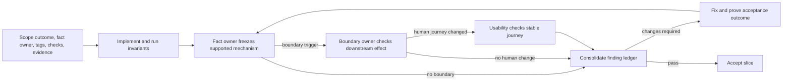

# Review process

- Status: Adopted 2026-07-16
- Applies to: plans, product code, Bundle resources, UI, tests, runbooks, and documentation

## Purpose

The release must be correct on Databricks, faithful to dbt Core, and easy to operate. Three persistent domain owners protect those outcomes. They do not all review every edit.

AI expert review is defect-finding evidence. It does not replace accountable human approval, a customer security or legal review, an accessibility audit, penetration testing, or Databricks partner review.

## Operating model

Quality is enforced through four layers:

1. **Executable invariants** catch repeatable defects on every change.
2. **One domain owner** reviews the changed assumption and adjacent failure paths.
3. **A second owner** joins only when the change crosses a named boundary.
4. **All three owners** review the same frozen evidence at three release milestones.

This is continuous ownership, not three independent source-wide audits.

### Owners

| Owner | Owns | Primary evidence |
|---|---|---|
| Databricks platform | Authentication, identities, Unity Catalog, Apps, Bundles, Jobs, SQL execution, deployment lifecycle, cost, and Azure cleanup | Contract tests, Bundle validation, privilege/inventory diffs, API receipts, and live proof |
| dbt Core | Invocation, supported versions, artifacts and events, attempt identity, parsing, completeness, retries, and reconciliation | Golden dbt fixtures, compatibility tests, command captures, artifact hashes, and observed rows |
| Usability | Installer, dbt operator, and viewer journeys; safe defaults; errors; cost disclosure; recovery; teardown; and documentation findability | Rendered journeys, CLI/App captures, failure drills, task assertions, and lifecycle receipts |

Reviewers are read-only and never approve work they authored.

### Decision rights and review order

Review is not a three-person vote. Each factual claim has one accountable domain
owner:

- Databricks decides which platform mechanism, identity, privilege, resource,
  lifecycle, and cost claims are supportable from current first-party evidence.
- dbt Core decides which invocation, profile, artifact, event, parsing, attempt,
  and reconciliation claims are supportable.
- Usability decides whether the already-supported mechanism is understandable,
  operable, recoverable, and accessible to the intended person.

For a cross-domain slice, review follows the dependency direction:

1. The owner of the underlying technical fact reviews and freezes the mechanism.
2. A technical boundary owner validates its effect on their contract, if any.
3. Usability reviews the resulting human journey after the technical values are
   stable.

A boundary reviewer may reject an impact in their domain, but must not prescribe
an unsupported mechanism in another owner's domain. Disagreement becomes one
ledger item: the owner of the disputed fact supplies the supported options, and
the affected owner states the constraint those options must satisfy. Resolution
is evidence-based, not majority voting.

### Routing tags

Every reviewable change declares one or more tags:

- `DBX`: changes a Databricks interface, authority, resource, lifecycle, or cost assumption.
- `DBT`: changes a dbt command, version, artifact, event, attempt, parser, or reconciliation assumption.
- `UX`: changes an operator-visible input, output, decision, recovery action, documentation route, or destructive consequence.

The dominant tag names the accountable reviewer. Add another owner only for these boundary triggers:

| Trigger | Required owners |
|---|---|
| Databricks Job task, deterministic dbt evidence path, or collector identity | Databricks + dbt Core |
| Authentication, permissions, cost, lifecycle recovery, or teardown shown to a person | Databricks + usability |
| dbt command, evidence failure, or recovery action shown to a person | dbt Core + usability |
| Shared trust boundary or irreversible migration | Fact owner plus each domain whose frozen promise changes |
| Contract-freeze milestone, immutable local release candidate, or live Azure proof | All three |

No trigger means one reviewer. An intermediate support-contract edit routes only
to the owner of each changed assumption; all three sign the consolidated contract
once at contract freeze. Documentation wording alone does not automatically
require all subject-matter owners.

### Review lanes

| Lane | When it applies | Required quality control |
|---|---|---|
| Mechanical | Formatting, generated digests, snapshots, or lock data change with no normative or observable behavior change | Executable invariant and parity evidence; no auditor |
| Single-domain | One domain assumption or behavior changes | Dominant owner only |
| Boundary | One frozen change has a named effect in another domain | Technical fact owner first, then the affected boundary owner |
| Milestone | Contract freeze, immutable local release candidate, or live Azure proof | All three sign their own domain column against one packet |

If a proposed slice crosses both Databricks and dbt boundaries and also changes
the human journey, split it into ordered outcomes when possible. If it cannot be
split safely, all three still inspect only the named changed criteria.

## Frozen domain rubrics

Each owner maintains a small stable rubric. A change is reviewed only against affected checks. New checks require a demonstrated gap and replace or consolidate an existing check where possible.

### Databricks platform rubric

- `DBX-01` — Native submission accepts only registered operations, binds the expected actor and target, and has explicit terminal and indeterminate outcomes.
- `DBX-02` — Installation previews and creates only the frozen customer objects and grants; production mutation authority is explicit and bounded.
- `DBX-03` — Runtime principals have only the documented read/write capabilities, with distinct observed, collector, and App identities.
- `DBX-04` — Bundle and App resources are pinned, bound, reproducible, and reject unexpected existing deployment state.
- `DBX-05` — App lifecycle and SQL/Jobs execution have deterministic recovery and no automatic replay after an indeterminate mutation.
- `DBX-06` — Stop, failure, resume, retain-uninstall, and delete-uninstall preserve unrelated resources and expose any remaining cost.
- `DBX-07` — Data remains customer-local; logs, receipts, and UI do not disclose credentials, raw SQL, Personal Data, or unstable internal identifiers.
- `DBX-08` — Current feature status and limitations are supported by primary Databricks documentation; Preview dependencies are explicit or excluded.
- `DBX-09` — Live Azure evidence proves exact released artifacts, expected inventories and permissions, terminal runs, and zero product-started compute left running.

### dbt Core rubric

- `DBT-01` — The exact dbt Core, adapter, and Python tuple is pinned and reproduced by the released environment.
- `DBT-02` — The generated command, selector, target, log path, and artifact path are deterministic and cannot be replaced by user SQL or hidden flags.
- `DBT-03` — Invocation and attempt identity prevent overwrite and correlate dbt artifacts, structured events, Job state, and collected rows.
- `DBT-04` — Parsers validate supported schemas, preserve unknown evidence safely, and fail explicitly on malformed or incompatible artifacts.
- `DBT-05` — Success, node failure, early failure, partial write, retry, repair, and missed collection have golden fixtures and deterministic outcomes.
- `DBT-06` — Collection and reconciliation do not change native dbt outcomes or refresh immutable run evidence.
- `DBT-07` — Sensitive artifact fields and environment data follow the documented raw-evidence and redaction policy.
- `DBT-08` — A real non-demo dbt project proves two changed-input runs and at least one failure or partial-evidence path through queryable observability rows.
- `DBT-09` — Behavior and version claims are supported by primary dbt and adapter documentation.

### Usability rubric

- `UX-01` — The supported people, identities, authority, and absence or presence of independent review are understandable without internal terminology.
- `UX-02` — Installation has one canonical entry point, named prerequisites, fail-before-mutation preflight, exact preview, explicit approval, progress, and a useful receipt.
- `UX-03` — Every interrupted or indeterminate stage offers one safe next action and never reports false success or silently repeats a mutation.
- `UX-04` — The dbt operator follows a generated command/path contract without guessing SQL, IDs, profile names, paths, or YAML.
- `UX-05` — The App's first page answers whether dbt ran, whether evidence is complete, what failed, and what to do next; empty and stale states are actionable.
- `UX-06` — App and warehouse cost consequences are visible before a query or start action, and closing a browser is not presented as stopping compute.
- `UX-07` — Stop, retain-uninstall, and delete-uninstall have distinct previews, safe defaults, destructive confirmation, and exact post-operation receipts.
- `UX-08` — Current documentation is findable from each landing page; historical commands cannot be mistaken for the supported release.
- `UX-09` — Regulated-use, support, security, and compliance claims are explicit and do not imply certification or guarantees not established by evidence.
- `UX-10` — CLI, App, and documentation meet the project's terminology, accessibility, scannability, and error-message conventions.

## Evidence packet

Reviewers receive one immutable packet, identified by commit or content digest, containing:

- outcome, non-goals, routing tags, and affected rubric IDs;
- accountable fact owner, named boundary triggers, and review order;
- scoped diff and changed contracts;
- exact normative before/after values and an explicit unchanged list;
- exact validation commands and results;
- a user-observable result when behavior is visible;
- primary-source links for time-sensitive claims;
- known residual risks and the release gate that owns them.

Reviewers inspect the named checks and adjacent attack or failure paths. They do not reopen unchanged decisions or perform a general repository audit.

## Finding ledger

All reviewers write to one severity-ranked release ledger. A finding must identify a violated rubric check and a single acceptance outcome.

Related symptoms are consolidated under their root cause. There is no cap on genuine safety defects, but a reviewer must not split one missing contract decision into several blockers merely because it affects several pages or tests.

Each entry contains:

- ID and rubric check;
- gate: contract freeze, implementation, local release candidate, live Azure proof, or post-release;
- severity and verdict;
- exact evidence and user/system impact;
- one accountable resolver;
- deterministic acceptance evidence;
- resolution commit and re-review result.

Unchanged evidence is not reviewed again. A fix returns only to the criterion owner, plus an owner newly required by a boundary trigger.

## Review cycle



1. Define the outcome, non-goals, fact owner, routing tags, affected rubric checks, and exit evidence.
2. Run automated invariants before asking for review.
3. Give the immutable packet to the fact owner; add boundary owners in dependency order only after the underlying values are stable.
4. Consolidate findings by root cause and assign each to the gate where it can be proven.
5. Fix the smallest complete outcome and re-run affected checks.
6. Re-review only changed criteria.
7. Accept when required criteria are `PASS` or `PASS_WITH_FOLLOW_UP` and no current-gate blocker remains.

## Milestone gates

| Gate | Frozen evidence | Three independent decisions |
|---|---|---|
| Contract freeze | Support matrix, authority and trust boundaries, three user journeys, object/grant contract, and executable acceptance matrix | Is the promised platform support safe? Is the dbt promise correct? Can a customer understand and operate it? |
| Local release candidate | Reproducible packages, complete suites, installer-to-App captures, documentation build, and unresolved ledger | Does the integrated release satisfy each frozen rubric without relying on cloud-only assumptions? |
| Live Azure proof | Exact released artifacts, bounded Databricks evidence, dbt observability rows/App result, lifecycle receipts, teardown inventory, and zero product-started compute | Did the platform, dbt evidence, and customer journey all work on the same deployment? |

At a milestone, each owner signs only their domain column against the same evidence packet. Cross-domain disagreement becomes one ledger entry with one acceptance outcome; it does not create duplicate findings.

## Verdicts

- `WAITING_ON_UPSTREAM` — review has not started because a prerequisite fact is
  not stable; this is a routing state, not a verdict or a pass.
- `PASS` — current-gate acceptance evidence is complete.
- `PASS_WITH_FOLLOW_UP` — safe for this gate; a non-blocking item has an owner and later gate.
- `CHANGES_REQUIRED` — a current-gate acceptance outcome is missing or contradicted.
- `BLOCKER` — the design can cause material security, compliance, data-loss, cost, or product-boundary failure.

## Documentation review

Documentation uses the same routing model plus focused passes:

1. A Diataxis reviewer checks information architecture before full prose.
2. The relevant Databricks or dbt owner freezes changed subject-matter claims; both join only at a platform/dbt boundary.
3. A FastAPI-style writing reviewer checks clarity, runnable examples, expected output, and progressive disclosure.
4. A security/compliance reviewer checks Personal Data language, permissions, secrets, evidence classification, retention, egress, and sanitized captures.
5. A usability/accessibility reviewer checks task completion, recovery, search terms, alt text, keyboard use, and scannability after rendering.

Information architecture and prose/style are separate passes. Review one page or substantial section at a time. Re-review navigation only when a page is added, moved, renamed, split, or changes audience/task ownership.

## Reviewer response template

```markdown
# <owner> review: <outcome>

- Evidence packet: <commit or digest>
- Routing tags: <DBX | DBT | UX>
- Rubric checks: <IDs>
- Verdict: PASS | PASS_WITH_FOLLOW_UP | CHANGES_REQUIRED | BLOCKER

## Finding <ID>: <one acceptance outcome>

- Gate:
- Rubric:
- Severity:
- Evidence:
- Impact:
- Acceptance evidence:
- Resolver:
- Re-review:
```
