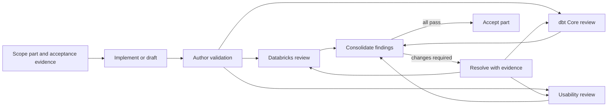

# Review process

- Status: Draft under review
- Applies to: Plans, code, Bundle resources, UI, runbooks, tests, and documentation

## Purpose

Every product part must be correct for Databricks, correct for dbt Core, and understandable to the person installing or operating it. These concerns are reviewed independently because a technically valid implementation can still be insecure, incompatible, or unnecessarily difficult to use.

AI expert reviews in this repository are design evidence and defect-finding aids. They do not replace a customer's security approval, legal review, accessibility audit, penetration test, Databricks partner review, or accountable human sign-off.

## Required product reviewers

### Databricks platform reviewer

Checks:

- Current Azure Databricks feature status, region, tier, and compliance requirements.
- Bundle, App, Jobs, Unity Catalog, system-table, and identity design.
- Direct grant-reconciliation semantics versus targeted privilege operations; preservation of customer/App-generated grants; direct versus inherited effective access.
- Complete point-in-time data-authority evaluation across exact direct grants, current inherited/group/`ALL PRIVILEGES` DML, ownership/`MANAGE` self-grant capability, named-actor/group direct and indirect paths, whole-group trusted roots, caller visibility, and pagination. Reject claims of complete continuous group-member enumeration.
- OAuth U2M profile ownership and secure-store enforcement in both immutable installer modes: one accountable actor/account/profile in `COMBINED_ROLE`, and distinct managed OS accounts with capsule integrity and verified return of control in `SEPARATED_DUTIES`.
- The absence of a privileged migration Job/SP and of SQL/UC DDL/DML in Direct plan/apply or Bundle hooks. Review the installer-only warehouse, direct `CAN_MONITOR` privacy, the workspace-admin verifier's effective `CAN_MANAGE`, one-operation `50s` cancel policy, GA Query History cross-user recovery, exact cleanup locator, ten-minute procedural escalation, and no Preview history dependency.
- The two-phase truth: a customer-owned `DATA_APPLIED_PENDING_REVOKE` row contains completed prior statement IDs but not its own or post-revoke claims; only the row plus fresh complete live observation/no-indeterminate-query/mode gate forms the composite seal.
- Exact runtime DML sets versus deployment mutation. Review every runtime principal's cross-table/ledger/fence/DDL denials; the named App/Job/deployment/group/SP-role/trust-committer roots; the GA-visible observation matrix; the verifier-admin native service-principal-roster attestation; exhaustive ledger DDL and four-operation required/null matrix; literal RFC 8785 domains and shared Python/generated-SQL/JavaScript vectors; unsigned decimal-string encoding for every canonical integral property; deterministic event, payload, server-record, snapshot, and row IDs; one statement-scoped query-start timestamp per event; distinct `STOPPED` pre-start and `ACTIVE` post-start observations with one stable graph; original self-anchored roster evidence and complete accepted-source revalidation; client-signature non-authority; latest-generation summary reduction; collector observation-time rather than commit-current provenance; the pre-start audit plus post-start-machine/original-roster validity clocks; stale behavior; and the explicit absence of continuous or low-privilege live verification. The required path must not call the Public Preview Account Access Control or Workspace Groups APIs.
- For P6, review the exact ordered unpartitioned-fence envelope: managed Delta create with explicit `UTF8_BINARY`, separate `Serializable` property operation, eleven separately marked `ALTER TABLE ... ADD CONSTRAINT` operations, complete readback/partial-state recovery, and singleton insert last. Execute generated-SQL/parser tests and a bounded supported-warehouse staging test; inline Delta `CHECK` clauses in `CREATE TABLE` are a blocker. Then review nullability/cardinality, same-row versioned claim/drain/release/reopen/retire operations, owner/App/verifier grants, action-ledger-before-dispatch ordering, one deterministic Jobs idempotency token, asynchronous cancel, current-`status`-first/legacy-`state`-fallback terminal projection including `INTERNAL_ERROR`, conflict/unknown handling, final paginated inventory, indeterminate dispatch, lease takeover without auto-release, closed-before-trust/lifecycle ordering, and explicit reopen. Verify that no Preview multi-table transaction/catalog-commit feature is required and that per-table snapshot reads are not misrepresented as an atomic trust-plus-action-plus-Jobs transaction. The promise is only that a drain blocks later dbtobsb admissions and an earlier admission reaches a proven terminal/no-request outcome before mutation. App/admin compromise and external Job callers remain explicit boundaries.
- The sequential-plan App lifecycle: zero-product-authority/no-user-access stage plan/apply; fully paginated deployment baseline; one wrapper `bundle run` invocation with no wrapper retry; stop/reconcile on success and error; exactly one new terminal matching `SNAPSHOT`; a fresh final-binding plan from the post-stage lineage/serial; separate final approval; pre-start candidate; direct `apps start` of the reconciled deployment; same-ID post-start observation; final event acceptance; and stop-on-failure. Review the pinned runner's prior-deployment start and internal POST reissue, first install, upgrade, rollback, unchanged refresh, stale plans, remote drift, process death, billed intervals, and the wrapper-wide no-argument deploy prohibition.
- Least privilege, resource binding, run-as behavior, auditability, deletion, and honest administrator-resistance limits.
- Cost and lifecycle behavior, including App start/stop and test cleanup.
- Optional system-enrichment identity, unavoidable source scope, filtering, snapshots, cadence, degradation, and complete removal.
- Whether a recommended practice is GA or depends on Preview, Beta, or Experimental functionality.
- Alignment with current official documentation and first-party examples.

### dbt Core reviewer

Checks:

- Tested Core/adapter/Python compatibility and exact dependency pins.
- Artifact schemas, invocation identity, structured event contracts, and early-failure behavior.
- Command construction, selectors, retries, repairs, concurrency, and overwrite prevention.
- Immutable AttemptKey-root trust-observation provenance: trust fields never enter AttemptKey, artifact/log hashes, pair validation, result resolution, capture precedence, or native dbt/Lakeflow outcomes; retry and partial-write recovery never refresh them.
- P6 fence/action/trust/token values remain outside dbt argv, environment, selector, vars, target/log paths, artifacts, structured events, and workload parameters. Jobs API idempotency does not change dbt correlation.
- Sensitive artifact fields, environment variable behavior, raw evidence policy, and redaction.
- Golden fixture coverage and forward-tolerant parsing without silently accepting unknown schemas.
- Alignment with current dbt documentation and dbt Labs/adapter release evidence.

### Usability and onboarding reviewer

Checks:

- One clear journey with no guessed or entered SQL, internal IDs, paths, profile names, capsules, checkpoints, flags, privileges, or YAML.
- One complete `COMBINED_ROLE` journey with one actor/account/profile, acknowledgement of no independent data observation or SP-role review, no handoff gates, Query History cleanup, composite/trust acceptance, named roots, and its own active-time target including roster work.
- Two-person `SEPARATED_DUTIES` choreography with one command per actor, distinct accounts, no credential/checkpoint transfer, signed capsules, a deployment/seal-verifier recovery path through a native Query History deep link and exact revoke, independent live observation, and fail-closed wrong/unavailable actor behavior. Same-account separation never silently becomes combined.
- Read-only preflight before mutation and an exact change preview.
- Separation and explanation of App access versus resource authorization.
- Accurate progress, long-running status, cost visibility, and safe recovery actions.
- P6 makes **new admissions blocked** distinct from **maintenance safe to begin**; shows whether one earlier action may run, current compute/cost, fixed cancel-or-wait policy, terminal proof, recovery owner, downtime, and an explicit post-trust reopen; offers exactly one next action and no force-open or entered ID/token.
- First value proven by queryable evidence rather than deployment success.
- Existing-job migration, rollback, uninstall, and orphan prevention.
- Terminology, accessibility, error messages, and optional-AI behavior.

## Additional documentation reviewers

Documentation has additional gates:

1. **Diataxis information-architecture reviewer** — verifies that tutorials, how-to guides, reference, and explanation serve distinct reader needs and that navigation supports the user's task.
2. **FastAPI-style technical-writing reviewer** — checks plain language, progressive disclosure, runnable examples, expected output, visible prerequisites, short sections, and scannability.
3. **Security/compliance reviewer** — checks Personal Data language, permissions, secret handling, evidence classification, retention, egress claims, and safe screenshots/examples.
4. **Documentation usability/accessibility reviewer** — checks task success, search terms, error recovery, alt text, keyboard-friendly examples, accessible callouts, and mobile/scannable layout.
5. **Subject-matter reviewer** — the Databricks and dbt reviewers re-check all technical claims that concern their domains.

Information architecture and prose/style are separate passes. A page can pass one and fail the other.

## What counts as a part

A part is the smallest independently useful and testable change. Examples:

- One parser behavior plus fixtures and tests.
- One Bundle resource and its permissions.
- One installer stage.
- One App page and the API endpoint that supports it.
- One runbook.
- One documentation file or one substantial section.

Do not submit a whole phase as one part if reviewers cannot trace a finding to one behavior and one validation result.

## Review cycle



1. Define the part, reader/user outcome, non-goals, risks, and exit evidence.
2. Implement or draft the smallest complete slice.
3. Run author checks and capture evidence.
4. Give all reviewers the same immutable commit or diff and acceptance criteria.
5. Reviewers work independently before seeing the consolidated verdict.
6. Record findings in `docs/reviews/<part>/<reviewer>.md`.
7. Resolve findings in code/docs or record a decision explaining why a change is rejected.
8. Re-run affected checks and request re-review from every reviewer whose area changed.
9. Accept only when every required verdict is `PASS` or `PASS_WITH_FOLLOW_UP` and no blocking follow-up belongs in the current part.

## Verdicts

- `PASS` — Meets the part's acceptance criteria with no required change.
- `PASS_WITH_FOLLOW_UP` — Safe to accept; a clearly scoped non-blocking improvement is recorded with an owner and target part.
- `CHANGES_REQUIRED` — A correctness, operability, compatibility, or usability problem must be resolved before acceptance.
- `BLOCKER` — The design can cause a material security, compliance, data-loss, cost, or product-boundary failure.

## Finding format

Every finding contains:

- ID: `DBX-<part>-NNN`, `DBT-<part>-NNN`, `UX-<part>-NNN`, or the documentation-review equivalent.
- Verdict and severity: critical, high, medium, or low.
- Exact affected file, section, behavior, or user step.
- Evidence from code, tests, rendered UI/docs, or a current primary source.
- Why it matters to the user or system.
- Required change or acceptance condition.
- Resolution commit and validation evidence.
- Re-review outcome.

Reviewers should avoid broad preferences without a user impact or verifiable acceptance condition.

## Part-level review matrix

Every product-plan part P0 through P10 requires all three core reviews. Focus does not remove responsibility; it tells reviewers where to spend extra attention.

| Part | Databricks focus | dbt Core focus | Usability focus |
|---|---|---|---|
| P0 | Stable platform baseline | Compatible capture contract | Coherent product journey |
| P1 | Portable local architecture | Artifact/event correctness | Actionable validation errors |
| P2 | Jobs, archive, exact per-table DML, no collector DDL, and honest cross-table snapshot semantics | Missing/partial/malformed evidence plus one immutable AttemptKey-root trust tuple excluded from dbt identity/outcomes | Separate run/capture/current-trust/collector-observed-trust outcomes |
| P3 | Direct deployment with no SQL/UC DDL/DML; customer schema; dedicated warehouse direct/effective authority; marked Statement Execution/Query History recovery; pending data attestation/composite seal; sequential stage and fresh post-stop final plans; lineage/serial checks; full before/after deployment inventory and exactly one reconciled `SNAPSHOT`; pinned-runner retry/old-start handling; one-row-per-event ledger with exhaustive DDL, exact event matrix, decimal-string canonical domains/vectors, phase-specific observations, original roster source, and latest-generation summary; whole-group/self-grant/admin/committer roots; Preview-disabled native roster review; explicit same-deployment start; P6 fixture initially closed and explicitly reopened | Pinned runtime/job command and data-contract compatibility; no migration, deployment, trust, component, fence, or user input can become a dbt command or evidence | Zero-guess combined and exactly-two-person separated paths; third-reviewer rejection; one recovery-actor table; separate stage/final approvals; automatic deployment reconciliation with no ID choice; row/candidate/accepted distinction; setup-only safe boot; pre-start audit plus two validity clocks/oldest validity age; optional fence remains locked through acceptance; stop/cost states; 20-minute combined target including all active reviews |
| P4 | App auth/resources/ephemeral state and separately installed system enrichment | Correct run semantics in views; optional enrichment stays outside canonical artifact parsing | Accessible navigation/investigation; base remains complete when enrichment is disabled |
| P5 | Existing-job ownership/binding | Command and attempt validation | Proposed patch, semantic-change review, rollback, unsupported states |
| P6 | Same marked/recoverable data plane and composite seal; exact nine-table DML/grants; App/manager/committer roots; unpartitioned Serializable singleton DDL; same-row claim/drain linearization; fresh exact `CONTROLLED_ACTIONS` summary; action-ledger-before-dispatch; same-token Run Now; async cancel/terminal proof; lease takeover; closed-before-mutation; explicit reopen/retire; no Preview multi-table transaction; external-caller/compromised-App boundary | No free-form dbt/migration/deployment/trust/component/fence input; action and token remain outside dbt identity/argv/evidence | Review/approval, verifier-admin roster/drain/recovery/reopen task, admission-versus-quiescence comprehension, safe display names only, cost/downtime, expiry-during-action behavior, indeterminate dispatch recovery, pending-row/candidate truth, and no weakening of action-person separation |
| P7 | Query-history privacy/retention, direct/current/self-grant and warehouse authority truth, whole-group roots, non-independent manual SP evidence, durable trust ledger/view, point-in-time states, staged lifecycle, optional fence drain/retire/removal, audit and denial | Sensitive fields and data-contract compatibility | Safe export/delete/transfer of both ledgers and fence, wrong/unavailable actor recovery, native escalation, no force-open, trust refresh without expiry extension, explicit reopen, App/workstation restart, and mode-correct lifecycle |
| P8 | Two-user query/result/cancel proof; recovery-actor table; exact revoke/pending/composite; owner/`MANAGE`; stage zero-authority; stale-plan and remote-drift rejection; paginated deployment-set/retry/old-start reconciliation; same-deployment start; Preview-disabled roster review; executable ledger DDL/matrix/decimal vectors, query-start timing, pre/post phases, original-anchor source validation, cardinality/conflict/forgery/restart/expiry; collector trust-read/commit barriers; two-session fence races, Jobs fault hooks, closed-before-mutation, zero duplicate runs, explicit reopen; runtime cross-table denial and next-observation drift | Real capture correctness, immutable observation provenance, and unchanged dbt outcomes through trust/fence races | First-run confidence, kill/race/visibility/escalation, automatic deployment reconciliation, authority/cost disclosure, dual-role verifier task, all independence flags, setup-only/candidate/stale/drain/unknown/closed/reopen states, three statement times/two validity clocks, and Direct deployment versus intentional runtime DML |
| P9 | AI feature/compliance boundary | Deterministic validation remains canonical | Core journey works with AI disabled |
| P10 | Repeatable customer deployment in both immutable installer modes | Real project/version diversity | Combined and separated time-to-value, lifecycle completion, lost-dispatch recovery, admission/drain/quiescence/reopen comprehension, zero duplicate run/force-open/false-success, and support burden |

## Documentation review cadence

- Review the planned information architecture before drafting full prose.
- Maintain a page registry with audience, product part, stage, owner, prerequisites, publication state, search terms/codes, and required evidence for every planned page.
- Review one file or substantial section at a time.
- Render the site before the usability/style pass.
- Run link, spelling, code-snippet, accessibility, and publication-safety checks before final review.
- Real captures must be sanitized and independently checked for workspace IDs, emails, user names, account IDs, tokens, signed URLs, source URLs, raw SQL, and Personal Data.
- The universal documentation passes apply in addition to each D-stage gate; D0 may review plans before pages can render.
- Re-review category navigation and every affected audience/task route after each completed category or page move, split, rename, or optionality change.

## Review record template

```markdown
# <Reviewer> review: <part>

- Commit/diff: <immutable identifier>
- Date: YYYY-MM-DD
- Verdict: PASS | PASS_WITH_FOLLOW_UP | CHANGES_REQUIRED | BLOCKER
- Sources checked: <links>

## Acceptance criteria reviewed

- ...

## Findings

### <ID>: <short title>

- Severity:
- Evidence:
- User/system impact:
- Required change:

## Resolution and re-review

- Resolution:
- Validation:
- Re-review verdict:
```
