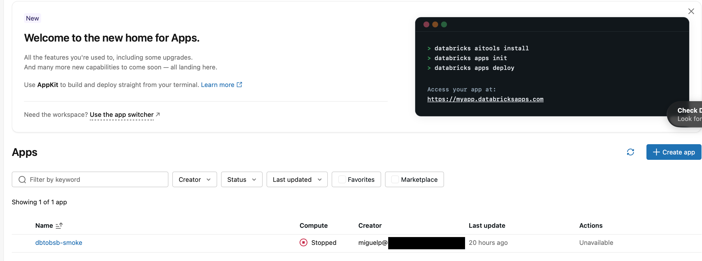

# Install the private release

Use this guide to install dbtobsb `v0.4.0` in one Azure Databricks workspace.
The installation is attended: one accountable administrator reviews the selected
resources before any change is made.

!!! danger "Check the workspace before you start"

    This release installs only in an Azure Databricks workspace deployed in the
    customer's Azure subscription. Do not continue with AWS, GCP, **Databricks
    Free Edition**, or the retired Community Edition. “Personal Edition” is not a
    current product name; a personal-use Databricks signup is Free Edition and is
    unsupported by dbtobsb.

## Agent-assisted path

Agents that support repository skills can follow the version-controlled
[`install-and-run-dbtobsb` skill](https://github.com/MiguelElGallo/dbtobsb/blob/main/.agents/skills/install-and-run-dbtobsb/SKILL.md).
From a clone of this repository, ask:

```text
Use $install-and-run-dbtobsb to install dbtobsb, run the weather example,
prove that its model result and structured logs were captured, and stop compute.
```

The agent asks for every resource, mutation, cost, project, and finish choice before
it changes anything. It still pauses at the installation preview and cannot type
`APPROVE` without your confirmation.

## Before you begin

Use a managed Apple-silicon Mac with:

- Python `3.12`;
- `uv`;
- Databricks CLI `1.8.0`;
- `jq` for the optional final-state checks;
- a checkout of the `v0.4.0` release; and
- a named Azure Databricks OAuth profile for the canonical
  `https://adb-...azuredatabricks.net` workspace URL. Do not use `DEFAULT`.

Check the local tools, release, and authenticated profile before continuing:

```console
python3 --version
uv --version
databricks version
jq --version
git describe --tags --exact-match
databricks auth describe --profile '<profile>'
databricks current-user me --profile '<profile>' --output json
```

The versions must match the [supported environment](../reference/supported-environment.md),
the Git command must print `v0.4.0`, and both Databricks commands must succeed for
the same named profile and supported Azure workspace. Stop if the profile belongs
to Free Edition or another cloud.

The signed-in person must be both an Azure Databricks account administrator and
workspace administrator. The same person must own the existing evidence schema.
This release does not provide independent separation of duties.

## Resources that must already exist

dbtobsb does not create these customer-owned resources:

- one or two existing Unity Catalog catalogs;
- one empty, dedicated evidence schema;
- one dbt target schema owned by the observed Job service principal;
- separate active service principals for the observed and collector Jobs;
- one group that may manage the Jobs and use the App;
- one existing SQL warehouse that the observed principal can use; and
- one [prepared dbt project](add-a-dbt-project.md) in its own child directory below
  the repository root.

The source project contains two required YAML files: `dbt_project.yml` and
`selectors.yml`. The preparation guide provides copy-paste examples and links to a
complete working project. Do not create a source profile for dbtobsb: the installer
generates the runtime `profiles.yml` from the resources you approve. The exact
rules are in the [dbt project input reference](../reference/dbt-project-input.md).

The evidence schema and dbt target schema may be in different catalogs. The
installer lists only empty administrator-owned evidence schemas and
observed-principal-owned target schemas, then shows both fully qualified names in
the approval preview.

If you cannot identify each resource and its owner, stop and ask the Azure
Databricks administrator. The exact runtime access is listed in
[Security and permissions](../reference/security-and-permissions.md).

!!! warning "Installation can change production data objects"

    The attended bootstrap creates the fixed dbtobsb tables, views, and Volumes in
    the evidence schema you approve. It can target production when the administrator
    deliberately chooses that destination. Ordinary collection does not create
    objects.

## 1. Prepare the local installer

From the repository root, install the locked environment:

```console
uv sync --project installer --locked
```

## 2. Start the attended installation

Run:

```console
uv run --project installer --no-sync dbtobsb bootstrap
```

The installer asks you to select the named profile, service principals, group,
warehouse, catalog, schemas, and dbt project. Review the full summary. Type
`APPROVE` only when every value is correct.

The installer then:

1. copies the approved dbt project and prevents unreviewed runtime changes;
2. deploys the observed, collector, and paused reconciler Jobs;
3. creates and verifies the nine fixed
   [Unity Catalog objects](../reference/evidence-data.md);
4. applies the exact product permissions;
5. starts and stops the read-only App during two bounded deployment checks; and
6. leaves the App stopped.

Serverless bootstrap Job compute and the two bounded App deployment checks can run
for several minutes and incur usage. Bootstrap verifies that the App is stopped
after each check and before success. It does not start the selected SQL warehouse.

A successful installation ends with:

```json
{"app_state":"STOPPED","event":"dbtobsb_installation_verified","reconciler_state":"PAUSED","stage":"INSTALLED"}
```

{ loading="lazy" }

*After installation, the App is present in the workspace and its compute is
stopped. This is the expected idle state.*

## 3. Resume an interrupted installation

The local `.dbtobsb/release-installation-v2.json` file records completed stages and
uses owner-only permissions. It also contains sensitive operational identifiers,
including the actor, workspace host, resource IDs, identity and group names, and
schema names. Keep it on the managed installation workstation; do not commit, copy,
or attach it to an ordinary support ticket. Do not edit or delete it after an
interruption.

v0.4.0 has no upgrade or legacy-state adoption path. A v1 state or any prior App,
product Job, product object, or Terraform state blocks the fresh installer before
mutation.

Run the same command again:

```console
uv run --project installer --no-sync dbtobsb bootstrap
```

The installer compares the saved stage with remote state and continues safely. It
does not repeat a change when the previous result is unknown.

## 4. Continue to a first run

The App remains stopped and the reconciler schedule remains paused. Continue with
[See your first observed dbt run](../tutorials/see-your-first-run.md).

If the installer reports a stable code instead of success, preserve that code and
the local state file. Do not edit Jobs, grants, App bindings, or evidence objects by
hand. Project-preparation errors start with `DBTOBSB_ONBOARDING_`; use the checks in
[Prepare a dbt project](add-a-dbt-project.md) before running the same bootstrap
command again. For any other code, follow the safe action printed by the installer
or escalate the code without attaching raw logs or the state file.
