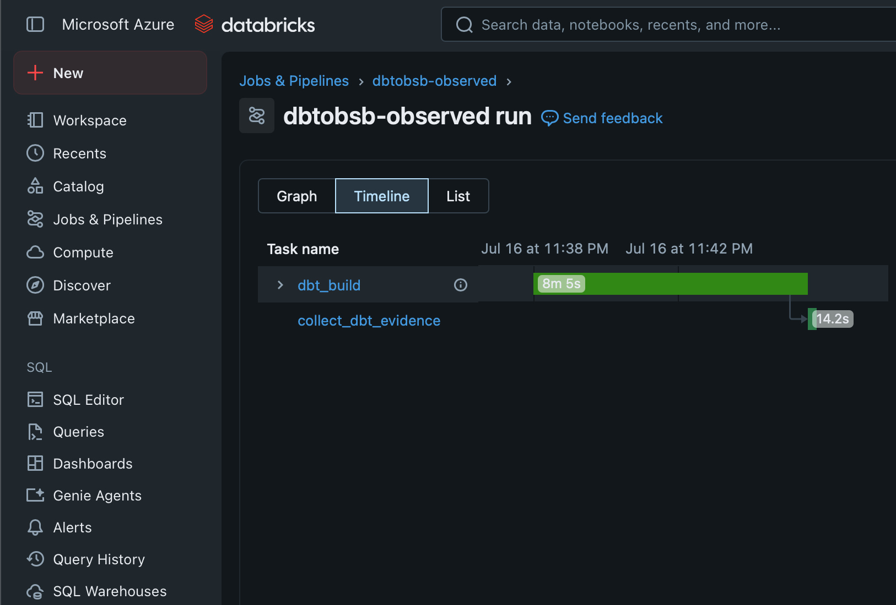
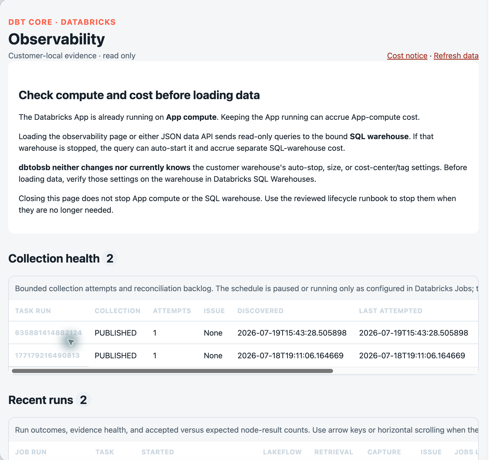

# See your first observed dbt run

In this tutorial, we will run one prepared dbt Job, inspect its captured evidence,
and finish with no product compute running.

The example uses a small synthetic weather project. It does not use customer data.

!!! warning "Supported workspace required"

    This tutorial uses the installed product, so it requires a supported Azure
    Databricks workspace. It does not work with Databricks Free Edition, the
    retired Community Edition, AWS, or GCP. “Personal Edition” is not a current
    Databricks product name; personal-use Databricks means Free Edition.

## Before you start

Ask the dbtobsb administrator to complete the
[private installation](../how-to-guides/install-private-release.md) with the
[weather qualification project](https://github.com/MiguelElGallo/dbtobsb/tree/main/qualification_dbt).
The recorded output on this page comes from that exact project: three models, one
seed, and five tests. Its repository `profiles.yml` supports local qualification
only; dbtobsb ignores it and generates the installed runtime profile. You need:

- permission to run the installed `dbtobsb-observed` Job;
- permission to query the three dbtobsb health views; and
- an administrator who can start and stop the read-only
  [Databricks App](../reference/glossary.md#databricks-app).

The Job uses serverless compute. Loading data in the App can start its SQL warehouse.
Keep the administrator available until the final compute check passes.

!!! warning "Use synthetic data for this tutorial"

    dbt artifacts and logs can contain SQL, relation names, messages, paths, and
    Personal Data. Do not use a customer project for a learning exercise.

## 1. Run the observed Job

In **Databricks Jobs & Pipelines**:

1. Open `dbtobsb-observed`.
2. Select **Run now**.
3. Do not add parameters or task overrides.
4. Wait for both tasks to finish.

The first task runs the fixed dbt command. The second task collects evidence even
when dbt fails.

{ loading="lazy" }

*A real sanitized run: `dbt_build` finishes first, then `collect_dbt_evidence`
captures and publishes the files left by dbt.*

In the documentation check on 18 July 2026, the first serverless start took about
five minutes. The task showed **Waiting for cluster** during that time. Startup time
varies; do not create another run while the first one is still pending.

Open the output for the collection task. A complete capture looks like this:

!!! success "Captured from the stable release"

    The output and SQL rows in this tutorial were captured from a real `v0.3.0`
    installation in the Azure qualification workspace on 18 July 2026. Workspace,
    Job, run, account, user, host, and policy identifiers were removed.

```json
{
  "capture_state": "COMPLETE",
  "event": "dbtobsb_collection_published",
  "node_count": 9,
  "pair_state": "PAIR_VALID",
  "retrieval_state": "RETRIEVED"
}
```

Notice that the output describes evidence quality. It does not replace the native
dbt or Databricks task result.

## 2. Read the run summary

Open a Databricks SQL editor that can query the evidence schema. Replace the two
placeholders with the catalog and schema chosen during installation:

```sql
SELECT
  lakeflow_result_state,
  retrieval_state,
  capture_state,
  pair_state,
  result_count,
  status_counts_json
FROM `<catalog>`.`<evidence-schema>`.`dbt_run_health`
ORDER BY task_start_time DESC
LIMIT 1;
```

The synthetic run produces a row like this:

| lakeflow result | retrieval | capture | pair | results | dbt statuses |
| --- | --- | --- | --- | ---: | --- |
| `SUCCESS` | `RETRIEVED` | `COMPLETE` | `PAIR_VALID` | 9 | `{"pass":5,"success":4}` |

You can now see two independent facts: the task succeeded, and its evidence is
complete and valid.

## 3. See model, seed, and test results

Run this query:

```sql
SELECT
  resource_type,
  status,
  COUNT(*) AS node_count
FROM `<catalog>`.`<evidence-schema>`.`dbt_node_health`
GROUP BY resource_type, status
ORDER BY resource_type, status;
```

The result is:

| resource type | status | node count |
| --- | --- | ---: |
| `model` | `success` | 3 |
| `seed` | `success` | 1 |
| `test` | `pass` | 5 |

These are dbt's own node results. dbtobsb does not turn them into one new success
score.

## 4. Check collection health

Run one final query:

```sql
SELECT
  collector_state,
  collection_issue_code,
  collection_attempt_count
FROM `<catalog>`.`<evidence-schema>`.`dbt_collection_health`
ORDER BY task_start_time DESC
LIMIT 1;
```

A healthy first attempt looks like this:

| collector state | issue | attempts |
| --- | --- | ---: |
| `PUBLISHED` | `NULL` | 1 |

## 5. View the same run in the App

On the installation workstation, the administrator starts the App:

```console
printf 'START\n' | uv run --project installer --no-sync dbtobsb start
```

Open the App and select **Load observability**. The App shows the same run, node,
and collection data as the SQL views. It also shows **Failures over time** and
**Total models over time** for recent accepted runs. Loading data can start the
bound SQL warehouse.

The failure chart counts accepted node results whose native dbt status is `error`
or `fail`. The model chart counts accepted model-result rows in each run. It does
not claim to count every model in the project, because unselected models do not
produce a result row. Expand **View chart data as a table** for the exact accessible
values behind both charts.

{ loading="lazy" }

*Historical v0.3 App evidence after loading data. In v0.4, the native trend charts
appear above the same collection and run history; replace this image only after
the v0.4 live qualification is complete.*

## 6. Stop compute

Closing the browser does not stop compute. On the installation workstation, run:

```console
uv run --project installer --no-sync dbtobsb stop
```

The expected receipt is:

```json
{"app_state":"STOPPED","event":"dbtobsb_stop_verified","reconciler_state":"PAUSED"}
```

Confirm that:

- the observed and collector runs are terminal;
- the App is stopped;
- the reconciler schedule is paused; and
- the SQL warehouse is stopped after its configured auto-stop period.

The warehouse can remain running until that auto-stop period ends. Do not stop or
resize it unless customer policy allows that exact action. Use the scoped checks in
[Verify the final state](../how-to-guides/stop-or-uninstall.md#verify-the-final-state)
to prove that the App is stopped, the reconciler is paused, and no product Job run
is active.

You have now followed one dbt run from execution to normalized evidence and App
readback, then returned the product to its stopped state.

Next, read [Why outcomes stay separate](../explanation/why-outcomes-stay-separate.md)
or learn how to [query more observability data](../how-to-guides/query-observability-data.md).
